# Dreamers — GitHub Copilot CLI

An agent orchestration system for GitHub Copilot CLI. Runs the planning → tests-first → implementation → full review → Vigil follow-up review → docs → PR flow.

Invoke any skill from Copilot CLI: `/dreamers-full <task>`, `/dreamers-plan <task>`, `/dreamers-fix <bug>`, etc.

## Layout

```
.github/
├── agents/       # Agent definitions
├── skills/       # Skill entry points (/dreamers-*)
├── dreamers/
│   ├── refs/     # Shared reference docs inlined into consumers at build time
│   └── templates/# Plan, manifest, PR description, logging standards, etc.
└── instructions/ # Auto-loaded instruction files (Copilot CLI picks these up)
```

## Agents

| Agent | Type | Role |
|---|---|---|
| **Forge** | Persona | Implementation orchestrator. Enter via `/agents forge` for a session pre-loaded with the pipeline. Routes user intent to the right skill. |
| **Nova** | Persona | Planning specialist. Enter via `/agents nova` for a multi-turn planning session. Hard-stops at the approval gate; does not implement. |
| **Sentinel** | Subagent | Reviewer — correctness, security, maintainability. Read-only except one `.dreamers/reviews/` artifact. |
| **Probe** | Subagent | Reviewer — test coverage (AC matrix, layer audit, edge + negative cases, regression risk). Read-only except one `.dreamers/reviews/` artifact. |
| **Hone** | Subagent | Reviewer — over-engineering, redundancy, bad architecture. Read-only except one `.dreamers/reviews/` artifact; surfaces full-refactor recommendations without softening. |
| **Vigil** | Subagent | Single-pass reviewer for `/dreamers-lite`, skill-internal reviews outside `/dreamers-full` and `/dreamers-review`, and `/dreamers-full` follow-up reruns. Combines Sentinel, Probe, and Hone lenses and writes one `.dreamers/reviews/` artifact. |
| **Echo** | Subagent | Documentarian — README, CHANGELOG, Echo-owned sections of `copilot-instructions.md`. Stages edits; never commits. |
| **Sage** | Subagent | Researcher — deep multi-perspective research with citation verification. |

Sentinel, Probe, and Hone spawn through `/dreamers-review` according to the selected review lane and each write a durable review artifact. `/dreamers-full` runs the full triad once per plan; follow-up review reruns use Vigil by default. Other skills that need a review call Vigil, not individual Sentinel/Probe/Hone lanes, except `/dreamers-find-refactors`, which intentionally uses section-scoped Hone calls for refactor discovery. A second triad or selected lane is user-gated for major-change reruns. Echo spawns per milestone via `/dreamers-docs`. Sage is invoked by `/dreamers-research`.

## Skills

Explicit user instructions can skip or alter skill phases/actions.

### Pipeline

| Skill | Purpose |
|---|---|
| `/dreamers-full <task | plan paths | manifest>` | End-to-end pipeline: plan → implementation-start gate → implement → review → templated user-test when triggered → pre-PR approval → ship. |
| `/dreamers-lite <task | plan paths>` | Lean pipeline: task mode runs compact proposal + critique → approved plan file; plan path mode skips planning and uses supplied plans directly. Then implement → Vigil artifact review → docs when triggered → commit → PR. |
| `/dreamers-plan <task>` | 3-phase planning (Hash-out → Write → Review). Produces plan file(s) + optional manifest, verifies plan coverage against the proposal and user discussion, then hard-stops at approval. |
| `/dreamers-implement <plan>` | One cycle against an approved plan: failing tests → code → run tests. Exits at green tests. |
| `/dreamers-review` | Spawns the selected reviewer lane, reads reviewer artifacts, and reports read-only structured findings. `--lens <name>` for single-lens audit; `--lenses sentinel,probe` for a selected subset; no flag keeps the full triad. |
| `/dreamers-docs` | Spawns Echo to update project docs from the diff. `--branch` or `--staged` scope. |
| `/dreamers-pr` | Pushes the branch, drafts the PR body from the template, opens the PR via `gh`. |
| `/dreamers-fix <bug>` | Lightweight bug-fix pipeline: branch + regression test + implement + run tests. Escalates to `/dreamers-full` on scope blowup. |
| `/dreamers-find-refactors [scope or directive]` | Refactor discovery: select lenses, section the repo, run section-scoped Hone audits, synthesize findings, write Dreamers plan files, then stop. No implementation or PR. |

### Standalone reviewer audits

| Skill | Purpose |
|---|---|
| `/dreamers-test` | Focused Vigil audit — test coverage findings on the current diff. |
| `/dreamers-simplify` | Focused Vigil audit — over-engineering and architectural findings. |

### Utility

| Skill | Purpose |
|---|---|
| `/dreamers-pr-resolve [#PR]` | Resolve unresolved PR review comments. Apply accepted fixes inline; Vigil reviews accepted changes before thread resolution. |
| `/dreamers-research <topic>` | Deep research via Sage: scoping → parallel sub-topic research → synthesis. |
| `/dreamers-issue <task>` | Create a structured GitHub issue with acceptance criteria. Prefix with `#` for discussion mode. |
| `/dreamers-new-project` | Bootstrap a new project: discovery → stack → brief → shell plans. |
| `/dreamers-cleanup-comments` | Project-wide comment cleanup per `comment-rules.md`. Audit → approve → apply. |
| `/dreamers-cleanup-comments-branch` | Same cleanup, scoped to the current feature-branch diff. |
| `/dreamers-add-logging` | Phased pass to add/improve logging per `logging-standards.md`. |
| `/dreamers-clean-work` | Between-milestone maintenance: audit improvements, inspect legacy workspace files, scan for drift. |
| `/dreamers-plan-verify <plan>` | Inline drift check: cited paths / signatures / data shapes still hold? |

## Full (`/dreamers-full`) flow example

```mermaid
flowchart TD
    Start(["/dreamers-full $ARGUMENTS"]) --> ModeCheck{"$ARGUMENTS<br/>type?"}

    ModeCheck -->|Task description| Mode1["Mode 1"]
    ModeCheck -->|Plan paths| Mode2["Mode 2"]
    ModeCheck -->|manifest.md| Mode3["Mode 3 + shared context"]

    Mode1 --> P1["Phase 1 — Planning"]
    Mode2 --> P15
    Mode3 --> P15

    P1 --> InvokePlan["Invoke /dreamers-plan"]
    InvokePlan --> PlanResult{"Plan result"}
    PlanResult -->|Halt| HaltA(["Halt + resume cmd"])
    PlanResult -->|Plan paths| P15

    P15["Phase 1.5<br/>Plan review / implementation start"] --> PlanGate{"Start approved?"}
    PlanGate -->|Single-plan approved| BranchSetup
    PlanGate -->|INCREMENTAL| BranchSetup
    PlanGate -->|ATOMIC| BranchSetup
    PlanGate -->|Revise| P15
    PlanGate -->|Halt| HaltB(["Halt + resume cmd"])

    BranchSetup["Branch setup<br/>cut feat slug + check improvements.md"] --> Cycle

    Cycle["Phase 2 — cycle N"] --> S1["Step 1<br/>Read plan + write failing tests"]
    S1 --> S2["Step 2<br/>Implement inline"]
    S2 --> S3["Step 3<br/>Type-check + run tests"]

    S3 --> S3Check{"Tests green<br/>within 3 attempts?"}
    S3Check -->|No| HaltC(["Halt + surface"])
    S3Check -->|Yes| S4

    S4["Step 4<br/>Full lane<br/>Invoke /dreamers-review"] --> ReviewResult{"Review result"}
    ReviewResult -->|Blocked| HaltD(["Halt + surface"])
    ReviewResult -->|Findings| S5

    S5["Step 5 — Apply findings"] --> Gate{"Major-refactor<br/>gate fires?"}
    Gate -->|No| ApplyFixes
    Gate -->|Yes| GateChoice{"User decides"}
    GateChoice -->|Apply now| ApplyFixes
    GateChoice -->|Defer| CreateStub["Create stub plan file"]
    CreateStub --> ApplyFixes
    GateChoice -->|Other| GateChoice

    ApplyFixes["Apply non-deferred fixes<br/>re-run tests"] --> RerunCheck{"Review rerun<br/>needed?"}
    RerunCheck -->|No, before user test| S6Check{"User testing<br/>triggered?"}
    RerunCheck -->|Normal| Vigil["Spawn Vigil"]
    RerunCheck -->|Major change| RerunGate{"User chooses<br/>review rerun"}
    S6Check -->|No| MorePlans
    S6Check -->|Yes| S6
    S6["Step 6<br/>User testing gate"] --> UserTest{"User response"}
    UserTest -->|Bug| BugFix["Fix inline + re-test"]
    BugFix --> BugRerunCheck{"Review rerun<br/>needed?"}
    BugRerunCheck -->|No| S6
    BugRerunCheck -->|Normal| Vigil
    BugRerunCheck -->|Major change| RerunGate
    RerunGate -->|Vigil| Vigil
    RerunGate -->|Full triad| FullRerun["Invoke /dreamers-review<br/>full lane"]
    RerunGate -->|Selected lane| SelectedRerun["Invoke /dreamers-review<br/>selected lane"]
    RerunGate -->|Skip before user test| S6Check
    RerunGate -->|Skip after bug| S6
    Vigil --> S5
    FullRerun --> S5
    SelectedRerun --> S5
    UserTest -->|Halt| HaltE(["Halt"])
    UserTest -->|Approved| MorePlans{"More plans<br/>remain?"}

    MorePlans -->|No| P3
    MorePlans -->|Yes| Between{"Strategy?"}

    Between -->|INCREMENTAL| Light["Drift check<br/>Invoke /dreamers-docs if applicable<br/>commit"]
    Between -->|ATOMIC| AtomicCommit["Drift check<br/>commit"]

    Light --> IncrPRGate{"Pre-PR<br/>approved?"}
    IncrPRGate -->|Approved| IncrPR["Invoke /dreamers-pr"]
    IncrPRGate -->|Halt| HaltF(["Halt"])
    IncrPR --> MergeWait(["Halt until PR merged"])
    AtomicCommit --> Cycle

    MergeWait --> ReCut["Re-cut feature branch"]
    ReCut --> Cycle

    P3["Phase 3 — Close-out FULL"] --> Improvements["Append .dreamers/improvements.md"]
    Improvements --> InvokeDocs["Invoke /dreamers-docs"]
    InvokeDocs --> Retro["Write retro"]
    Retro --> FinalCommit["Final commit if staged"]
    FinalCommit --> Approval{"User approval"}
    Approval -->|Halt| HaltH(["Halt"])
    Approval -->|Approved| InvokePR["Invoke /dreamers-pr"]
    InvokePR --> PostScan["Post-PR scan<br/>surface improvements + drift<br/>no prompt"]
    PostScan --> End(["PR URL + summary"])

    classDef skill fill:#1e40af,stroke:#1e3a8a,stroke-width:2px,color:#fff
    classDef gate fill:#92400e,stroke:#78350f,stroke-width:2px,color:#fff
    classDef halt fill:#7f1d1d,stroke:#991b1b,stroke-width:2px,color:#fff
    classDef phase fill:#166534,stroke:#14532d,stroke-width:2px,color:#fff

    class InvokePlan,S4,Vigil,FullRerun,SelectedRerun,InvokeDocs,InvokePR,IncrPR skill
    class ModeCheck,PlanResult,PlanGate,S3Check,ReviewResult,Gate,GateChoice,S6Check,UserTest,RerunCheck,BugRerunCheck,RerunGate,MorePlans,Between,IncrPRGate,Approval gate
    class HaltA,HaltB,HaltC,HaltD,HaltE,HaltF,HaltH halt
    class P1,Cycle,P3,BranchSetup,Light,AtomicCommit,Improvements,Retro,FinalCommit,PostScan phase
```


