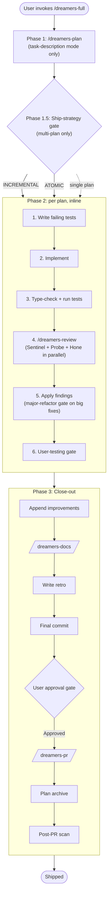

# Dreamers — GitHub Copilot CLI

An agent orchestration system for GitHub Copilot CLI. Runs the planning → tests-first → implementation → parallel-review → docs → PR flow.

Invoke any skill from Copilot CLI: `/dreamers-full <task>`, `/dreamers-plan <task>`, `/dreamers-fix <bug>`, etc.

## Layout

```
.github/
├── agents/       # Agent definitions
├── skills/       # Skill entry points (/dreamers-*)
├── dreamers/
│   ├── refs/     # Shared reference docs inlined into consumers at build time
│   └── templates/# Plan, manifest, PR description, logging standards, etc.
└── instructions/ # Auto-loaded instruction files (Copilot CLI picks these up)
```

## Agents

| Agent | Type | Role |
|---|---|---|
| **Forge** | Persona | Implementation orchestrator. Enter via `/agents forge` for a session pre-loaded with the pipeline. Routes user intent to the right skill. |
| **Nova** | Persona | Planning specialist. Enter via `/agents nova` for a multi-turn planning session. Hard-stops at the approval gate; does not implement. |
| **Sentinel** | Subagent | Reviewer — correctness, security, maintainability. Read-only; returns structured findings. |
| **Probe** | Subagent | Reviewer — test coverage (AC matrix, layer audit, edge + negative cases, regression risk). Read-only. |
| **Hone** | Subagent | Reviewer — over-engineering, redundancy, bad architecture. Surfaces full-refactor recommendations without softening. Read-only. |
| **Echo** | Subagent | Documentarian — README, CHANGELOG, Echo-owned sections of `copilot-instructions.md`. Stages edits; never commits. |
| **Sage** | Subagent | Researcher — deep multi-perspective research with citation verification. |

Sentinel + Probe + Hone spawn in parallel per cycle via `/dreamers-review`. Echo spawns per milestone via `/dreamers-docs`. Sage is invoked by `/dreamers-research`.

## Skills

### Pipeline

| Skill | Purpose |
|---|---|
| `/dreamers-full <task | plan paths | manifest>` | End-to-end pipeline: plan → implement → review → user-test → ship. |
| `/dreamers-plan <task>` | 3-phase planning (Hash-out → Write → Review). Produces plan file(s) + optional manifest. Hard-stops at approval. |
| `/dreamers-implement <plan>` | One cycle against an approved plan: failing tests → code → run tests. Exits at green tests. |
| `/dreamers-review` | Spawns Sentinel + Probe + Hone in parallel. Read-only structured findings. `--lens <name>` for single-lens audit. |
| `/dreamers-docs` | Spawns Echo to update project docs from the diff. `--branch` or `--staged` scope. |
| `/dreamers-pr` | Pushes the branch, drafts the PR body from the template, opens the PR via `gh`. |
| `/dreamers-fix <bug>` | Lightweight bug-fix pipeline: branch + regression test + implement + run tests. Escalates to `/dreamers-full` on scope blowup. |

### Standalone reviewer audits

| Skill | Purpose |
|---|---|
| `/dreamers-test` | Probe-only audit — test coverage findings on the current diff. |
| `/dreamers-simplify` | Hone-only audit — over-engineering and architectural findings. |

### Utility

| Skill | Purpose |
|---|---|
| `/dreamers-pr-resolve [#PR]` | Resolve unresolved PR review comments. Apply accepted fixes inline; parallel review of accepted changes. |
| `/dreamers-research <topic>` | Deep research via Sage: scoping → parallel sub-topic research → synthesis. |
| `/dreamers-issue <task>` | Create a structured GitHub issue with acceptance criteria. Prefix with `#` for discussion mode. |
| `/dreamers-new-project` | Bootstrap a new project: discovery → stack → brief → shell plans. |
| `/dreamers-cleanup-comments` | Project-wide comment cleanup per `comment-rules.md`. Audit → approve → apply. |
| `/dreamers-cleanup-comments-branch` | Same cleanup, scoped to the current feature-branch diff. |
| `/dreamers-add-logging` | Phased pass to add/improve logging per `logging-standards.md`. |
| `/dreamers-clean-work` | Between-milestone maintenance: archive merged plans, audit improvements, scan for drift. |
| `/dreamers-plan-verify <plan>` | Inline drift check: cited paths / signatures / data shapes still hold? |

## Pipeline shape (`/dreamers-full`)




