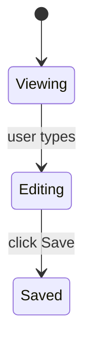

# Plan Content Rules

Every plan uses `~/.copilot/dreamers/templates/plan.md` as the starting structure. Copy it, fill in the sections, remove any that don't apply.

## Required metadata block

Top of file, just under the H1 title:

- `# Plan-NN: {short-title}` — filename matches `plan-NN-{slug}.md` (NN is the zero-padded order within the feature dir)
- `**Date:**` YYYY-MM-DD
- `**Status:**` Draft / Active / Completed / Superseded
- `**Branch:**` feat/{slug} (or fix/{slug} for bug-fix plans)
- `**User-testing-required:**` yes / no

No `Owner`, no `Scope`, no `Links` metadata fields. They belong in the PR description.

## Required sections

In this order — Verification ALWAYS LAST (Anthropic recency-bias rule):

1. **Goal** (mandatory) — one paragraph. What is true when this plan is done that wasn't true before.
2. **Context** (mandatory) — ≤ 200 words. Bullet links to relevant files / prior plans / PRs. NO motivation prose ("this is important because..."); that belongs in Goal or the PR description.
3. **Acceptance Criteria** (mandatory) — XML-wrapped, numbered G/W/T with Layer annotations. See "Acceptance Criteria format" below.
4. **Out of Scope** (mandatory) — explicit bullets. "Will NOT touch X." "Will NOT change Y."
5. **Constraints** (mandatory) — XML-wrapped. Technical / process / hard rules. See "Constraints format" below.
6. **Design Decisions** (optional but recommended) — only when there are non-obvious choices. See "Design Decisions format" below.
7. **UI** (optional) — only when the plan has a user-visible surface. See "UI section" below.
8. **Verification** (mandatory, bottom of file) — commands to run + files to inspect + smoke check. 5–8 lines max.

## Acceptance Criteria format

XML-wrapped, numbered, each item in Given/When/Then form with a layer annotation:

```
<acceptance_criteria>
1. Given <state>, when <trigger>, then <observable outcome>.
   *Layer: unit.*
2. Given ..., when ..., then ...
   *Layer: integration.*
</acceptance_criteria>
```

**Layer label set (closed):** `unit` / `integration` / `E2E` / `perf`. Compound labels allowed when one test serves two purposes (e.g., `*Layer: integration / perf.*`).

**Why the layer annotation:** `/dreamers-implement` Step 1 writes failing tests from each AC; the layer label tells the implementer which test layer to write in. Probe's coverage sweep in Step 4 reads these labels to verify coverage at every layer.

**Number of ACs:** soft minimum 2. A plan with only one AC produces a Phase 1f soft warning (overridable with user confirmation if the work is genuinely single-AC).

**"And" continuation** is allowed for compound outcomes:

```
1. Given a feature with 3 plans, when ship-strategy is "atomic", then no PR opens until all 3 plans complete; and on any plan failure, the entire feature reverts.
   *Layer: integration.*
```

## Constraints format

XML-wrapped, organized into 3 sub-categories:

```
<constraints>
- **Technical:** stack / perf / libs.
- **Process:** gates / review / tests.
- **Hard rules:** "never do Z" — the rationale-bearing constraints that prevent the agent from relaxing the rule.
</constraints>
```

## Design Decisions format

Optional section. Include ONLY when the plan has non-obvious choices the implementer needs the rationale for (so the agent doesn't relax a constraint it shouldn't, and doesn't re-ask a question the planning conversation already answered).

One entry per significant choice:

- **Decision:** what was chosen
- **Rationale:** why — one sentence
- **Rejected:** alternatives considered — one line each

Skip the section entirely on trivial plans where no decision is non-obvious.

## UI section (3-layer convention)

Include this section ONLY when the plan has a user-visible surface (UI screen, CLI output, chat block, IDE pane, etc.).

**Layer 1 — ASCII layout (MANDATORY when UI section exists):**

Box-drawing characters in a code-fenced block. Shows spatial arrangement.

```
┌─ Header: title ───────────────────────────┐
│  Body content                              │
│    Nested element                          │
│  [Action button]   [Cancel]                │
└────────────────────────────────────────────┘
```

**Layer 2 — Component spec (MANDATORY when UI section exists):**

Two acceptable formats — writer's choice based on row count and cell length:

Table form (good for ≤ 5 components, short cells):

| Component | Type | Behavior | Source data |
|---|---|---|---|
| ... | ... | ... | ... |

OR per-component subsections (good when behavior descriptions are long):

```
### ComponentName
- **Type:** <UI primitive>
- **Behavior:** <what it does, when it's disabled, etc.>
- **Source data:** <where the data comes from>
```

**Layer 3 — Mermaid state/flow (OPTIONAL):**

Use only when the UI has interactive state transitions or branching flows that prose would describe verbosely.



Layer 4 (pseudo-JSX) is NOT used. Sage's research flagged it as risky — agents treat it as ground truth and over-fit.

## Verification format

Plain markdown (NOT XML-wrapped). 5–8 lines max. Commands and files, not narrative.

- **Test command:** the command from `.github/copilot-instructions.md`
- **Type-check command:** the command from `.github/copilot-instructions.md`
- **Files to inspect after implementation:** absolute or repo-relative paths
- **Smoke check:** one or two specific commands or manual steps not covered by automated tests

NO retelling of ACs. ACs are already specified above; Verification is the closing checklist of commands to run.

## XML escaping rule

Inside `<acceptance_criteria>` and `<constraints>` blocks, if you need to write literal angle brackets in content (e.g., a constraint that describes another plan's XML structure), use HTML entity escapes:

- `&lt;` for `<`
- `&gt;` for `>`
- `&amp;` for `&`

Renderers (GitHub, VS Code preview) decode these to literal characters in the display. The parser used by `/dreamers-plan` Phase 1f is entity-aware — it sees `&lt;/acceptance_criteria&gt;` as text content, not a closing tag.

Phase 1f only flags genuinely-malformed structural XML (e.g., missing closing tag at the right nesting depth), not literal text content that happens to contain `<` or `>`.

## Code in plans (mandatory rule)

Plans must NOT include code snippets. Implementation is the orchestrator's domain.

**One exception:** interface and type contracts where the signature itself IS the design decision (e.g., a new public API shape). In this case:
- Include the interface/type signature only — no implementation bodies.
- State the file path and package where it will live.
- Keep it minimal: the contract, not the code.

## Plan length

- **Target:** 200–400 lines.
- **Hard cap:** 600 lines. If a plan exceeds 600 lines, split it into two plans within the feature directory.

Research evidence ([Sage report §verbosity U-curve](.dreamers/sage/plan-format-research/report.md)) shows execution accuracy degrades past 600 lines for LLM consumers; technical-writing literature shows human readers disengage past ~400.

## Sections NOT to include in a plan

The following are explicitly out — do not add them to plans even if you think they'd help. Each item lists where the equivalent information goes instead.

- **Summary** — write a **Goal** paragraph instead.
- **Scope / Non-goals** — split across **Context** (bullet links to relevant code) and **Out of Scope** (explicit "will NOT" bullets).
- **Test Cases** as a standalone section — embed in **Acceptance Criteria** as `*Layer: ...*` annotations on each AC.
- **Rollback Boundary** — write in PR description / commit body. Not a plan section.
- **Risks / Mitigations** — write real risks as hard rules inside **Constraints** ("never do Z"). Decorative risk enumeration adds no execution value.
- **Post-merge gates** — write in PR description.
- **Deferred Items** — write in PR description.
- **Owner / Stakeholders / Links** metadata — write in PR description.
- **Open Questions** — banned. All open questions must be resolved in the planning conversation BEFORE plan generation. A plan with open questions is not ready to ship.
- **Race conditions sub-table** — write into Constraints when relevant.

## Multi-plan work

When the scope of work is too large for one plan, planning produces **multiple plans inside a feature directory**: `.dreamers/plans/feature-<slug>/plan-01-<name>.md`, `plan-02-<name>.md`, etc.

For multi-plan features with shared cross-plan context, an OPTIONAL **manifest** lives at `.dreamers/plans/feature-<slug>/manifest.md`. See `feature-decomposition.md` § "Manifest pattern" for when to use one.

Single-plan features still get a feature directory: `.dreamers/plans/feature-<slug>/plan-01-<name>.md` — no manifest needed.
