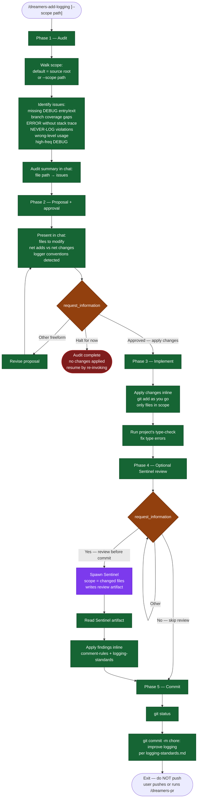

# /dreamers-add-logging — flow

Visual map of the 5-phase logging audit + apply pipeline. Source of truth is `SKILL.md`.

## Key invariants

- **Audit-first, edit later.** Phase 1 is pure analysis; no files are touched until Phase 3.
- **Halt is a valid exit.** A user can `Halt for now` after the audit and get the audit summary with zero changes applied.
- **NEVER-LOG violations are high priority.** Secrets, PII, and full request bodies in INFO logs surface first.
- **Logger conventions are detected, not invented.** Phase 2 surfaces the existing library/format so additions stay consistent.
- **No push.** This skill exits at the commit. Push is the user's call or `/dreamers-pr`'s job.
- **Review artifacts are read before fixes.** Optional Sentinel review writes `.dreamers/reviews/sentinel-*.md`; Phase 4 applies findings from that artifact.
