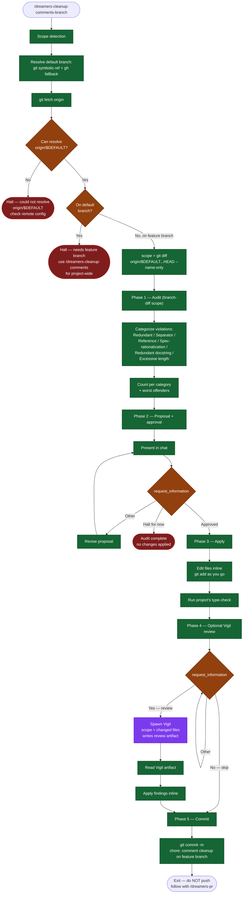

# /dreamers-cleanup-comments-branch — flow

Visual map of the branch-scoped comment cleanup variant. Source of truth is `SKILL.md`.

## Key invariants

- **Branch-only scope.** Files come from `git diff origin/$DEFAULT...HEAD --name-only` — nothing outside the branch diff is touched.
- **Refuses to run on the default branch.** Halt with a redirect to `/dreamers-cleanup-comments` for project-wide sweeps.
- **Fetch before diff.** Stale `origin/$DEFAULT` produces wrong scope — always fetch first.
- **Same phases as the project-wide variant** — only the scope source differs.
- **Review artifacts are read before fixes.** Optional Vigil review writes `.dreamers/reviews/vigil-*.md`; Phase 4 applies findings from that artifact.
- **Pre-PR positioning.** Designed to run before opening a PR; commit stays on branch for `/dreamers-pr` to push.
