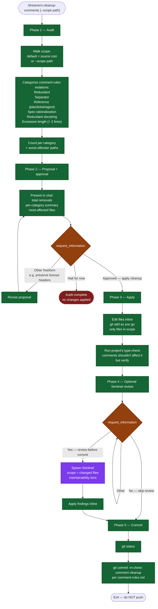

# /dreamers-cleanup-comments — flow

Visual map of the project-wide comment cleanup. Source of truth is `SKILL.md`.

## Key invariants

- **Audit-first.** Phase 1 only categorizes — no edits until Phase 3.
- **Categories are the worst offenders the audit looks for** — separator comments, plan/ticket references, redundant docstrings, spec-rationalization comments.
- **License headers and TODO/FIXME are preserved** by default; users can refine via `Other` (e.g., "preserve vendor headers").
- **No logic edits.** Phase 3 touches comments only — no while-I'm-here code refactors.
- **No push.** Exits at commit.

For branch-scoped cleanup (only files in the current feature-branch diff), use `/dreamers-cleanup-comments-branch`.
