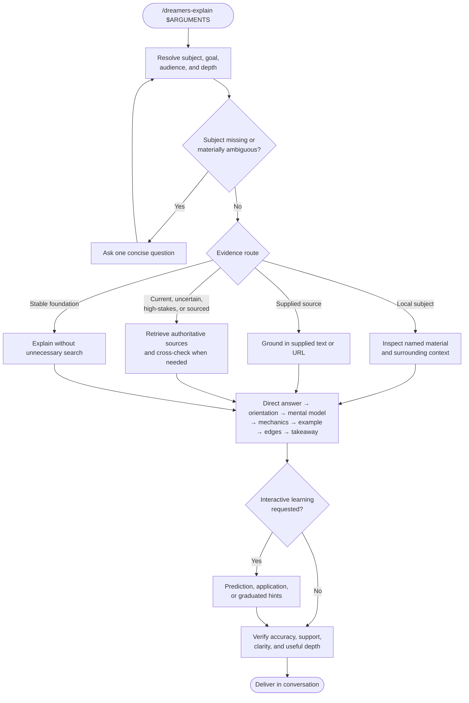

# /dreamers-explain — flow

General-purpose, read-only explanation skill. Source of truth is `SKILL.md`.

## Key invariants

- Read-only unless the user explicitly requests an artifact.
- Focused explanation stays inline; durable multi-perspective reports belong to `/dreamers-research`.
- Local claims cite repository evidence. Current, uncertain, disputed, or high-stakes claims use authoritative external sources.
- Explanations lead with the core answer, then add intuition, mechanics, examples, and boundaries as needed.
- Quizzes and Socratic pacing are opt-in, not forced on ordinary explanation requests.
