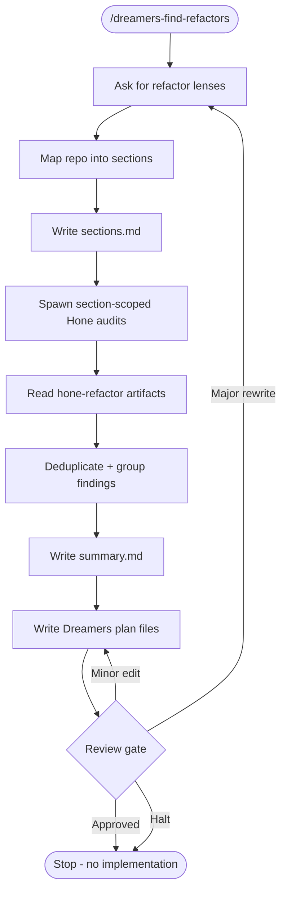

# dreamers-find-refactors - flow

Source of truth is `SKILL.md`.

## Invariants

- Read-only for project code.
- Hone writes section-named `.dreamers/reviews/hone-refactor-*.md` artifacts.
- The orchestrator groups findings into coherent plan files instead of one plan per finding.
- Generated plans follow `plan-writing-guide.md`.
- No branch, implementation, commit, push, or PR.
