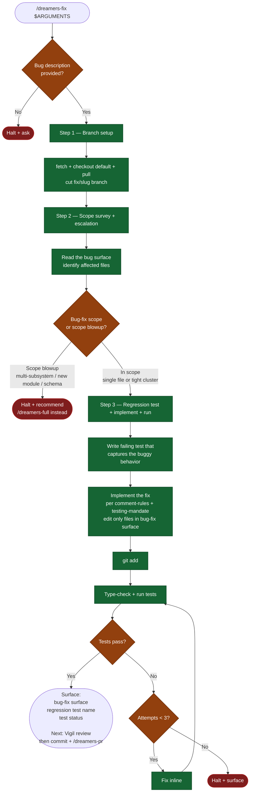

# /dreamers-fix — flow

Visual map of the lightweight bug-fix pipeline. Source of truth is `SKILL.md`.

## Key invariants

- **Escalation check in Step 2.** Multi-subsystem changes, new modules, or schema changes are NOT in bug-fix scope — halt and recommend `/dreamers-full` instead.
- **Regression test first.** Step 3 writes the failing test BEFORE implementing the fix. If no test infra exists for the affected surface, note the absence.
- **Files in the bug-fix surface only.** No while-I'm-here cleanup, no unrelated refactors.
- **3-attempt fix loop.** Same as `/dreamers-implement`. Halt and surface after 3 failed attempts.
- **No review, no commit, no push.** This skill exits at green tests. The user runs Vigil for the audit, then commits + `/dreamers-pr` to ship.
