# /dreamers-full — flow

Visual map of every decision point in the end-to-end pipeline. Source of truth is `SKILL.md`; this is the picture. Task mode runs Phase 1 Grill/right-sized planning and Phase 1.5. Plan path and manifest modes skip Phase 1.5 and start implementation after artifact + plan-quality checks.

```mermaid
flowchart TD
    Start(["/dreamers-full $ARGUMENTS"]) --> ModeCheck{"$ARGUMENTS<br/>type?"}

    ModeCheck -->|Task description| Mode1["Mode 1"]
    ModeCheck -->|Plan paths| Mode2["Mode 2"]
    ModeCheck -->|manifest.md| Mode3["Mode 3 + shared context"]

    Mode1 --> P1["Phase 1 — Planning"]
    Mode2 --> ArtifactCheck["Resolve supplied artifact(s)<br/>multi-plan default: ATOMIC"]
    Mode3 --> ArtifactCheck

    P1 --> InvokePlan["Invoke /dreamers-plan<br/>Grill + right-sized plans"]
    InvokePlan --> PlanResult{"Plan result"}
    PlanResult -->|Halt| HaltA(["Halt + resume cmd"])
    PlanResult -->|Plan paths| Quality
    ArtifactCheck --> Quality{"Plan quality<br/>check passes?"}
    Quality -->|No| HaltQ(["Halt + revise plan"])
    Quality -->|Yes, Mode 1| P15
    Quality -->|Yes, plan/manifest| BranchSetup

    P15["Phase 1.5<br/>Plan review / implementation start"] --> PlanGate{"Start approved?"}
    PlanGate -->|Single-plan approved| BranchSetup
    PlanGate -->|INCREMENTAL| BranchSetup
    PlanGate -->|ATOMIC| BranchSetup
    PlanGate -->|Revise| P15
    PlanGate -->|Halt| HaltB(["Halt + resume cmd"])

    BranchSetup["Branch setup<br/>cut feat slug + check improvements.md"] --> Cycle

    Cycle["Phase 2 — cycle N"] --> S1["Step 1<br/>Read plan + write failing tests"]
    S1 --> S2["Step 2<br/>Implement inline"]
    S2 --> S3["Step 3<br/>Type-check + run tests"]

    S3 --> S3Check{"Tests green<br/>within 3 attempts?"}
    S3Check -->|No| HaltC(["Halt + surface"])
    S3Check -->|Yes| S4

    S4["Step 4<br/>Full lane<br/>Invoke /dreamers-review"] --> ReviewResult{"Review result"}
    ReviewResult -->|Blocked| HaltD(["Halt + surface"])
    ReviewResult -->|Findings| S5

    S5["Step 5 — Apply findings"] --> Gate{"Major-refactor<br/>gate fires?"}
    Gate -->|No| ApplyFixes
    Gate -->|Yes| GateChoice{"User decides"}
    GateChoice -->|Apply now| ApplyFixes
    GateChoice -->|Defer| CreateStub["Create stub plan file"]
    CreateStub --> ApplyFixes
    GateChoice -->|Other| GateChoice

    ApplyFixes["Apply non-deferred fixes<br/>re-run tests"] --> RerunCheck{"Review rerun<br/>needed?"}
    RerunCheck -->|No, before user test| S6Check{"User testing<br/>triggered?"}
    RerunCheck -->|Normal| Vigil["Spawn Vigil"]
    RerunCheck -->|Major change| RerunGate{"User chooses<br/>review rerun"}
    S6Check -->|No| MorePlans
    S6Check -->|Yes| S6
    S6["Step 6<br/>User testing gate"] --> UserTest{"User response"}
    UserTest -->|Bug| BugFix["Fix inline + re-test"]
    BugFix --> BugRerunCheck{"Review rerun<br/>needed?"}
    BugRerunCheck -->|No| S6
    BugRerunCheck -->|Normal| Vigil
    BugRerunCheck -->|Major change| RerunGate
    RerunGate -->|Vigil| Vigil
    RerunGate -->|Full triad| FullRerun["Invoke /dreamers-review<br/>full lane"]
    RerunGate -->|Selected lane| SelectedRerun["Invoke /dreamers-review<br/>selected lane"]
    RerunGate -->|Skip before user test| S6Check
    RerunGate -->|Skip after bug| S6
    Vigil --> S5
    FullRerun --> S5
    SelectedRerun --> S5
    UserTest -->|Halt| HaltE(["Halt"])
    UserTest -->|Approved| MorePlans{"More plans<br/>remain?"}

    MorePlans -->|No| P3
    MorePlans -->|Yes| Between{"Strategy?"}

    Between -->|INCREMENTAL| Light["Drift check<br/>Invoke /dreamers-docs if applicable<br/>commit"]
    Between -->|ATOMIC| AtomicCommit["Drift check<br/>commit"]

    Light --> IncrPRGate{"Pre-PR<br/>approved?"}
    IncrPRGate -->|Approved| IncrPR["Invoke /dreamers-pr"]
    IncrPRGate -->|Halt| HaltF(["Halt"])
    IncrPR --> MergeWait(["Halt until PR merged"])
    AtomicCommit --> Cycle

    MergeWait --> ReCut["Re-cut feature branch"]
    ReCut --> Cycle

    P3["Phase 3 — Close-out FULL"] --> Improvements["Append .dreamers/improvements.md"]
    Improvements --> InvokeDocs["Invoke /dreamers-docs"]
    InvokeDocs --> Retro["Write retro"]
    Retro --> FinalCommit["Final commit if staged"]
    FinalCommit --> Approval{"User approval"}
    Approval -->|Halt| HaltH(["Halt"])
    Approval -->|Approved| InvokePR["Invoke /dreamers-pr"]
    InvokePR --> PostScan["Post-PR scan<br/>surface improvements + drift<br/>no prompt"]
    PostScan --> End(["PR URL + summary"])

    classDef skill fill:#1e40af,stroke:#1e3a8a,stroke-width:2px,color:#fff
    classDef gate fill:#92400e,stroke:#78350f,stroke-width:2px,color:#fff
    classDef halt fill:#7f1d1d,stroke:#991b1b,stroke-width:2px,color:#fff
    classDef phase fill:#166534,stroke:#14532d,stroke-width:2px,color:#fff

    class InvokePlan,S4,Vigil,FullRerun,SelectedRerun,InvokeDocs,InvokePR,IncrPR skill
    class ModeCheck,PlanResult,Quality,PlanGate,S3Check,ReviewResult,Gate,GateChoice,S6Check,UserTest,RerunCheck,BugRerunCheck,RerunGate,MorePlans,Between,IncrPRGate,Approval gate
    class HaltA,HaltB,HaltC,HaltD,HaltE,HaltF,HaltH,HaltQ halt
    class P1,Cycle,P3,ArtifactCheck,BranchSetup,Light,AtomicCommit,Improvements,Retro,FinalCommit,PostScan phase
```

## Legend

- **Blue nodes** — invoke another skill (`/dreamers-plan`, `/dreamers-review`, `/dreamers-docs`, `/dreamers-pr`).
- **Orange diamonds** — decision points (most call `request_information` and surface options to the user).
- **Red nodes** — halt points (skill exits with a resume command).
- **Green nodes** — phase / step / inline action.

## Key invariants

- Task mode invokes `/dreamers-plan`, which runs the Grill phase, selects lite / standard / complex, then writes the smallest plan that preserves quality.
- Plan path and manifest modes do not invoke `/dreamers-plan` and do not enter the Phase 1.5 implementation-start gate; they resolve supplied artifacts under `.dreamers/plans/`, preserve the provided sequence, default multi-plan strategy to ATOMIC unless explicitly supplied, and continue directly to branch setup after plan-quality checks.
- Bare plans do not proceed to implementation. Current-format plans must include `Plan-type` metadata and satisfy the selected guide; legacy plans require explicit user approval after a missing-type warning.
- Step 6 (user-testing gate) fires only when manual verification, user-facing behavior, build/distribution, reviewer feedback, or user request triggers it. It uses `.github/dreamers/templates/user-testing-gate.md`: numbered testing steps, notes, and exactly `Approved` / `Bug found (enter text)` / `Other (enter text)`.
- Step 4 always runs the `full` review lane once per plan: `/dreamers-review` with no lens flags, scoped to the branch. This is the only automatic triad pass.
- Follow-up review reruns use Vigil by default. A second triad or selected `/dreamers-review` lane runs only when a major-change trigger fires and the user chooses that option.
- `/dreamers-review` is **report-only** and artifact-backed — it reads reviewer `.dreamers/reviews/` artifacts before returning findings. Step 5 (apply findings + major-refactor gate) lives in this skill, not in `/dreamers-review`.
- Gates are declared inline at the phase or step where they happen.
- INCREMENTAL ships a PR per plan after an explicit pre-PR approval gate, then halts until the user confirms merge. ATOMIC accumulates commits and ships one PR at Phase 3.
