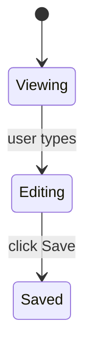

## What this skill does

Standalone entry point for implementing a single existing plan. The user invokes this when they want to run one implementation cycle and stop — to inspect the result before shipping, or to chain manually.

This skill follows `~/.copilot/dreamers/refs/implementation-procedure.md` end-to-end (Step 1 → Step 8) and exits cleanly at the commit. It does NOT push, does NOT open a PR, does NOT update docs. Those belong to close-out (`/dreamers-close-out` or `/dreamers-full`'s Phase 3).

This skill does NOT invoke any other skill. The user is in control of what runs next.

If the user wants the full pipeline (planning + implementation + close-out), they should run `/dreamers-full` instead.

---

## Inlined ref content

Refs below are inlined from `.github/dreamers/refs/` by `scripts/sync-refs.ps1`. Do NOT edit between the XML tags — edit the source file and re-run sync.


Also load at runtime (not inlined — these are templates / project files):
- `~/.copilot/dreamers/templates/logging-standards.md` — logging discipline
- `.github/copilot-instructions.md` (root) — project conventions, **test commands** (binding), build commands.
- `.github/instructions/build.instructions.md` (root, if present) — user-testing build/distribute playbook.
- `.github/instructions/git.instructions.md` (root, if present) — commit message style.
- `./test-benchmarks.md` (root, if present) — test run-time benchmarks for timeout selection.

If no plan path is provided in `$ARGUMENTS`, halt and ask the user — do not invent or skip the plan.

<orchestration-flow>
<!-- GENERATED from .github/dreamers/refs/orchestration-flow.md -- do not edit between tags; edit the source file and re-run scripts/sync-refs.ps1 -->
# Orchestration flow — ref delivery, single-owner todo, continuation principle

Single source of truth for three orchestration principles that apply across all Dreamers skills.

---

## Ref delivery (HARD RULE)

Refs are delivered to skills and agents via **build-time inlining**, not runtime `view` reads. Each consumer file (skill or agent) declares the refs it depends on by placing XML marker pairs (`<NAME>...</NAME>`) at the appropriate position in its body. `scripts/sync-refs.ps1` regenerates the content between the markers from `.github/dreamers/refs/NAME.md` on every sync. CI's `verify-refs` workflow fails any PR whose inlined ref content drifts from the source.

**Implications:**
- Skills and agents no longer need to "load this ref before Step 1" instructions — the ref content is already in the prompt body, between the markers.
- To change a rule that appears in a ref, edit only the source file at `.github/dreamers/refs/NAME.md`. Run `pwsh -File scripts/sync-refs.ps1 -Sync`. Commit the regenerated consumer files alongside the ref edit.
- NEVER edit content between marker tags by hand. The auto-inserted `<!-- GENERATED ... -->` warning comment makes this visible to humans and agents.
- A consumer file MAY still reference templates, project-level files, or other non-ref artifacts at runtime — those remain runtime `view` reads (not in scope for ref inlining).

---

## Single-owner todo rule (HARD RULE)

There is exactly ONE todo list per user-invoked skill run. The skill the user invoked at the top level (`/dreamers-full`, `/dreamers-plan`, `/dreamers-implement`, `/dreamers-fix`, `/dreamers-close-out`, etc.) owns the todo for the duration of its run. No other entity touches it.

### What the orchestrator does

At skill entry:
- Declare the todo via `manage_todo_list`. Each item corresponds to one major phase or step. Declare all items upfront; do not add items mid-run.

During the run:
- Mark the active item `in_progress` when starting.
- Mark it `completed` when done.
- Never batch completions at the end. The todo is a live progress indicator, not a retrospective log.
- Before every meaningful step, re-read the todo to confirm position — the todo is the authoritative "where am I" signal, not chat context.

At skill exit:
- All items should be `completed` (or explicitly noted as deferred/skipped, with reason).

### What subagents do NOT do

Subagents spawned by the orchestrator (Sentinel, Probe, Hone, Echo, Sage) do NOT touch the todo. Their prompts MUST include the line:

> "Do NOT call `manage_todo_list`. The orchestrator owns the todo."

A subagent that creates its own todo creates a parallel state that drifts from the orchestrator's. Don't do it.

### No composed-mode handoff

There is no "composed mode" for the todo. Skills do not invoke other skills as runtime sub-routines in this system. Each user-invoked skill runs end-to-end with its own todo. When a user wants the full pipeline, they run `/dreamers-full`; when they want only planning, they run `/dreamers-plan`; etc. Each run has one owner, one todo, one exit.

This rule replaces the previous "composed vs standalone — sub-skill updates parent's matching item" pattern, which created multi-owner todo state and was the root cause of mid-pipeline progress lapses.

### Granularity

One todo item per major phase or clearly distinct step. Not one per line of work. Not one per sub-step within a phase. Scannable overview, not micro-log.

---

## Continuation principle

### Definition

The orchestrator MUST NOT silently halt mid-feature. At every natural pause — where a phase ends and a meaningful choice about what to do next exists — the orchestrator calls `request_information` with a structured choice block. The user picks `Continue`, `Halt for now`, or `Other (freeform)`. No silent forward progress; no silent stops.

### Pause-point list

The following are the canonical natural pauses where a continuation prompt is required:

1. Between ATOMIC cycles in a multi-plan loop, after each plan's commit and drift check, before the next cycle starts — only when more plans remain.
2. Between LIGHT close-outs in INCREMENTAL multi-plan mode, after each per-plan PR opens, before the next cycle starts — only when more plans remain.

**Approval gates are NOT continuation prompts.** Phase 1c (proposal approval), Phase 1g (plan-file approval), and close-out Step 5 (push approval) each carry their own decision. They do not need a follow-up "do you want to continue?" prompt after they fire. Phase 1g's `Approved — start implementation` answer is itself the proceed signal — no second gate fires between Phase 1g and Phase 1.5 / Phase 2.

### Prompt template

Use this shape for every continuation prompt:

```
<status summary — one sentence stating what just completed>

<concrete next action — one sentence stating what will happen if the user says Continue>

Options:
- label: Continue — <specific yes-action label>
- label: Halt for now — No (halt; resume later)
- label: Other — freeform redirect
```

Call `request_information` with at minimum these three choices. The `Continue` label must name the concrete next action (e.g., "start next cycle for feature-auth/plan-02-logout.md").

### Halt behavior

On `Halt for now` at any continuation prompt: halt cleanly. Output one line stating the resume command:

```
Resume by re-invoking `/dreamers-full` with the remaining plan paths: <paths>
```

(Adapt the resume command to whichever skill the user was running.)

Do not leave partial state dangling. Stage nothing new. Do not proceed.

On `Other`: treat the freeform input as a redirect instruction. Acknowledge it, confirm the new direction, and proceed accordingly.

---

## Tool naming convention

Skills in this system reference two tools by pseudonym. Runtime resolves the pseudonym to whatever Copilot CLI surfaces as the actual tool name at the time of invocation.

| Pseudonym | Tool | What it does |
|-----------|------|--------------|
| `request_information` | Copilot CLI user-prompt tool | Pauses the orchestrator, presents a message and structured choices, waits for the user's response |
| `manage_todo_list` | Copilot CLI todo tool | Creates, updates, and marks items in a persistent todo list visible to the user |

When a skill says "call `request_information`" or "declare via `manage_todo_list`", it means: invoke the tool Copilot CLI has bound to that function at runtime. The pseudonym names are stable across skill files regardless of CLI version.

### Legacy convention note

The `.github/agents/nova.agent.md` file retains the older `ask_user` pseudonym (predates this ref). It is functionally equivalent to `request_information`. Out of scope for the current alignment pass; tracked as a follow-up to harmonize agent files with the skill convention.
</orchestration-flow>

<orchestrator-discipline>
<!-- GENERATED from .github/dreamers/refs/orchestrator-discipline.md -- do not edit between tags; edit the source file and re-run scripts/sync-refs.ps1 -->
# Orchestrator Discipline (mandatory)

When a Dreamers pipeline sub-skill is doing work the orchestrator handles inline — implementation, test writing, comment writing, logging, git operations — these rules apply.

Cited by `/dreamers-plan`, `/dreamers-implement`, `/dreamers-close-out`, `/dreamers-fix`, `/dreamers-pr-resolve`, `/dreamers-full`, and the three reviewer agents (Sentinel, Probe, Hone) for the structured findings format spec. This ref is inlined into every consumer by `scripts/sync-refs.ps1` and CI-verified — to change a rule, edit this file and re-run sync.

---

## Implementation discipline

- **NEVER spawn general-purpose or non-Dreamers subagents.** Implementation work (writing production code, writing tests, running tests, type-checking, running build/lint, git operations, file edits, doc updates beyond Echo-owned scope, PR creation) is done INLINE by the orchestrator using its own Edit / Write / Bash tools. The ONLY subagents Dreamers skills may spawn are: `sentinel` / `probe` / `hone` (read-only review) and `echo` (scoped doc writing) and `sage` (research). See `delegation.md` § "Subagent allowlist" for the full hard rule with the forbidden list. If you find yourself about to call `task` / Agent with `agent_type: "general-purpose"` (or any type outside the 5-item allowlist), STOP — the action belongs to the orchestrator inline or to one of the named Dreamers agents, never to a fallback.
- **Plan adherence:** only edit files in the plan's scope (or that the plan's scope clearly entails). No "while I'm here" cleanup, no unrelated refactors mixed with feature work. If a refactor is genuinely needed for the plan's work, do it as a separate inline step and note it in chat.
- **Incremental edits:** make changes in small, coherent steps. Stage with `git add` as work progresses.
- **No spec-arguing comments:** never add a code comment that argues the spec permits a pattern. If spec interpretation is non-obvious, document the reasoning in the PR description or commit message — never in code comments. When in doubt, implement the cleanest separation and let Sentinel judge.
- **All imports at the top of the file.** Every `import` statement before any declaration, function, or expression. Never insert imports mid-file or at the bottom.
- **Method signature changes:** when changing a signature (sync→async, parameter added/removed/renamed), grep the full codebase for every call site before staging. The plan's listed files are necessary but not sufficient.
- **Zustand creator objects:** never use ES getters (they're evaluated once at creation time and baked as static values, never reactive). Define computed values as exported selector functions outside the store.
- **Branch identity check:** before the first edit, run `git log --oneline -3` and confirm the branch and recent commits match the expected feature branch. If the working tree shows no feature commits for this milestone, stop and surface the discrepancy.
- **Data-model changes:** when a plan supersedes an earlier plan's data model, discard the old model completely. Cite the specific interface definitions from the plan's §Data Models (or equivalent) section before writing any new tables or classes.
- **No dependency installs without permission.** Do not add new packages, run `npm install <pkg>`, `pip install <pkg>`, or equivalent without explicit user approval. If a new dependency is needed for the plan, surface it in chat and ask before installing.
- **Type-check before declaring implementation done.** Run the project's type-check command (from project `.github/copilot-instructions.md`). Fix any errors before moving to the test-run step.

---

## Comment-writing discipline (mandatory — orchestrator is also the implementer)

Pulled from `comment-rules.md`. The orchestrator now writes comments inline, so these rules apply directly to every code edit:

- **No plan/ticket references in source.** Never mention plan files, milestone names (e.g. `D25`, `plan-3`), ticket numbers, or agent names in source code (production OR test).
- **No separator comments.** Never use `// ---`, `// ===`, `// ###`, blank-comment lines, or visual dividers.
- **No spec rationalization comments.** Implement cleanly; let review judge.
- **No redundant JSDoc/KDoc** that only repeats the function signature.
- **Style:** one line when possible; never exceed two lines for inline comments. Write *why*, never *what*. If a comment would need more than two lines to be useful, the code needs refactoring, not more words.
- **When to comment:** non-obvious logic (hidden constraints, gotchas, workarounds for specific bugs), public API documentation callers need, TODO/FIXME with specific actionable notes, license headers.

---

## Logging discipline (mandatory — orchestrator writes log calls inline)

Pulled from `logging-standards.md`. Key rules:

- **Log levels (use the right one):**
  - **ERROR** — unhandled or unexpected failures only. Always include the full error object and stack trace. Never swallow silently.
  - **WARN** — recoverable issues, unexpected-but-handled states, deprecations.
  - **INFO** — lifecycle and business signal. Use for startup config (non-secret), shutdown, incoming requests (method/path/status/duration), outbound HTTP (target/endpoint/status/duration), auth events, key business events.
  - **DEBUG** — high-traceability internal flow. Function entry/exit on non-trivial functions, every branch affecting business outcome, repository/data-layer calls (query + row count), cache hits/misses, retry attempts, state-machine transitions, middleware entries/exits.
- **Hard prohibitions — NEVER log:**
  - Passwords, API keys, tokens, secrets of any kind
  - PII: email addresses, phone numbers, names, addresses, payment data
  - Full request or response bodies (log status codes and durations instead)
- **High-frequency loop internals at DEBUG are allowed** if they add traceability value. Mark them with a `// high-freq` comment so Sentinel can assess noise risk.

---

## Test-writing discipline

- **Tests-first:** write failing tests against the plan's Acceptance Criteria (Given/When/Then with Layer annotations per `plan-content.md`) BEFORE implementing. There is no separate Test Cases section in the new plan format — the ACs are the test specification.
- **AC coverage matrix:** for every plan AC, identify the test(s) that cover it. If an AC has no covering test, write one. Do not declare the cycle done based on test count alone — verify by AC.
- **Layer audit (mandatory after implementation):** for the changed code, ask explicitly per layer:
  - *Unit:* Are there functions, branches, or error paths in the changed code with no unit test?
  - *Integration:* Are there layer boundaries (repo↔DB, service↔API, function↔trigger) exercised by this change without an integration test?
  - *UI / E2E:* Are there user-facing flows, screen states, or navigation paths introduced or changed without a UI / E2E test?
- **Navigation change rule:** when a plan changes how a nav element behaves (tab tap, modal open, screen transition), the work MUST include explicit E2E test cases — not just unit tests.
- **Negative + edge cases:** for non-trivial logic, write tests for invalid input, boundary values, empty/null/max, and error states.
- **No AC labels in test sources:** the AC coverage matrix lives in chat output / the retro. Never label tests with AC numbers, plan refs, or milestone names in source files (no `// AC-3`, no `describe('AC-7: ...')`).
- **No commented-out test bodies:** if a test must be disabled, use the runner's skip mechanism (`it.skip`, `xit`).
- **Test commands:** use ONLY the test commands defined in the project-level `.github/copilot-instructions.md`. Do not invent alternatives. Never run tests in parallel unless they are explicitly confirmed safe to run concurrently (separate runtimes, no shared daemon, no shared lock files, no shared output dirs). When in doubt, run sequentially.
- **Final missed-AC check (mandatory, last item of coverage sweep):** After the layer audit, re-read the plan's Acceptance Criteria one final time. Confirm every AC has a green test. If any AC has no covering test and no documented reason, write the test before signaling cycle complete. This is a hard gate.
- **Regression analysis (mandatory when the originating task is a user-reported bug fix):** when the work in this skill was triggered by a user-reported bug, the close-out retro must answer three questions explicitly:
  1. **Why wasn't this caught?** — which test layer failed (no test existed; test existed but didn't cover this path; test covered it but assertion was wrong; test was skipped/deferred)
  2. **What was added?** — specific test(s) now covering this case (names + file paths)
  3. **What else might be missing?** — adjacent cases the same gap might have left uncovered

---

## Closeout / retro discipline

- **Retro file:** `.dreamers/retros/retro-d<N>-<name>.md` per `close-out-procedure.md` Step 3. Orchestrator writes this inline (FULL close-out mode only).
- **Echo-owned section updates** to `.github/copilot-instructions.md` (Tech stack, Repo structure, Conventions, Key files, Test commands): delegated to the Echo subagent — see `close-out-procedure.md` Step 2 for the inline invocation contract.

---

## Git discipline

- Stage with `git add` as work progresses across all phases. Never commit mid-cycle.
- **One commit per cycle = one commit per plan.** Multi-plan milestones produce N commits on the branch (one per plan in the sequence).
- Commit message follows `.github/instructions/git.instructions.md` (if present) or the conventional-commits style used by recent commits on the default branch. Body MUST include `Plan: feature-<slug>/plan-NN-<name>` — the repo-relative plan path without the `.md` extension and without the `.dreamers/plans/` prefix. Example: `Plan: feature-plan-quality-scoring/plan-01-section-scorer`.
- **Push exactly once**, immediately before `gh pr create` at final close-out. Never push between cycles, never between plans.

---

## Review phase: parallel reviewers + orchestrator-as-fixer

The review phase in `/dreamers-implement` and `/dreamers-pr-resolve` spawns **three reviewers in parallel** via a single tool-call containing 3 Agent sub-tool-uses:

- **Sentinel** — correctness, security, maintainability lenses
- **Probe** — test coverage lens (AC matrix, layer audit, edge cases, gaps)
- **Hone** — simplicity / over-engineering / architectural quality lens

**All three are read-only / report-only.** They identify findings and return them in the structured format below. **None of them edits files** — the orchestrator (which already has the code in context from implementation) applies fixes from the combined findings.

### Structured findings format (mandatory — all three reviewers MUST use)

Each reviewer returns chat output containing:

**Status line** (one of):
- `Approved — no findings`
- `Findings reported — N items`
- `Blocked — <reason>`

**Findings** (if any) — one bullet per finding, exact format:
```
[severity] [lens-tag] file:line — what was wrong → suggested fix
```

Where:
- `severity` is one of: `critical`, `high`, `medium`, `low`
- `lens-tag` is one of: `correctness`, `security`, `maintainability` (Sentinel) / `test-coverage` (Probe) / `simplicity` (Hone)
- `file:line` is the absolute or repo-relative path + line number
- `what was wrong → suggested fix` is a one-line description + targeted fix the orchestrator can apply mechanically

**Observations** (optional, all reviewers) — out-of-scope notes that aren't findings. The orchestrator may or may not act on them.

**Open questions** (optional, all reviewers) — items needing orchestrator or user judgment. Use "none" if no questions.

### Orchestrator-as-fixer behavior

After all three reviewers return their chat output, the orchestrator:

1. **Concatenates the findings** into a single list, sorted by severity (critical → high → medium → low).
2. **Resolves conflicts.** If two findings touch the same `file:line` with contradicting fixes — e.g., Sentinel `[correctness] add defensive check` vs Hone `[simplicity] remove this as over-engineering` — apply the **conflict-resolution rule**:
   - **Correctness > simplicity always.** When in conflict, the correctness/security/maintainability finding wins.
   - **Genuine ambiguity surfaces to user.** If both arguments are equally strong (rare), present the conflict to the user before applying either.
3. **Evaluates each finding against the Major-refactor finding gate** (see sub-section below). For each finding, check the closed criteria checklist. If ANY criterion fires, route through the gate: call `request_information` with the 3-choice template; apply or defer per the user's answer. If no criterion fires, the finding is small — fall through to step 4 and apply inline. The orchestrator NEVER silently applies a finding that meets gate criteria, regardless of severity.
4. **Applies fixes inline** (only for findings that didn't trigger the gate, or that the user opted to apply via the gate). The orchestrator has Edit + Write tools; agents don't. Apply each finding's suggested fix as a targeted edit. Stage with `git add`.
5. **Re-runs type-check + tests after applying fixes** (to catch any regression introduced by fix application).
6. **Handles `Blocked` status from any reviewer** by halting the cycle and surfacing the block to the user. Resolve, then re-spawn the affected reviewer.
7. **Handles open questions** from any reviewer by presenting them to the user before declaring the review phase complete. Open questions still surface to the user; captured decisions still apply inline. The follow-up is re-run tests only — NOT a full re-spawn of Steps 3 + 4 + 5.

If the post-fix test run regresses (tests fail), the orchestrator diagnoses and re-fixes inline — up to 3 attempts, then surfaces to the user.

### Major-refactor finding gate

The orchestrator MUST NOT silently apply a finding that triggers any of the criteria below. The user decides whether to apply now in the current cycle, defer to a follow-up plan, or redirect. This is the mechanism that keeps performance and end-state code quality first-class — Hone (and any other reviewer) surfaces architectural issues without softening; the user disposes via this gate.

**The gate fires regardless of severity.** Critical / high severity findings still go through the gate when they meet the criteria — the user decides apply-now vs defer.

#### Closed criteria checklist (any ONE fires the gate)

A finding is "major-refactor scope" if its suggested fix meets ANY of:

1. **New module or top-level directory.** The fix adds a new module, package, or directory that doesn't exist in the plan's scope.
2. **Schema / data-model change.** The fix modifies a database schema, persisted shape, migration, or core data-model interface.
3. **Cross-cutting refactor.** The fix touches multiple unrelated subsystems (e.g., auth + cache + UI in one fix).
4. **New public exported symbols.** The fix introduces new exported functions, classes, types, or API endpoints not specified in the plan.
5. **Files outside the plan's scope.** The fix touches files not listed in the current plan's §Context or §Out of Scope. Bug-fix flows (`/dreamers-fix`) substitute "files outside the bug-fix surface" — same intent.
6. **Hone-recommended full refactor.** The suggested fix uses scope language like "tear out X across N files," "rewrite Y module," "remove Z abstraction and inline at N call sites" — indicating a refactor that goes beyond the immediate fix site.

The criteria are evaluated by reading the finding's suggested-fix text. If ambiguous, treat as major-refactor (fire the gate). The orchestrator does NOT invent new criteria at runtime; the checklist is closed.

#### Gate prompt template

For each finding (or batched group sharing the same refactor scope), call `request_information` with this block:

```
**Major-refactor finding surfaced.**

Reviewer: <sentinel | probe | hone>
Severity: <critical | high | medium | low>
Lens: <correctness | security | maintainability | test-coverage | simplicity>
Location: <file:line>

Finding:
<what was wrong>

Suggested fix:
<suggested fix verbatim>

Triggered criterion: <N — short label of which criterion fired>
Rationale: <one sentence explaining why criterion N fired for THIS specific finding — e.g., "This fix touches `src/auth/session.ts`, which is not listed in the current plan's scope" or "The suggested fix tears out the cache module across 12 files; meets criterion 6 (Hone-recommended full refactor)">
Breadth estimate: <files touched count, ~LOC, in-plan-scope: yes/no>

Options:
- label: Apply now — refactor in this cycle
- label: Defer — create follow-up plan
- label: Other
```

#### Routing per user's answer

- **`Apply now — refactor in this cycle`** → apply the fix inline at step 4 of orchestrator-as-fixer behavior; re-run tests at step 5; stage with `git add`. The current cycle continues — note this may expand cycle scope significantly; the user has accepted that.

- **`Defer — create follow-up plan`** → do NOT apply the fix. Create a stub plan file at `.dreamers/plans/feature-<deferred-slug>/plan-01-<short-slug>.md` using the canonical plan format from `plan-content.md`. The `<deferred-slug>` is derived from the finding's topic (kebab-case, ≤ 40 chars; e.g., "simplify-notification-factory"). The stub captures the finding verbatim but leaves real ACs / constraints / verification as TODO placeholders for the user to fill in via `/dreamers-plan` later. Stub format:

  ```
  # Plan-01: <short title derived from finding>

  **Date:** <today, YYYY-MM-DD>
  **Status:** Draft
  **Branch:** (TBD — fill in when starting work)
  **User-testing-required:** (TBD)

  ## Goal

  [Finding surfaced during review of <original-plan-path>. Captured for follow-up — fill in concrete done-state when ready to work on it.]

  ## Context

  - Surfaced by: <reviewer agent name>
  - During cycle of: <original-plan-path>
  - Finding verbatim:
    > [severity] [lens-tag] file:line — what was wrong → suggested fix
  - Triggered criterion: <criterion N>
  - Breadth estimate: <files / LOC / in-scope status>

  ## Acceptance Criteria

  <acceptance_criteria>
  1. (TBD — convert the finding's suggested fix into a verifiable AC.)
     *Layer: ___.*
  </acceptance_criteria>

  ## Out of Scope

  - (TBD)

  ## Constraints

  <constraints>
  - (TBD)
  </constraints>

  ## Verification

  - (TBD — fill in commands + files when planning this work)
  ```

  After writing the stub, surface the stub path to the user in chat and continue with the remaining findings. Do NOT mark the deferred finding as applied; do not edit the current cycle's code based on it.

- **`Other`** (freeform) → treat the response as a redirect. If the user clarifies "yes apply", route to Apply now. If they clarify "no defer", route to Defer. If they want something else (e.g., halt the cycle, revise the plan first), follow that direction. The orchestrator never silently applies or defers on `Other`.

#### Batching shared-scope findings

When multiple findings share the same refactor scope (e.g., 3 Hone findings all pointing at the same module), the orchestrator MAY combine them into a single gate call. The prompt lists all findings under one "Triggered criterion" block. The user's single answer applies to all batched findings.

Batching criteria: findings share scope when their suggested fixes touch the same module/directory AND would be implemented as a single refactor. When in doubt, do NOT batch — one gate call per finding is safe; over-batching loses granularity.

#### Severity does NOT bypass the gate

Critical and high severity findings still go through the gate when they meet the criteria. The user decides whether to apply now or defer, regardless of severity. The orchestrator surfaces; the user disposes. Use case: a critical security finding whose fix requires rewriting the entire auth module may be best deferred to a focused follow-up plan rather than mid-cycle, depending on the user's risk model. That's the user's call.

### Re-verification after fixes (mandatory)

**Snapshot first (required on both paths).** Before applying any review findings, snapshot the currently staged files via `git diff --cached --name-only` and `git diff --cached --stat`. This snapshot is the only accurate way to measure the fix-pass delta and is mandatory on the default path AND the second-pass path — without it, the significant-refactor criteria can't be evaluated at all.

After applying fixes from the first parallel review, the orchestrator re-runs the project's test command ONLY. No reviewer is re-spawned by default. A second 3-parallel pass occurs ONLY when the significant-refactor criteria fire AND the user explicitly opts in via `request_information`.

**Default path (no second pass):** snapshot → apply fixes → re-run tests → update `./test-benchmarks.md` → commit.

**Second-pass path (opt-in only):** snapshot → apply fixes → re-run tests → update `./test-benchmarks.md` → check significant-refactor criteria (see below) → if criteria fire, call `request_information` with (a) which criterion fired and the measured values, (b) one-sentence reasoning for why a second pass is recommended, (c) explicit choices `["Run second 3-parallel pass", "Skip — commit as-is", "Other"]`. On `Skip` = commit as-is. On `Other` = present the user's freeform response back to them as a redirect and halt — do not auto-commit and do not auto-spawn reviewers. On `Run second 3-parallel pass` = re-spawn Sentinel + Probe + Hone, re-apply findings, re-run tests, and update `./test-benchmarks.md` again with the second-pass run time before commit.

### Significant-refactor criteria

Diff the post-fix staged state against the snapshot captured in Re-verification (above) to measure the fix-pass delta. A second 3-parallel pass is eligible (not automatic — still requires user opt-in) when ANY ONE of the following fires:

1. More than 5 production files touched in the fix pass.
2. More than 150 LOC of production code changed in the fix pass.
3. A new file was added by the fix pass.
4. A new exported or public symbol was introduced by the fix pass.
5. Code was moved between modules in the fix pass.

**Test files are excluded from the LOC and file-count criteria** (criteria 1 and 2 only). Structural criteria (3–5) apply to all file types.

OR semantics: any single criterion firing is sufficient to make the second pass eligible.

### Parallel spawn — invocation pattern

In the skill body, the review phase is described as a single tool-call with 3 Agent sub-tool-uses (Claude Code idiom) or 3 parallel `task()` invocations (Copilot CLI idiom). Skills should specify intent ("spawn S + P + H in parallel; wait for all three to complete") and let the runtime execute per its primitives. If a runtime doesn't support parallel spawn, the skill still works — wall-clock cost increases but correctness is preserved.
</orchestrator-discipline>

<delegation>
<!-- GENERATED from .github/dreamers/refs/delegation.md -- do not edit between tags; edit the source file and re-run scripts/sync-refs.ps1 -->
# Delegation Protocol

Each Agent tool invocation must include in the prompt:
- **Context** — what this agent is being asked to do and why
- **Prior work** — what was done previously, with absolute paths to any output files to read
- **What is needed** — specific deliverable expected from this agent
- **Constraints** — hard rules the agent must not violate
- **Definition of Done** — how to know the work is complete
- **Plan file path** — absolute path to the relevant plan file (if applicable)

## MANDATORY — Agent mode

All agents MUST be invoked with `mode: "sync"`. The agent blocks until completion and returns its summary inline. The orchestrator gates on the result before firing anything else.

For the parallel reviewer triad in `/dreamers-implement` Step 5 and `/dreamers-pr-resolve` Step 5: spawn Sentinel + Probe + Hone in a single tool-call with 3 Agent sub-tool-uses. All three run concurrently; the orchestrator waits for all three before applying findings.

## MANDATORY — Reading templates and project files at runtime

Refs are inlined into every consumer at build time by `scripts/sync-refs.ps1`; they are part of the live prompt and do not require a runtime read. Templates (`~/.copilot/dreamers/templates/*.md`) and project files (`.github/copilot-instructions.md`, `.github/instructions/*.md`) are NOT inlined and MUST be read in full using the `view` tool when a skill or agent reaches them. Never use shell commands (`cat`, `head`, `tail`, `Select-String`) to read templates or project files — they truncate. Every line matters.

## Subagent allowlist (HARD RULE — read this twice)

The ONLY subagent types a Dreamers skill may spawn are the five below. Any other agent type is FORBIDDEN. There is no fallback, no "general-purpose for when nothing fits" escape hatch.

### Allowed (the only types you may pass as `agent_type` in a `task` / Agent tool call)

- **`sentinel`** — read-only review of correctness, security, maintainability. Returns structured findings; the orchestrator applies fixes. One of the three parallel reviewers per cycle. Also invokable standalone via `/dreamers-review`.
- **`probe`** — read-only review of test coverage (AC matrix, layer audit, edge cases, regression risk). Returns structured findings. One of the three parallel reviewers per cycle. Also invokable standalone via `/dreamers-test`.
- **`hone`** — read-only review of simplicity, over-engineering, redundancy, bad architecture. May recommend full refactors. Returns structured findings. One of the three parallel reviewers per cycle. Also invokable standalone via `/dreamers-simplify`.
- **`echo`** — documentation. Updates Echo-owned sections of `.github/copilot-instructions.md` plus other project docs after a cycle. Spawned inline at `close-out-procedure.md` Step 2, and by the `/dreamers-docs` standalone skill for ad-hoc doc updates.
- **`sage`** — deep multi-perspective research. Used by `/dreamers-research`. Orthogonal to the pipeline.

### Forbidden (must NEVER appear as `agent_type` from a Dreamers skill)

- **`general-purpose`** — NEVER. If you reach for general-purpose to "implement," "edit a file," "run a test," or "do git work," that is a bug. Implementation is INLINE by the orchestrator. There is no fallback.
- **`claude`**, **`claude-code-guide`**, **`Explore`**, **`Plan`** (capital-P architect agent), **`statusline-setup`**, **`vercel:*`** — host-runtime agents from other systems. NEVER spawn from a Dreamers skill.
- **`forge`**, **`nova`** — these are USER-ENTERED personas (via `/agents forge` or `/agents nova`). Skills do NOT spawn them as subagents.
- **`bolt`** — does not exist as a subagent in this Dreamers system. Implementation, git ops, and PR creation are done INLINE by the orchestrator.
- **Anything not in the 5-item allowlist above** — NEVER.

### Runtime hard stop

Before EVERY `task` / Agent tool call, check the `agent_type` argument:

- ✅ If `agent_type` is one of `sentinel` / `probe` / `hone` / `echo` / `sage` → proceed.
- ❌ If `agent_type` is anything else → STOP. Do not spawn. The action you're about to delegate either:
  - (a) belongs to the orchestrator INLINE (writing code, writing tests, running tests, git operations, doc updates, file edits, PR creation), OR
  - (b) needs the right Dreamers agent — re-evaluate which of Sentinel / Probe / Hone / Echo / Sage fits.

There is no third option. There is no "general-purpose because I'm not sure which agent to use" path.

## What implementation looks like (NO subagent)

Implementation (writing production code, writing tests, running tests, type-checking, running build / lint / format, git operations including `add` / `commit` / `push` / `mv` / `rm`, branch setup, doc updates, PR creation via `gh`) is the orchestrator's lane — done inline using the orchestrator's Edit / Write / Bash tools. The five allowed subagents are read-only reporters (Sentinel / Probe / Hone return findings) or scoped doc-writers (Echo edits docs only) — none of them write production code or run the build.

## Read-only reviewer lanes

The three reviewer agents (Sentinel, Probe, Hone) have **`tools: Read, Glob, Grep, Bash`** in their frontmatter — no Write or Edit. They cannot modify files. They return structured findings per the spec in `orchestrator-discipline.md`; the orchestrator applies fixes inline.

## Conflict resolution between reviewers

When two reviewers' findings touch the same `file:line` with contradicting fixes (e.g., Sentinel `[correctness] add defensive check` vs Hone `[simplicity] remove this as over-engineering`):

- **Correctness > simplicity always.** When in conflict, the correctness/security/maintainability finding wins.
- **Genuine ambiguity surfaces to user.** If both arguments are equally strong (rare), present the conflict before applying either.

See `orchestrator-discipline.md` § "Orchestrator-as-fixer behavior" for the full handling rules.
</delegation>

<git-workflow>
<!-- GENERATED from .github/dreamers/refs/git-workflow.md -- do not edit between tags; edit the source file and re-run scripts/sync-refs.ps1 -->
# Git Workflow (mandatory)

Every milestone uses a feature branch + PR — never work directly on the default branch.

## Startup verification (do this FIRST)
1. Detect the repo's default branch:
   ```bash
   DEFAULT_BRANCH=$(git symbolic-ref refs/remotes/origin/HEAD 2>/dev/null | sed 's@^refs/remotes/origin/@@')
   [ -z "$DEFAULT_BRANCH" ] && DEFAULT_BRANCH=$(gh repo view --json defaultBranchRef -q .defaultBranchRef.name 2>/dev/null || echo "main")
   ```
   Store `$DEFAULT_BRANCH` — use it everywhere `main` would have been used.
2. `git fetch origin && git log origin/$DEFAULT_BRANCH --oneline -5` — anchor to remote truth before reading any `.dreamers/` files. Workspace files are local-only and may be stale. `origin/$DEFAULT_BRANCH` is the authoritative record of what is actually shipped.

## Branch setup (before invoking `/dreamers-implement`)
1. `git checkout $DEFAULT_BRANCH && git pull origin $DEFAULT_BRANCH` — never build off a stale local default branch.
2. Cut `feat/<slug>` from `$DEFAULT_BRANCH`.
3. Confirm `.dreamers/` is in the project's `.gitignore`. If not, add it before any further edits.
4. **Archive prior feature's plan directory** — check if the previous feature's PR is merged (`gh pr list --state merged` or `gh pr view <number>`):
   - **Merged:** move the entire feature directory from `.dreamers/plans/feature-<slug>/` to `.dreamers/plans/archive/feature-<slug>/` (create the archive dir if it doesn't exist). The PR description is the lasting public record; the archived feature directory is preserved locally for easy reference. Use `mv` (or `Move-Item`), not `rm` — never delete plan files. Mid-feature archive (file-by-file) is NOT allowed; only whole-feature-directory archive at the milestone-final PR merge.
   - **Not merged:** leave the feature directory in place.
   - **Note:** this step catches prior features not already archived by `/dreamers-close-out` Step 7 (the primary archive trigger). If close-out already ran on the prior feature, the source directory won't exist and the `mv` is a no-op — skip silently.
5. No init commit — the first commit for the milestone is the first thing in the PR diff.

## Commit discipline (non-negotiable)
1. **Commit at end of each cycle** — one commit per plan in the sequence (single-plan: one commit total; multi-plan: N commits, one per plan).
2. **Commit before PR creation** — a final commit capturing any last changes before opening the PR.
3. **No auto-commit after PR is created** — if changes are made after `gh pr create`, do NOT commit automatically. Ask the user first.

## Push discipline (non-negotiable)
`git push` happens EXACTLY ONCE — immediately before `gh pr create` at final close-out. Never push after intermediate commits, between cycles, or at any other point in the pipeline.

## Post-PR push discipline
If the user approves a post-PR commit, push with `git push` (no force). The PR will update automatically.

## Commit structure (one commit per cycle)
- Exactly **one** commit per plan/cycle, immediately after the reviewer findings have been applied and tests are green (and user testing, if required, is signed off).
- The orchestrator stages changes with `git add` throughout the cycle but does **not** run `git commit` until the cycle ends.
- Commit message format follows `.github/instructions/git.instructions.md` (if present). Pipeline-specific bits:
  - Subject: `feat: <plan-name>` (or `feat!: <plan-name>` for breaking changes — see git.instructions.md for the breaking-change footer rule)
  - Body: reference the plan file (e.g. `Plan: feature-auth/plan-01-login-flow`) — repo-relative path without `.md`, without `.dreamers/plans/` prefix

One commit per plan keeps each plan's contribution atomic. Reviewer-fix application is part of the same cycle (not separate commits).

## What gets committed
Nothing in `.dreamers/` is committed — all workspace files (plans, retros, improvements.md) are gitignored and stay local. Ensure `.dreamers/` is in the project's `.gitignore`.

## No worktrees
The orchestrator works directly on the feature branch. Worktrees previously caused reviewers to read stale default-branch code.

## Git history is the archive
No separate archive directories. `git log` and PR diffs are the record.
</git-workflow>

<agent-recovery>
<!-- GENERATED from .github/dreamers/refs/agent-recovery.md -- do not edit between tags; edit the source file and re-run scripts/sync-refs.ps1 -->
# Agent Failure Recovery (mandatory)

When a spawned agent hits a rate limit, crashes, or times out mid-run:
1. Read whatever workspace files the agent managed to write before failing.
2. Determine which steps completed and which remain (check workspace outputs, git log, test results).
3. Complete remaining steps directly (you have Read, Write, Edit, Glob, Grep, Bash in the main conversation) or re-spawn the agent scoped to only the remaining work.
4. Do not re-run steps that already completed — build on partial progress.
</agent-recovery>

<implementation-procedure>
<!-- GENERATED from .github/dreamers/refs/implementation-procedure.md -- do not edit between tags; edit the source file and re-run scripts/sync-refs.ps1 -->
# Implementation Procedure (canonical)

This ref is the SOLE source of truth for the Dreamers implementation phase (one cycle per plan). Both `/dreamers-implement` (standalone) and `/dreamers-full` (end-to-end pipeline) follow this procedure for each plan in their sequence. There is no composed-mode branching.

---

## Inputs

- A **plan file path** (`.dreamers/plans/feature-<slug>/plan-NN-<name>.md`).
- The branch the cycle runs on (the orchestrator handles branch setup before invoking this procedure; this procedure assumes the correct branch is already checked out).
- Optional **shared context payload** when invoked from a manifest-mode pipeline run — the manifest's Shared constraints / design decisions / data models / end-to-end ACs are threaded into the per-cycle reviewer prompts. Skip if no shared context was passed.

## Outputs

- One commit on the branch (the cycle's commit, with `Plan: feature-<slug>/plan-NN-<name>` in the body).
- Updated `./test-benchmarks.md` row if the project uses one.

This procedure runs ONE cycle per invocation. Multi-plan sequences run this procedure N times.

The orchestrator's todo (a single list owned by the top-level skill) records cycle completion.

---

## Subagent failure recovery (applies to any reviewer invocation below)

Per `agent-recovery.md`: if Sentinel, Probe, or Hone hits a rate limit, crashes, or times out mid-run:

1. Read whatever the failing reviewer managed to write before failing (chat output, any staged files via `git status`).
2. Determine which checks completed and which remain.
3. Complete remaining work inline (the orchestrator has Read/Write/Edit/Bash) OR re-spawn the affected reviewer scoped to only the remaining work. The other two reviewers' outputs are unaffected — do not re-spawn them.
4. Do not re-run steps that already completed — build on partial progress.

---

## Step 1 — Read plan + write failing tests

Read the plan file passed as input.

Read the plan's Acceptance Criteria (numbered Given/When/Then with `*Layer: ...*` annotations per `plan-content.md`). For each AC, write at least one failing test that would verify it, at the layer the annotation specifies. There is no separate Test Cases section in the new plan format — the ACs are the test specification.

- Tests live wherever the project's test convention specifies (consult `.github/copilot-instructions.md`).
- Stage with `git add`.
- Do not run yet — they should fail.

## Step 2 — Implement

**HARD STOP — implementation is inline.** The orchestrator (running this procedure in its context) edits files directly using Edit / Write / Bash tools. **Do NOT spawn any subagent to write code.** Specifically:
- ❌ `agent_type: "general-purpose"` → FORBIDDEN. There is no general-purpose fallback for implementation.
- ❌ Any other host-runtime agent → FORBIDDEN.
- ❌ `agent_type: "forge"` / `"nova"` / `"bolt"` → FORBIDDEN (these are not subagents in this system — see `delegation.md`).
- ✅ The only `agent_type` values you may spawn during this procedure are `sentinel` / `probe` / `hone` in Step 5 (parallel review). Nothing else.

If you reach the implementation step and find yourself thinking "let me delegate this to an agent," that's the bug. The orchestrator does the implementation.

Follow the **Implementation discipline** rules in `orchestrator-discipline.md`:
- Edit only files in the plan's scope.
- No while-I'm-here cleanup, no unrelated refactors mixed with feature work.
- All `import` statements at the top of each file.
- Method-signature changes: grep the full codebase for every call site before staging.
- No spec-arguing comments in source.
- No dependency installs without explicit user approval — surface and ask first if a new dependency is required.
- Stage with `git add` as work progresses.

## Step 3 — Type-check + run tests

1. Run the project's type-check command. Fix any errors before proceeding.
2. Run the project's test command (scoped to the new tests if the runner supports it; else full suite). Use the recommended timeout from `./test-benchmarks.md` if the file exists.

If tests fail:
- Diagnose. Fix inline (production code, not the tests — the tests express the spec).
- Re-run. Repeat up to 3 attempts.
- If still failing after 3 attempts, stop and surface to the user. Do not loosen the tests to make them pass.

Update `./test-benchmarks.md` with the actual run time after the suite passes (per `testing-mandate.md`).

## Step 4 — Coverage sweep (mandatory, unskippable checklist)

After tests are green, run the coverage sweep before invoking the reviewers:

- [ ] **AC coverage matrix:** for every plan AC, name the test(s) that cover it. Any AC without a covering test → write one now.
- [ ] **Layer audit — Unit:** for each changed file, are there functions, branches, or error paths with no unit test?
- [ ] **Layer audit — Integration:** are there layer boundaries (repo↔DB, service↔API, function↔trigger) exercised by this change without an integration test?
- [ ] **Layer audit — UI / E2E:** are there user-facing flows, screen states, or navigation paths introduced or changed without a UI / E2E test? (Navigation change = E2E required, not optional.)
- [ ] **Negative + edge cases:** for each piece of non-trivial logic, is there a test for invalid input, boundary values, empty/null/max, error states?
- [ ] **Regression risks:** anything in the change that touches existing behavior — is the most likely regression covered?
- [ ] **Final missed-AC check:** re-read the plan's Acceptance Criteria one last time and confirm every AC has a green test. Hard gate.

Any gap → write the test now. Re-run the test command. Loop until all checklist items pass.

## Step 5 — Parallel review (Sentinel + Probe + Hone)

Spawn **three reviewers in parallel** in a single batched `task` call. All three are read-only / report-only; each returns structured findings in the format from `orchestrator-discipline.md`. None of them edits files.

**Subagent prompt rule (every spawn):** include the line "Do NOT call `manage_todo_list`. The orchestrator owns the todo." in each subagent's prompt. Subagents must not touch the todo mechanism — that's the orchestrator's lane.

Common prompt context for all three:
- Plan file path
- Scope: list of changed files from `git status`
- Branch + default branch names
- What the orchestrator has done: written failing tests, implemented, type-checked, ran tests (passing), completed coverage sweep.
- **Shared context (if applicable)** — when manifest-mode is in effect, the orchestrator passes the manifest's Shared constraints + Shared design decisions + Shared data models + End-to-end ACs verbatim under a "Feature context" header. Reviewers use this to evaluate the current plan in light of the full feature.

Per-reviewer prompt addition:

**Sentinel** (`agent_type: "sentinel"`, `mode: "sync"`):
- Lenses: correctness, security, maintainability.
- Out of scope: test coverage (Probe's lane), simplicity (Hone's lane).
- Return: structured findings per the spec, plus plan-alignment summary.

**Probe** (`agent_type: "probe"`, `mode: "sync"`):
- Lens: test coverage (AC matrix, layer audit, edge cases, gaps).
- Out of scope: correctness/security/maintainability (Sentinel's lane), simplicity (Hone's lane).
- Return: structured findings per the spec, plus plan AC coverage table.

**Hone** (`agent_type: "hone"`, `mode: "sync"`):
- Lens: simplicity / over-engineering / redundancy / architectural quality.
- Out of scope: correctness/security/maintainability (Sentinel's lane), test coverage (Probe's lane).
- Return: structured findings per the spec.
- **Mandate reinforcement (include in Hone's prompt verbatim):** "Aggressively flag bad architecture, over-engineering, redundancy, and simpler alternatives. Refactor cost is NOT a moderating factor — do not soften, hedge, or omit findings because the fix is big. When the suggested fix has architectural scope (touches files outside the plan, requires a new module, requires schema or symbol changes, or amounts to a full refactor of a subsystem), state the scope explicitly in the suggested-fix text. The orchestrator's major-refactor finding gate (per `orchestrator-discipline.md`) routes those findings through the user for apply-now vs defer decisions. Your job is to surface; the gate handles disposition."

## Step 6 — Apply findings inline (orchestrator-as-fixer)

Concatenate findings from all three reviewers per the orchestrator-as-fixer behavior in `orchestrator-discipline.md`:

1. **Sort by severity** (critical → high → medium → low).
2. **Resolve conflicts** per the conflict-resolution rule: correctness > simplicity. Genuine ambiguity → surface to user before applying.
3. **Evaluate each finding against the Major-refactor finding gate** per `orchestrator-discipline.md` § "Major-refactor finding gate." For each finding, check the closed 6-criterion checklist (new module / schema change / cross-cutting refactor / new exported symbols / files outside plan scope / Hone-recommended full refactor). If ANY criterion fires, call `request_information` with the 3-choice template from the canonical rule (`Apply now — refactor in this cycle` / `Defer — create follow-up plan` / `Other`) and route per the user's answer. On `Defer`, create the stub plan file at `.dreamers/plans/feature-<deferred-slug>/plan-01-<short-slug>.md` per the canonical template; do NOT apply the fix. The orchestrator NEVER silently applies a gate-triggering finding, regardless of severity.
4. **Apply each (non-deferred) fix inline** as a targeted Edit. Stage with `git add` as you go. Findings that didn't trigger the gate, OR that the user opted to `Apply now` via the gate, apply here.
5. **Re-run type-check + tests** after all fixes applied. If regressions appear, diagnose + re-fix inline (up to 3 attempts, then surface to user).

Handle non-finding outputs:
- Any reviewer returns **`Blocked — <reason>`** → halt cycle; surface; resolve; re-spawn the affected reviewer only.
- Any reviewer returns **open questions** → present each to the user before proceeding. Capture decisions; apply.
- All three return **`Approved — no findings`** → proceed to Step 7 directly. No fix application needed.

After fix application (or skip + any deferred stubs written), proceed to Step 7.

## Step 7 — User testing (if required)

Check the plan's `User-testing-required` field.

- **`no`** → proceed directly to Step 8.
- **`yes`** → pause the cycle by calling `request_information`. Do not commit until the user explicitly approves.

The `request_information` call MUST include every item below:

- **Plan being tested:** ID + full path (e.g. `plan-01-section-scorer` → `.dreamers/plans/feature-plan-quality-scoring/plan-01-section-scorer.md`).
- **Build / distribution details:** check for `.github/instructions/build.instructions.md` at the project root.
  - **If present:** follow it exactly. Execute only the steps it explicitly authorises the orchestrator to run. Surface every user-action step verbatim.
  - **If absent:** state plainly that there is no `build.instructions.md`. Ask the user to either build/distribute the test build themselves and confirm when ready, OR provide the steps so a `build.instructions.md` can be created. Do not invent build steps.
- **What changed in this cycle:** 1–3 bullets summarising the user-visible behaviour delivered.
- **Step-by-step test steps:** numbered, concrete, reproducible. Derive directly from the plan's Acceptance Criteria (Given/When/Then with Layer annotations).
- **Known limitations / out-of-scope:** anything the user might try that this cycle deliberately doesn't cover.
- **How to respond:**
  - `Approved — continue` (procedure proceeds to Step 8)
  - `Bug: <description>` (procedure fixes inline, re-runs tests, re-distributes per `build.instructions.md` rules, re-calls `request_information` with refreshed test steps)
  - Freeform notes / corrections are also accepted and treated as bugs unless clearly approving.

**Resume rules:**
- On `Approved — continue` → proceed to Step 8.
- On any bug or correction → **fix inline.** No Sentinel re-invocation: during user-testing rounds, the user IS the test layer. Diagnose → fix in production code → re-run the test command → re-build/distribute → re-call `request_information` with refreshed test steps. Do NOT commit until explicit approval.

## Step 8 — Commit the cycle

Run `git status` to confirm staged content. Run `git commit` with a message following the project's commit-message style (see `.github/instructions/git.instructions.md` if present).

**Plan reference (mandatory):** the commit body MUST include a line of the form:

```
Plan: feature-<slug>/plan-NN-<name>
```

Repo-relative plan path WITHOUT the `.md` extension and WITHOUT the `.dreamers/plans/` prefix. Example: `Plan: feature-plan-quality-scoring/plan-01-section-scorer`. This format is required for `/dreamers-close-out` standalone auto-detection to find the plan.

One commit per cycle. Do NOT push — push happens at close-out per `pr-procedure.md`.

---

## What happens after this procedure ends

This procedure ends at Step 8 commit. What happens next depends on the consuming skill:

- **`/dreamers-full`** (end-to-end pipeline): the orchestrator's todo records this cycle complete and moves to the next plan in the sequence (if multi-plan) OR proceeds to close-out (if last plan).
- **`/dreamers-implement`** (standalone): exit with success. Surface the commit hash and AC coverage matrix to the user. Next step (their choice): more cycles via another `/dreamers-implement` invocation against the next plan, OR `/dreamers-close-out` if all plans are shipped.

Either consumer maintains its own todo (single-owner rule). This procedure does not touch the todo.
</implementation-procedure>

<plan-content>
<!-- GENERATED from .github/dreamers/refs/plan-content.md -- do not edit between tags; edit the source file and re-run scripts/sync-refs.ps1 -->
# Plan Content Rules

Every plan uses `~/.copilot/dreamers/templates/plan.md` as the starting structure. Copy it, fill in the sections, remove any that don't apply.

## Required metadata block

Top of file, just under the H1 title:

- `# Plan-NN: {short-title}` — filename matches `plan-NN-{slug}.md` (NN is the zero-padded order within the feature dir)
- `**Date:**` YYYY-MM-DD
- `**Status:**` Draft / Active / Completed / Superseded
- `**Branch:**` feat/{slug} (or fix/{slug} for bug-fix plans)
- `**User-testing-required:**` yes / no

No `Owner`, no `Scope`, no `Links` metadata fields. They belong in the PR description.

## Required sections

In this order — Verification ALWAYS LAST (Anthropic recency-bias rule):

1. **Goal** (mandatory) — one paragraph. What is true when this plan is done that wasn't true before.
2. **Context** (mandatory) — ≤ 200 words. Bullet links to relevant files / prior plans / PRs. NO motivation prose ("this is important because..."); that belongs in Goal or the PR description.
3. **Acceptance Criteria** (mandatory) — XML-wrapped, numbered G/W/T with Layer annotations. See "Acceptance Criteria format" below.
4. **Out of Scope** (mandatory) — explicit bullets. "Will NOT touch X." "Will NOT change Y."
5. **Constraints** (mandatory) — XML-wrapped. Technical / process / hard rules. See "Constraints format" below.
6. **Design Decisions** (optional but recommended) — only when there are non-obvious choices. See "Design Decisions format" below.
7. **UI** (optional) — only when the plan has a user-visible surface. See "UI section" below.
8. **Verification** (mandatory, bottom of file) — commands to run + files to inspect + smoke check. 5–8 lines max.

## Acceptance Criteria format

XML-wrapped, numbered, each item in Given/When/Then form with a layer annotation:

```
<acceptance_criteria>
1. Given <state>, when <trigger>, then <observable outcome>.
   *Layer: unit.*
2. Given ..., when ..., then ...
   *Layer: integration.*
</acceptance_criteria>
```

**Layer label set (closed):** `unit` / `integration` / `E2E` / `perf`. Compound labels allowed when one test serves two purposes (e.g., `*Layer: integration / perf.*`).

**Why the layer annotation:** `/dreamers-implement` Step 1 writes failing tests from each AC; the layer label tells the implementer which test layer to write in. Probe's coverage sweep in Step 4 reads these labels to verify coverage at every layer.

**Number of ACs:** soft minimum 2. A plan with only one AC produces a Phase 1f soft warning (overridable with user confirmation if the work is genuinely single-AC).

**"And" continuation** is allowed for compound outcomes:

```
1. Given a feature with 3 plans, when ship-strategy is "atomic", then no PR opens until all 3 plans complete; and on any plan failure, the entire feature reverts.
   *Layer: integration.*
```

## Constraints format

XML-wrapped, organized into 3 sub-categories:

```
<constraints>
- **Technical:** stack / perf / libs.
- **Process:** gates / review / tests.
- **Hard rules:** "never do Z" — the rationale-bearing constraints that prevent the agent from relaxing the rule.
</constraints>
```

## Design Decisions format

Optional section. Include ONLY when the plan has non-obvious choices the implementer needs the rationale for (so the agent doesn't relax a constraint it shouldn't, and doesn't re-ask a question the planning conversation already answered).

One entry per significant choice:

- **Decision:** what was chosen
- **Rationale:** why — one sentence
- **Rejected:** alternatives considered — one line each

Skip the section entirely on trivial plans where no decision is non-obvious.

## UI section (3-layer convention)

Include this section ONLY when the plan has a user-visible surface (UI screen, CLI output, chat block, IDE pane, etc.).

**Layer 1 — ASCII layout (MANDATORY when UI section exists):**

Box-drawing characters in a code-fenced block. Shows spatial arrangement.

```
┌─ Header: title ───────────────────────────┐
│  Body content                              │
│    Nested element                          │
│  [Action button]   [Cancel]                │
└────────────────────────────────────────────┘
```

**Layer 2 — Component spec (MANDATORY when UI section exists):**

Two acceptable formats — writer's choice based on row count and cell length:

Table form (good for ≤ 5 components, short cells):

| Component | Type | Behavior | Source data |
|---|---|---|---|
| ... | ... | ... | ... |

OR per-component subsections (good when behavior descriptions are long):

```
### ComponentName
- **Type:** <UI primitive>
- **Behavior:** <what it does, when it's disabled, etc.>
- **Source data:** <where the data comes from>
```

**Layer 3 — Mermaid state/flow (OPTIONAL):**

Use only when the UI has interactive state transitions or branching flows that prose would describe verbosely.



Layer 4 (pseudo-JSX) is NOT used. Sage's research flagged it as risky — agents treat it as ground truth and over-fit.

## Verification format

Plain markdown (NOT XML-wrapped). 5–8 lines max. Commands and files, not narrative.

- **Test command:** the command from `.github/copilot-instructions.md`
- **Type-check command:** the command from `.github/copilot-instructions.md`
- **Files to inspect after implementation:** absolute or repo-relative paths
- **Smoke check:** one or two specific commands or manual steps not covered by automated tests

NO retelling of ACs. ACs are already specified above; Verification is the closing checklist of commands to run.

## XML escaping rule

Inside `<acceptance_criteria>` and `<constraints>` blocks, if you need to write literal angle brackets in content (e.g., a constraint that describes another plan's XML structure), use HTML entity escapes:

- `&lt;` for `<`
- `&gt;` for `>`
- `&amp;` for `&`

Renderers (GitHub, VS Code preview) decode these to literal characters in the display. The parser used by `/dreamers-plan` Phase 1f is entity-aware — it sees `&lt;/acceptance_criteria&gt;` as text content, not a closing tag.

Phase 1f only flags genuinely-malformed structural XML (e.g., missing closing tag at the right nesting depth), not literal text content that happens to contain `<` or `>`.

## Code in plans (mandatory rule)

Plans must NOT include code snippets. Implementation is the orchestrator's domain.

**One exception:** interface and type contracts where the signature itself IS the design decision (e.g., a new public API shape). In this case:
- Include the interface/type signature only — no implementation bodies.
- State the file path and package where it will live.
- Keep it minimal: the contract, not the code.

## Plan length

- **Target:** 200–400 lines.
- **Hard cap:** 600 lines. If a plan exceeds 600 lines, split it into two plans within the feature directory.

Research evidence ([Sage report §verbosity U-curve](.dreamers/sage/plan-format-research/report.md)) shows execution accuracy degrades past 600 lines for LLM consumers; technical-writing literature shows human readers disengage past ~400.

## Sections NOT to include in a plan

The following are explicitly out — do not add them to plans even if you think they'd help. Each item lists where the equivalent information goes instead.

- **Summary** — write a **Goal** paragraph instead.
- **Scope / Non-goals** — split across **Context** (bullet links to relevant code) and **Out of Scope** (explicit "will NOT" bullets).
- **Test Cases** as a standalone section — embed in **Acceptance Criteria** as `*Layer: ...*` annotations on each AC.
- **Rollback Boundary** — write in PR description / commit body. Not a plan section.
- **Risks / Mitigations** — write real risks as hard rules inside **Constraints** ("never do Z"). Decorative risk enumeration adds no execution value.
- **Post-merge gates** — write in PR description.
- **Deferred Items** — write in PR description.
- **Owner / Stakeholders / Links** metadata — write in PR description.
- **Open Questions** — banned. All open questions must be resolved in the planning conversation BEFORE plan generation. A plan with open questions is not ready to ship.
- **Race conditions sub-table** — write into Constraints when relevant.

## Multi-plan work

When the scope of work is too large for one plan, planning produces **multiple plans inside a feature directory**: `.dreamers/plans/feature-<slug>/plan-01-<name>.md`, `plan-02-<name>.md`, etc.

For multi-plan features with shared cross-plan context, an OPTIONAL **manifest** lives at `.dreamers/plans/feature-<slug>/manifest.md`. See `feature-decomposition.md` § "Manifest pattern" for when to use one.

Single-plan features still get a feature directory: `.dreamers/plans/feature-<slug>/plan-01-<name>.md` — no manifest needed.
</plan-content>

<comment-rules>
<!-- GENERATED from .github/dreamers/refs/comment-rules.md -- do not edit between tags; edit the source file and re-run scripts/sync-refs.ps1 -->
# Comment Rules

## Core principle
Comments must add value that the code cannot express itself. Concise, no fluff, no separators — value only.

## When to comment
- Non-obvious logic: why a non-obvious approach was chosen, constraints, gotchas
- Public API documentation callers need to use the interface correctly
- TODO/FIXME with specific, actionable notes
- License headers

## When NOT to comment
- Code that reads naturally from well-named functions and variables
- Anything that restates what the code obviously does (`const isRunning` does not need `// tracks whether running`)

## Strict prohibitions
- **No plan/ticket references** — never mention plan files, milestone names (D25, plan-3), ticket numbers, or agent names in source code
- **No separator comments** — never use `// ---`, `// ===`, `// ###`, blank-comment lines, or visual dividers
- **No spec rationalization** — never write comments arguing a spec permits a pattern; implement cleanly and let review judge
- **No redundant JSDoc/KDoc** that only repeats the function signature

## Style
- One line when possible; never exceed two lines for inline comments
- Write *why*, never *what*
- If a comment requires more than two lines to be useful, the code needs refactoring, not more words
</comment-rules>

<testing-mandate>
<!-- GENERATED from .github/dreamers/refs/testing-mandate.md -- do not edit between tags; edit the source file and re-run scripts/sync-refs.ps1 -->
# Testing Coverage Mandate (MANDATORY)

Every plan must express its test coverage intent through the Acceptance Criteria's Layer annotations. The planner specifies *what observable outcome* the AC requires and *which test layer* covers it. The implementer (orchestrator at `/dreamers-implement` Step 1) writes the actual tests from each AC's Given/When/Then.

## How test coverage is expressed in plans (new format)

Plan ACs are numbered Given/When/Then statements with a Layer annotation per AC. See `plan-content.md` § "Acceptance Criteria format" for the canonical spec.

```
<acceptance_criteria>
1. Given <state>, when <trigger>, then <observable outcome>.
   *Layer: unit.*
2. Given <state>, when <trigger>, then <observable outcome>.
   *Layer: integration.*
3. Given <state>, when <trigger>, then <observable outcome>.
   *Layer: E2E.*
</acceptance_criteria>
```

Layer label set (closed): `unit` / `integration` / `E2E` / `perf`. Compound labels allowed when one assertion serves two purposes (e.g., `*Layer: integration / perf.*`).

**Test coverage intent is expressed via the `*Layer: ...*` annotation on each Acceptance Criterion — not via a standalone Test Cases section.** Do not write a separate Test Cases section in a plan; embed the test layer directly in the AC. This keeps ACs and test specification in one place so they never drift.

## Coverage requirement (every plan)

Across all of a plan's ACs, the layer mix must cover the following whenever applicable to the work — think through each layer explicitly:

**Unit layer**
- Each significant function, method, or class in isolation.
- All branches: happy path, edge cases (boundary values, empty/null/max), negative cases (invalid input, error states).
- Any pure logic that does not require a real device, network, or database.

**Integration layer**
- Interactions between layers: repository ↔ data source, ViewModel ↔ repository, service ↔ external API.
- Database reads/writes (real or in-memory, not mocked).
- Auth flows end-to-end within the backend.
- Cloud function triggers and side-effects.

**UI / E2E layer**
- Full user journeys through the UI: screen load → interaction → outcome visible on screen.
- Navigation flows between screens.
- Error and empty states rendered correctly in the UI.
- Any flow that requires a real device or emulator.
- **Navigation change rule (mandatory):** When a plan changes how a nav element behaves (tab tap, modal open, screen transition), the plan must include at least one AC with `*Layer: E2E.*` — not just unit/integration. Probe enforces this in the layer audit and blocks if missing.

**Regression risks**
- Anything touching existing behavior that could break — call out the specific existing test or flow at risk in the plan's Context section.

If a layer cannot be covered automatically (e.g., camera permission flows), flag it explicitly as a manual-verification requirement in the plan's Verification section with a reason.

## Probe's layer audit (consumes the new format)

In `/dreamers-implement` Step 4 (coverage sweep) and Step 5 (parallel review with Probe), the layer audit reads each AC's `*Layer: ...*` annotation to verify coverage at each layer was implemented. Probe blocks the cycle if any AC's annotated layer lacks a corresponding green test.

## Test benchmarks

Each project that uses `/dreamers-implement` maintains a `./test-benchmarks.md` file at the project root. The file records measured run times per test command so the orchestrator can set realistic timeouts.

- **File path:** `./test-benchmarks.md` at the project root (committed to version control).
- **Recommended-timeout formula:** `max(last_run_time × 2, 30s)` — the 2× multiplier accounts for machine variance; 30s is a non-negotiable floor.
- **Orchestrator updates** the row for each test command after every successful test run. **Humans may edit** the `Notes` column to capture CI environment factors or known flakiness.
- Template: `.github/dreamers/templates/test-benchmarks.md` (catalog-relative; resolves to `~/.copilot/dreamers/templates/test-benchmarks.md` at install).

## Why this matters

Layer-annotated ACs prevent Probe from guessing intent. The Given/When/Then format forces specificity about preconditions and expected outcomes; the Layer annotation forces specificity about which test layer covers each AC. Together they reduce ambiguity at the planning → implementation handoff without duplicating content across multiple plan sections.
</testing-mandate>

$ARGUMENTS

---

## Todo list (single owner: this skill)

At skill entry, declare via `manage_todo_list`:

- [ ] Read implementation-procedure.md
- [ ] Read plan file
- [ ] Step 1 — write failing tests
- [ ] Step 2 — implement (inline)
- [ ] Step 3 — type-check + run tests
- [ ] Step 4 — coverage sweep
- [ ] Step 5 — parallel review (Sentinel + Probe + Hone)
- [ ] Step 6 — apply reviewer findings + re-run tests
- [ ] Step 7 — user testing (if plan requires it)
- [ ] Step 8 — commit the cycle

Mark each item `in_progress` when starting, `completed` when done. Never batch completions at the end.

**Subagent prompt rule:** when this skill spawns Sentinel / Probe / Hone in Step 5, include the line "Do NOT call `manage_todo_list`. The orchestrator owns the todo." in each subagent's prompt. Per `orchestration-flow.md` § "Single-owner todo."

---

## MANDATORY first actions (in order, once at skill entry)

1. **Read `.dreamers/improvements.md`** if it exists. For every open improvement item, action it or explicitly re-defer with a note.

2. **Branch setup (inline, per `git-workflow.md`):**
   - Detect default branch (canonical two-step):
     ```bash
     DEFAULT=$(git symbolic-ref refs/remotes/origin/HEAD 2>/dev/null | sed 's@^refs/remotes/origin/@@')
     [ -z "$DEFAULT" ] && DEFAULT=$(gh repo view --json defaultBranchRef -q .defaultBranchRef.name 2>/dev/null || echo "main")
     ```
   - **Anchor to remote truth (mandatory before reading any `.dreamers/` files):** `git fetch origin && git log origin/$DEFAULT --oneline -5`.
   - If currently on default branch: `git checkout $DEFAULT && git pull origin $DEFAULT`, then cut `feat/<slug>` from `$DEFAULT`.
   - If already on a feature branch: confirm via `git branch --show-current`. Stay on it.
   - Confirm `.dreamers/` is in `.gitignore`. If not, add it before any further edits.

3. **Branch identity check** — `git log --oneline -3`. Confirm branch + recent commits match the expected feature.

---

## Procedure

Follow `~/.copilot/dreamers/refs/implementation-procedure.md` Step 1 through Step 8, exactly as written. The procedure handles:

- Writing failing tests against the plan's ACs (Step 1)
- Inline implementation with the HARD STOP block on agent spawning (Step 2)
- Type-checking + running tests (Step 3)
- Coverage sweep (Step 4)
- Parallel Sentinel + Probe + Hone review (Step 5)
- Orchestrator-as-fixer applying findings (Step 6)
- User-testing pause if `User-testing-required: yes` in the plan (Step 7)
- Final commit with the `Plan: feature-<slug>/plan-NN-<name>` body line (Step 8)

Update this skill's todo as each step completes.

---

## Exit behavior

On Step 8 commit, exit with success. Tell the user:
- Commit hash + summary.
- AC coverage matrix.
- Reviewer status (Sentinel + Probe + Hone).
- Next step (their choice): more cycles (next plan, another `/dreamers-implement` invocation), OR `/dreamers-close-out` if all plans are shipped.

This skill does NOT proceed to close-out automatically. The user is in control.

---

## Push discipline

`git push` does NOT happen in this skill. Push happens exactly once at PR close-out via `pr-procedure.md` (invoked from `close-out-procedure.md` Step 6).

---

## What this skill does NOT do

- Does NOT push.
- Does NOT open a PR.
- Does NOT update docs (Echo is invoked at close-out, not here).
- Does NOT invoke `/dreamers-close-out` or any other skill. The user runs close-out themselves when ready.
- Does NOT spawn agents outside the 5-item allowlist (`sentinel`, `probe`, `hone`, `echo`, `sage`). In this skill, only Sentinel + Probe + Hone are used (in Step 5).
