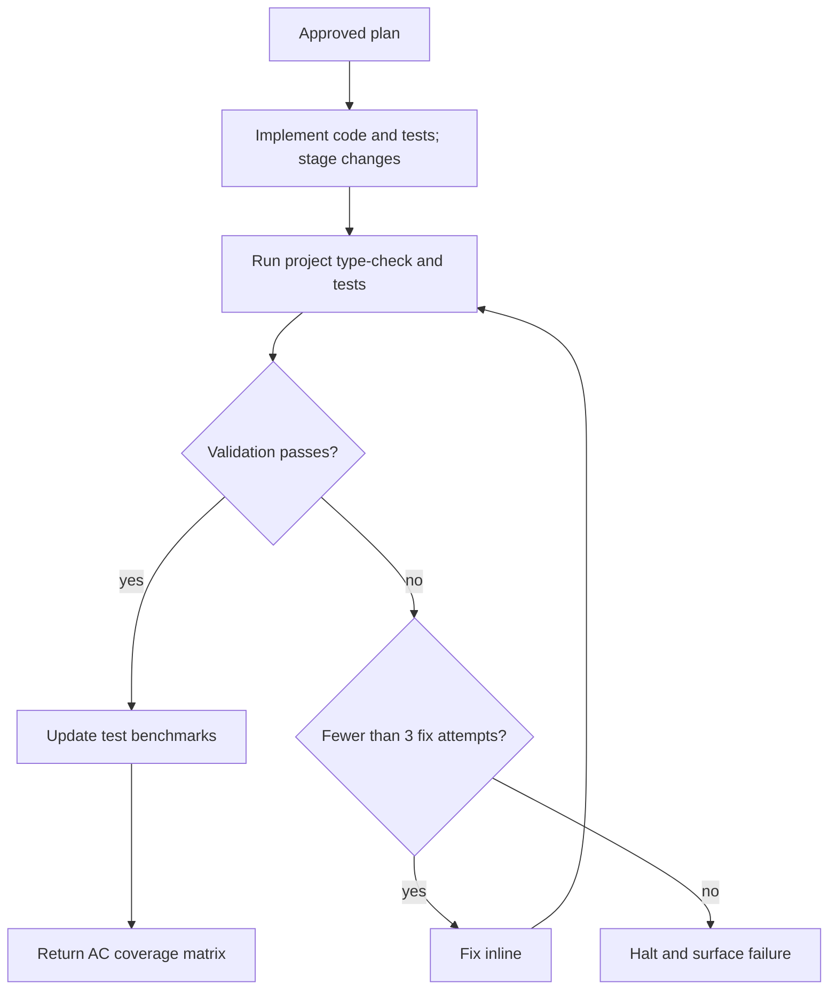

# /dreamers-implement — flow

One approved plan, implemented inline. Source of truth is `SKILL.md`.

- Tests cover the plan's annotated AC layers; tests-first ordering is not required.
- Standalone runs own a two-step todo. Calls from `/dreamers` use its existing todo.
- The skill exits at green validation. `/dreamers` invokes `/dreamers-review` next.
