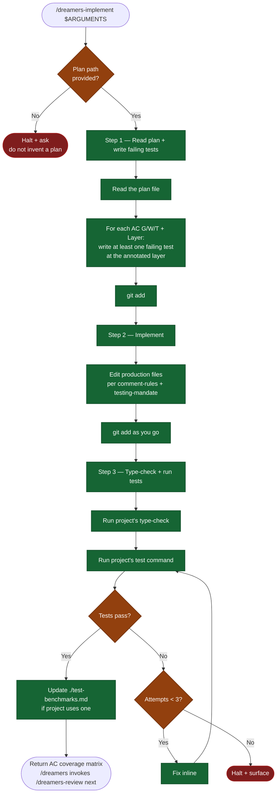

# /dreamers-implement — flow

Visual map of the one-cycle implementation skill. Source of truth is `SKILL.md`.

## Key invariants

- **Tests-first.** Step 1 writes failing tests BEFORE Step 2's implementation. Stage but don't run yet — they should fail.
- **Layer annotation drives test layer.** Each plan AC has a `*Layer: ...*` annotation; the test goes at that layer.
- **3-attempt fix loop in Step 3.** If tests still fail after 3 fix attempts, halt and surface to the user.
- **Phase boundary.** This skill returns after the initial change reaches green validation. It does not review, apply review findings, run user testing, commit, push, or open a PR.
- **Pipeline order.** When `/dreamers` invokes this skill, `/dreamers-review` runs immediately after a successful return.
