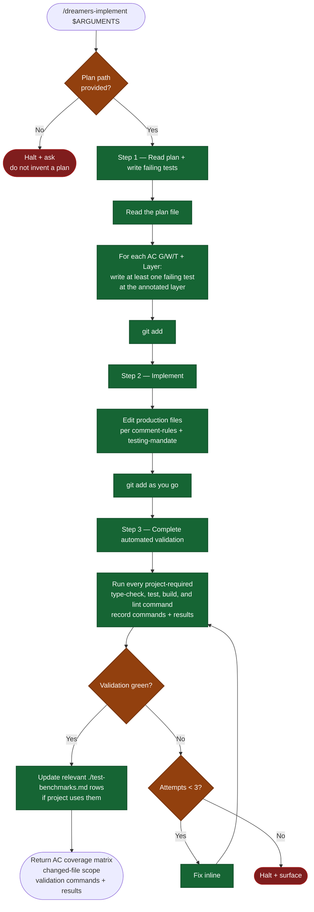

# /dreamers-implement — flow

Visual map of the initial-change implementation skill. Source of truth is `SKILL.md`.

## Key invariants

- **Tests-first.** Step 1 writes failing tests BEFORE Step 2's implementation. Stage but don't run yet — they should fail.
- **Layer annotation drives test layer.** Each plan AC has a `*Layer: ...*` annotation; the test goes at that layer.
- **Complete validation.** Step 3 runs every type-check, test, build, and lint command required by project instructions and records each result.
- **3-attempt fix loop in Step 3.** If automated validation is not green after 3 fix attempts, halt and surface to the user.
- **Phase boundary.** This skill returns after the initial change reaches green validation. It does not review, apply review findings, run user testing, commit, push, or open a PR.
- **Same-context composition.** When /dreamers invokes this skill, it keeps the outer todo and immediately invokes /dreamers-review after a successful return. Standalone use owns its own three-step todo.
