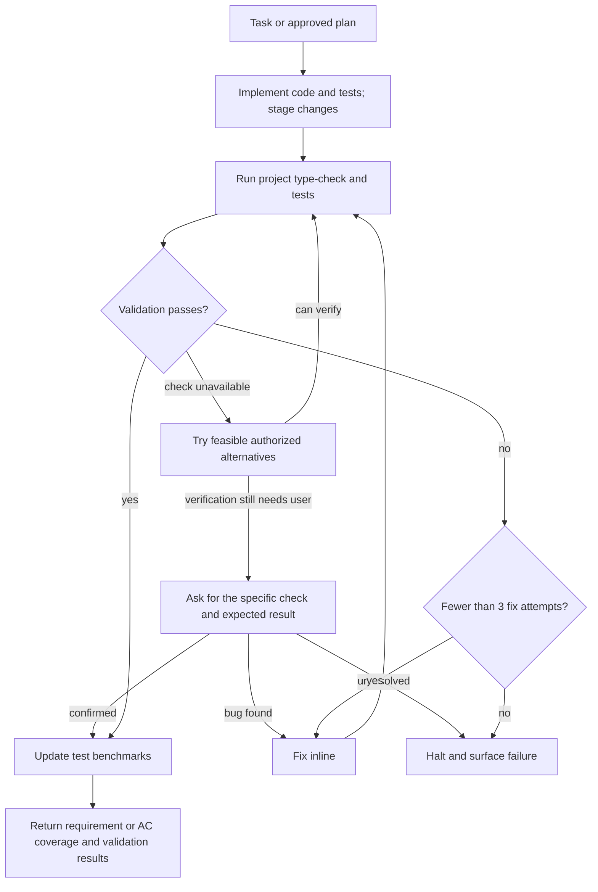

# /dreamers-implement — flow

One task or approved plan, implemented inline. Shared workflow: [implementation-workflow](../../dreamers/refs/implementation-workflow.md). `SKILL.md` embeds this ref and its required standards through XML sync.

```mermaid
flowchart TD
    P[Task or approved plan] --> I[Implement code and tests; stage changes]
    I --> V[Run project type-check and tests]
    V --> R{Validation passes?}
    R -->|check unavailable| U[Try feasible authorized alternatives]
    U -->|verification still needs user| Q[Ask for the specific check and expected result]
    U -->|can verify| V
    Q -->|confirmed| B
    Q -->|bug found| F
    Q -->|unresolved| H
    R -->|yes| B[Update test benchmarks]
    R -->|no| A{Fewer than 3 fix attempts?}
    A -->|yes| F[Fix inline]
    F --> V
    A -->|no| H[Halt and surface failure]
    B --> E[Return requirement or AC coverage and validation results]
```

- Tasks use their stated requirements as acceptance criteria, without a plan file. Plans use their annotated AC layers; tests-first ordering is not required.
- The Required workflow checklist drives the standalone todo. Delivery skills execute the same embedded operation under their own checklist and todo.
- The skill exits at green validation. `/dreamers` executes its embedded review workflow next.

Run feasible agent-operated checks as well as automated tests. If required verification remains unavailable after trying authorized alternatives, ask the user for the specific check and expected result; distinguish unresolved gaps from passing checks.
