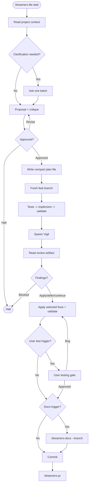

# /dreamers-lite - flow

Source of truth is `SKILL.md`.

## Invariants

- One approval gate covers plan approval and implementation start.
- Vigil writes one `.dreamers/reviews/` artifact; chat output stays short.
- Full-refactor findings are always surfaced. User may apply, defer, or continue lite scope.
- No pre-PR approval gate.
