# /dreamers-new-project — flow

Visual map of the 6-phase project bootstrap. Source of truth is `SKILL.md`.

```mermaid
flowchart TD
    Start(["/dreamers-new-project"]) --> P1

    P1["Phase 1 — Discovery"] --> Discovery["Read discovery-questions.md<br/>conversation only<br/>NO disk writes yet"]
    Discovery --> AllAnswered{"Every question<br/>has concrete answer?"}
    AllAnswered -->|No| Discovery
    AllAnswered -->|Yes| P2

    P2["Phase 2 — Tech stack recommendation"] --> Recommend["Recommend stack:<br/>Frontend / Backend / DB / Auth /<br/>Hosting / CI / Testing / AI<br/>+ rationale per choice"]
    Recommend --> StackGate{"User response"}
    StackGate -->|Adjust| ReviseStack["Capture corrections<br/>revise recommendation"]
    ReviseStack --> Recommend
    StackGate -->|Other| StackGate
    StackGate -->|Stack approved| P3

    P3["Phase 3 — Project brief"] --> WriteBrief["Read project-brief.md template<br/>fill it out<br/>write to .dreamers/atlas/project-brief.md"]
    WriteBrief --> BriefGate{"User response"}
    BriefGate -->|Revise| UpdateBrief["Capture changes<br/>update brief on disk"]
    UpdateBrief --> WriteBrief
    BriefGate -->|Other| BriefGate
    BriefGate -->|Brief approved| P4

    P4["Phase 4 — Repo + workspace bootstrap"] --> RepoCheck{"Already a<br/>git repo?"}
    RepoCheck -->|Yes| SkipInit["Skip git/gh creation steps"]
    RepoCheck -->|No| VisGate{"Public or<br/>Private?"}
    VisGate -->|Other| VisGate
    VisGate -->|Public or Private| CreateRepo["git init<br/>gh repo create<br/>create .gitignore + .dreamers/ dirs"]
    CreateRepo --> WriteCopilot
    SkipInit --> WriteCopilot["Create project-level<br/>.github/copilot-instructions.md"]
    WriteCopilot --> P5

    P5["Phase 5 — Shell plans"] --> ReadShell["Read shell-plan.md template"]
    ReadShell --> WriteShells["For each milestone in brief:<br/>create shell plan in<br/>.dreamers/plans/feature-slug/"]
    WriteShells --> ListShells["List all plans in chat<br/>with file paths + summaries"]
    ListShells --> P6

    P6["Phase 6 — Review loop"] --> ReviewGate{"User response"}
    ReviewGate -->|Revise| UpdatePlans["Capture changes<br/>update affected plan files<br/>re-list"]
    UpdatePlans --> ReviewGate
    ReviewGate -->|Other| ReviewGate
    ReviewGate -->|Look good| End(["Exit<br/>Next: /dreamers-plan on a milestone<br/>or /dreamers-full to plan + implement"])

    classDef gate fill:#92400e,stroke:#78350f,stroke-width:2px,color:#fff
    classDef phase fill:#166534,stroke:#14532d,stroke-width:2px,color:#fff

    class AllAnswered,StackGate,BriefGate,RepoCheck,VisGate,ReviewGate gate
    class P1,P2,P3,P4,P5,P6,Discovery,Recommend,ReviseStack,WriteBrief,UpdateBrief,SkipInit,CreateRepo,WriteCopilot,ReadShell,WriteShells,ListShells,UpdatePlans phase
```

## Key invariants

- **No disk writes until Phase 3.** Phases 1–2 are conversation-only. Phase 3 first writes anything (the brief).
- **Approval-gated phase transitions.** Phases 2, 3, and 6 each have an approval gate that loops until explicit user sign-off.
- **No skip-ahead.** Every phase must complete (or explicit user override) before the next starts.
- **Hard stop at Phase 6.** This skill never invokes `/dreamers-plan` or `/dreamers-full` — surfaces the next-step command for the user.
