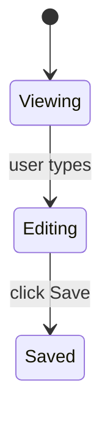

## What this skill does

Re-reads a plan file and checks whether it still applies to the current codebase. Useful when:
- A plan was written some time ago and the code has moved on.
- Multiple plans were written together; an earlier one shipped and may have changed paths / signatures / data shapes the later plans depend on.
- The user wants to confirm a plan is still actionable before invoking `/dreamers-implement`.

The check runs in-skill (no subagent spawn).

## Inlined ref content

Refs below are inlined from `.github/dreamers/refs/` by `scripts/sync-refs.ps1`. Do NOT edit between the XML tags — edit the source file and re-run sync.


<orchestrator-discipline>
<!-- GENERATED from .github/dreamers/refs/orchestrator-discipline.md -- do not edit between tags; edit the source file and re-run scripts/sync-refs.ps1 -->
# Orchestrator Discipline (mandatory)

When a Dreamers pipeline sub-skill is doing work the orchestrator handles inline — implementation, test writing, comment writing, logging, git operations — these rules apply.

Cited by `/dreamers-plan`, `/dreamers-implement`, `/dreamers-close-out`, `/dreamers-fix`, `/dreamers-pr-resolve`, `/dreamers-full`, and the three reviewer agents (Sentinel, Probe, Hone) for the structured findings format spec. This ref is inlined into every consumer by `scripts/sync-refs.ps1` and CI-verified — to change a rule, edit this file and re-run sync.

---

## Implementation discipline

- **NEVER spawn general-purpose or non-Dreamers subagents.** Implementation work (writing production code, writing tests, running tests, type-checking, running build/lint, git operations, file edits, doc updates beyond Echo-owned scope, PR creation) is done INLINE by the orchestrator using its own Edit / Write / Bash tools. The ONLY subagents Dreamers skills may spawn are: `sentinel` / `probe` / `hone` (read-only review) and `echo` (scoped doc writing) and `sage` (research). See `delegation.md` § "Subagent allowlist" for the full hard rule with the forbidden list. If you find yourself about to call `task` / Agent with `agent_type: "general-purpose"` (or any type outside the 5-item allowlist), STOP — the action belongs to the orchestrator inline or to one of the named Dreamers agents, never to a fallback.
- **Plan adherence:** only edit files in the plan's scope (or that the plan's scope clearly entails). No "while I'm here" cleanup, no unrelated refactors mixed with feature work. If a refactor is genuinely needed for the plan's work, do it as a separate inline step and note it in chat.
- **Incremental edits:** make changes in small, coherent steps. Stage with `git add` as work progresses.
- **No spec-arguing comments:** never add a code comment that argues the spec permits a pattern. If spec interpretation is non-obvious, document the reasoning in the PR description or commit message — never in code comments. When in doubt, implement the cleanest separation and let Sentinel judge.
- **All imports at the top of the file.** Every `import` statement before any declaration, function, or expression. Never insert imports mid-file or at the bottom.
- **Method signature changes:** when changing a signature (sync→async, parameter added/removed/renamed), grep the full codebase for every call site before staging. The plan's listed files are necessary but not sufficient.
- **Zustand creator objects:** never use ES getters (they're evaluated once at creation time and baked as static values, never reactive). Define computed values as exported selector functions outside the store.
- **Branch identity check:** before the first edit, run `git log --oneline -3` and confirm the branch and recent commits match the expected feature branch. If the working tree shows no feature commits for this milestone, stop and surface the discrepancy.
- **Data-model changes:** when a plan supersedes an earlier plan's data model, discard the old model completely. Cite the specific interface definitions from the plan's §Data Models (or equivalent) section before writing any new tables or classes.
- **No dependency installs without permission.** Do not add new packages, run `npm install <pkg>`, `pip install <pkg>`, or equivalent without explicit user approval. If a new dependency is needed for the plan, surface it in chat and ask before installing.
- **Type-check before declaring implementation done.** Run the project's type-check command (from project `.github/copilot-instructions.md`). Fix any errors before moving to the test-run step.

---

## Comment-writing discipline (mandatory — orchestrator is also the implementer)

Pulled from `comment-rules.md`. The orchestrator now writes comments inline, so these rules apply directly to every code edit:

- **No plan/ticket references in source.** Never mention plan files, milestone names (e.g. `D25`, `plan-3`), ticket numbers, or agent names in source code (production OR test).
- **No separator comments.** Never use `// ---`, `// ===`, `// ###`, blank-comment lines, or visual dividers.
- **No spec rationalization comments.** Implement cleanly; let review judge.
- **No redundant JSDoc/KDoc** that only repeats the function signature.
- **Style:** one line when possible; never exceed two lines for inline comments. Write *why*, never *what*. If a comment would need more than two lines to be useful, the code needs refactoring, not more words.
- **When to comment:** non-obvious logic (hidden constraints, gotchas, workarounds for specific bugs), public API documentation callers need, TODO/FIXME with specific actionable notes, license headers.

---

## Logging discipline (mandatory — orchestrator writes log calls inline)

Pulled from `logging-standards.md`. Key rules:

- **Log levels (use the right one):**
  - **ERROR** — unhandled or unexpected failures only. Always include the full error object and stack trace. Never swallow silently.
  - **WARN** — recoverable issues, unexpected-but-handled states, deprecations.
  - **INFO** — lifecycle and business signal. Use for startup config (non-secret), shutdown, incoming requests (method/path/status/duration), outbound HTTP (target/endpoint/status/duration), auth events, key business events.
  - **DEBUG** — high-traceability internal flow. Function entry/exit on non-trivial functions, every branch affecting business outcome, repository/data-layer calls (query + row count), cache hits/misses, retry attempts, state-machine transitions, middleware entries/exits.
- **Hard prohibitions — NEVER log:**
  - Passwords, API keys, tokens, secrets of any kind
  - PII: email addresses, phone numbers, names, addresses, payment data
  - Full request or response bodies (log status codes and durations instead)
- **High-frequency loop internals at DEBUG are allowed** if they add traceability value. Mark them with a `// high-freq` comment so Sentinel can assess noise risk.

---

## Test-writing discipline

- **Tests-first:** write failing tests against the plan's Acceptance Criteria (Given/When/Then with Layer annotations per `plan-content.md`) BEFORE implementing. There is no separate Test Cases section in the new plan format — the ACs are the test specification.
- **AC coverage matrix:** for every plan AC, identify the test(s) that cover it. If an AC has no covering test, write one. Do not declare the cycle done based on test count alone — verify by AC.
- **Layer audit (mandatory after implementation):** for the changed code, ask explicitly per layer:
  - *Unit:* Are there functions, branches, or error paths in the changed code with no unit test?
  - *Integration:* Are there layer boundaries (repo↔DB, service↔API, function↔trigger) exercised by this change without an integration test?
  - *UI / E2E:* Are there user-facing flows, screen states, or navigation paths introduced or changed without a UI / E2E test?
- **Navigation change rule:** when a plan changes how a nav element behaves (tab tap, modal open, screen transition), the work MUST include explicit E2E test cases — not just unit tests.
- **Negative + edge cases:** for non-trivial logic, write tests for invalid input, boundary values, empty/null/max, and error states.
- **No AC labels in test sources:** the AC coverage matrix lives in chat output / the retro. Never label tests with AC numbers, plan refs, or milestone names in source files (no `// AC-3`, no `describe('AC-7: ...')`).
- **No commented-out test bodies:** if a test must be disabled, use the runner's skip mechanism (`it.skip`, `xit`).
- **Test commands:** use ONLY the test commands defined in the project-level `.github/copilot-instructions.md`. Do not invent alternatives. Never run tests in parallel unless they are explicitly confirmed safe to run concurrently (separate runtimes, no shared daemon, no shared lock files, no shared output dirs). When in doubt, run sequentially.
- **Final missed-AC check (mandatory, last item of coverage sweep):** After the layer audit, re-read the plan's Acceptance Criteria one final time. Confirm every AC has a green test. If any AC has no covering test and no documented reason, write the test before signaling cycle complete. This is a hard gate.
- **Regression analysis (mandatory when the originating task is a user-reported bug fix):** when the work in this skill was triggered by a user-reported bug, the close-out retro must answer three questions explicitly:
  1. **Why wasn't this caught?** — which test layer failed (no test existed; test existed but didn't cover this path; test covered it but assertion was wrong; test was skipped/deferred)
  2. **What was added?** — specific test(s) now covering this case (names + file paths)
  3. **What else might be missing?** — adjacent cases the same gap might have left uncovered

---

## Closeout / retro discipline

- **Retro file:** `.dreamers/retros/retro-d<N>-<name>.md` per `close-out-procedure.md` Step 3. Orchestrator writes this inline (FULL close-out mode only).
- **Echo-owned section updates** to `.github/copilot-instructions.md` (Tech stack, Repo structure, Conventions, Key files, Test commands): delegated to the Echo subagent — see `close-out-procedure.md` Step 2 for the inline invocation contract.

---

## Git discipline

- Stage with `git add` as work progresses across all phases. Never commit mid-cycle.
- **One commit per cycle = one commit per plan.** Multi-plan milestones produce N commits on the branch (one per plan in the sequence).
- Commit message follows `.github/instructions/git.instructions.md` (if present) or the conventional-commits style used by recent commits on the default branch. Body MUST include `Plan: feature-<slug>/plan-NN-<name>` — the repo-relative plan path without the `.md` extension and without the `.dreamers/plans/` prefix. Example: `Plan: feature-plan-quality-scoring/plan-01-section-scorer`.
- **Push exactly once**, immediately before `gh pr create` at final close-out. Never push between cycles, never between plans.

---

## Review phase: parallel reviewers + orchestrator-as-fixer

The review phase in `/dreamers-implement` and `/dreamers-pr-resolve` spawns **three reviewers in parallel** via a single tool-call containing 3 Agent sub-tool-uses:

- **Sentinel** — correctness, security, maintainability lenses
- **Probe** — test coverage lens (AC matrix, layer audit, edge cases, gaps)
- **Hone** — simplicity / over-engineering / architectural quality lens

**All three are read-only / report-only.** They identify findings and return them in the structured format below. **None of them edits files** — the orchestrator (which already has the code in context from implementation) applies fixes from the combined findings.

### Structured findings format (mandatory — all three reviewers MUST use)

Each reviewer returns chat output containing:

**Status line** (one of):
- `Approved — no findings`
- `Findings reported — N items`
- `Blocked — <reason>`

**Findings** (if any) — one bullet per finding, exact format:
```
[severity] [lens-tag] file:line — what was wrong → suggested fix
```

Where:
- `severity` is one of: `critical`, `high`, `medium`, `low`
- `lens-tag` is one of: `correctness`, `security`, `maintainability` (Sentinel) / `test-coverage` (Probe) / `simplicity` (Hone)
- `file:line` is the absolute or repo-relative path + line number
- `what was wrong → suggested fix` is a one-line description + targeted fix the orchestrator can apply mechanically

**Observations** (optional, all reviewers) — out-of-scope notes that aren't findings. The orchestrator may or may not act on them.

**Open questions** (optional, all reviewers) — items needing orchestrator or user judgment. Use "none" if no questions.

### Orchestrator-as-fixer behavior

After all three reviewers return their chat output, the orchestrator:

1. **Concatenates the findings** into a single list, sorted by severity (critical → high → medium → low).
2. **Resolves conflicts.** If two findings touch the same `file:line` with contradicting fixes — e.g., Sentinel `[correctness] add defensive check` vs Hone `[simplicity] remove this as over-engineering` — apply the **conflict-resolution rule**:
   - **Correctness > simplicity always.** When in conflict, the correctness/security/maintainability finding wins.
   - **Genuine ambiguity surfaces to user.** If both arguments are equally strong (rare), present the conflict to the user before applying either.
3. **Evaluates each finding against the Major-refactor finding gate** (see sub-section below). For each finding, check the closed criteria checklist. If ANY criterion fires, route through the gate: call `request_information` with the 3-choice template; apply or defer per the user's answer. If no criterion fires, the finding is small — fall through to step 4 and apply inline. The orchestrator NEVER silently applies a finding that meets gate criteria, regardless of severity.
4. **Applies fixes inline** (only for findings that didn't trigger the gate, or that the user opted to apply via the gate). The orchestrator has Edit + Write tools; agents don't. Apply each finding's suggested fix as a targeted edit. Stage with `git add`.
5. **Re-runs type-check + tests after applying fixes** (to catch any regression introduced by fix application).
6. **Handles `Blocked` status from any reviewer** by halting the cycle and surfacing the block to the user. Resolve, then re-spawn the affected reviewer.
7. **Handles open questions** from any reviewer by presenting them to the user before declaring the review phase complete. Open questions still surface to the user; captured decisions still apply inline. The follow-up is re-run tests only — NOT a full re-spawn of Steps 3 + 4 + 5.

If the post-fix test run regresses (tests fail), the orchestrator diagnoses and re-fixes inline — up to 3 attempts, then surfaces to the user.

### Major-refactor finding gate

The orchestrator MUST NOT silently apply a finding that triggers any of the criteria below. The user decides whether to apply now in the current cycle, defer to a follow-up plan, or redirect. This is the mechanism that keeps performance and end-state code quality first-class — Hone (and any other reviewer) surfaces architectural issues without softening; the user disposes via this gate.

**The gate fires regardless of severity.** Critical / high severity findings still go through the gate when they meet the criteria — the user decides apply-now vs defer.

#### Closed criteria checklist (any ONE fires the gate)

A finding is "major-refactor scope" if its suggested fix meets ANY of:

1. **New module or top-level directory.** The fix adds a new module, package, or directory that doesn't exist in the plan's scope.
2. **Schema / data-model change.** The fix modifies a database schema, persisted shape, migration, or core data-model interface.
3. **Cross-cutting refactor.** The fix touches multiple unrelated subsystems (e.g., auth + cache + UI in one fix).
4. **New public exported symbols.** The fix introduces new exported functions, classes, types, or API endpoints not specified in the plan.
5. **Files outside the plan's scope.** The fix touches files not listed in the current plan's §Context or §Out of Scope. Bug-fix flows (`/dreamers-fix`) substitute "files outside the bug-fix surface" — same intent.
6. **Hone-recommended full refactor.** The suggested fix uses scope language like "tear out X across N files," "rewrite Y module," "remove Z abstraction and inline at N call sites" — indicating a refactor that goes beyond the immediate fix site.

The criteria are evaluated by reading the finding's suggested-fix text. If ambiguous, treat as major-refactor (fire the gate). The orchestrator does NOT invent new criteria at runtime; the checklist is closed.

#### Gate prompt template

For each finding (or batched group sharing the same refactor scope), call `request_information` with this block:

```
**Major-refactor finding surfaced.**

Reviewer: <sentinel | probe | hone>
Severity: <critical | high | medium | low>
Lens: <correctness | security | maintainability | test-coverage | simplicity>
Location: <file:line>

Finding:
<what was wrong>

Suggested fix:
<suggested fix verbatim>

Triggered criterion: <N — short label of which criterion fired>
Rationale: <one sentence explaining why criterion N fired for THIS specific finding — e.g., "This fix touches `src/auth/session.ts`, which is not listed in the current plan's scope" or "The suggested fix tears out the cache module across 12 files; meets criterion 6 (Hone-recommended full refactor)">
Breadth estimate: <files touched count, ~LOC, in-plan-scope: yes/no>

Options:
- label: Apply now — refactor in this cycle
- label: Defer — create follow-up plan
- label: Other
```

#### Routing per user's answer

- **`Apply now — refactor in this cycle`** → apply the fix inline at step 4 of orchestrator-as-fixer behavior; re-run tests at step 5; stage with `git add`. The current cycle continues — note this may expand cycle scope significantly; the user has accepted that.

- **`Defer — create follow-up plan`** → do NOT apply the fix. Create a stub plan file at `.dreamers/plans/feature-<deferred-slug>/plan-01-<short-slug>.md` using the canonical plan format from `plan-content.md`. The `<deferred-slug>` is derived from the finding's topic (kebab-case, ≤ 40 chars; e.g., "simplify-notification-factory"). The stub captures the finding verbatim but leaves real ACs / constraints / verification as TODO placeholders for the user to fill in via `/dreamers-plan` later. Stub format:

  ```
  # Plan-01: <short title derived from finding>

  **Date:** <today, YYYY-MM-DD>
  **Status:** Draft
  **Branch:** (TBD — fill in when starting work)
  **User-testing-required:** (TBD)

  ## Goal

  [Finding surfaced during review of <original-plan-path>. Captured for follow-up — fill in concrete done-state when ready to work on it.]

  ## Context

  - Surfaced by: <reviewer agent name>
  - During cycle of: <original-plan-path>
  - Finding verbatim:
    > [severity] [lens-tag] file:line — what was wrong → suggested fix
  - Triggered criterion: <criterion N>
  - Breadth estimate: <files / LOC / in-scope status>

  ## Acceptance Criteria

  <acceptance_criteria>
  1. (TBD — convert the finding's suggested fix into a verifiable AC.)
     *Layer: ___.*
  </acceptance_criteria>

  ## Out of Scope

  - (TBD)

  ## Constraints

  <constraints>
  - (TBD)
  </constraints>

  ## Verification

  - (TBD — fill in commands + files when planning this work)
  ```

  After writing the stub, surface the stub path to the user in chat and continue with the remaining findings. Do NOT mark the deferred finding as applied; do not edit the current cycle's code based on it.

- **`Other`** (freeform) → treat the response as a redirect. If the user clarifies "yes apply", route to Apply now. If they clarify "no defer", route to Defer. If they want something else (e.g., halt the cycle, revise the plan first), follow that direction. The orchestrator never silently applies or defers on `Other`.

#### Batching shared-scope findings

When multiple findings share the same refactor scope (e.g., 3 Hone findings all pointing at the same module), the orchestrator MAY combine them into a single gate call. The prompt lists all findings under one "Triggered criterion" block. The user's single answer applies to all batched findings.

Batching criteria: findings share scope when their suggested fixes touch the same module/directory AND would be implemented as a single refactor. When in doubt, do NOT batch — one gate call per finding is safe; over-batching loses granularity.

#### Severity does NOT bypass the gate

Critical and high severity findings still go through the gate when they meet the criteria. The user decides whether to apply now or defer, regardless of severity. The orchestrator surfaces; the user disposes. Use case: a critical security finding whose fix requires rewriting the entire auth module may be best deferred to a focused follow-up plan rather than mid-cycle, depending on the user's risk model. That's the user's call.

### Re-verification after fixes (mandatory)

**Snapshot first (required on both paths).** Before applying any review findings, snapshot the currently staged files via `git diff --cached --name-only` and `git diff --cached --stat`. This snapshot is the only accurate way to measure the fix-pass delta and is mandatory on the default path AND the second-pass path — without it, the significant-refactor criteria can't be evaluated at all.

After applying fixes from the first parallel review, the orchestrator re-runs the project's test command ONLY. No reviewer is re-spawned by default. A second 3-parallel pass occurs ONLY when the significant-refactor criteria fire AND the user explicitly opts in via `request_information`.

**Default path (no second pass):** snapshot → apply fixes → re-run tests → update `./test-benchmarks.md` → commit.

**Second-pass path (opt-in only):** snapshot → apply fixes → re-run tests → update `./test-benchmarks.md` → check significant-refactor criteria (see below) → if criteria fire, call `request_information` with (a) which criterion fired and the measured values, (b) one-sentence reasoning for why a second pass is recommended, (c) explicit choices `["Run second 3-parallel pass", "Skip — commit as-is", "Other"]`. On `Skip` = commit as-is. On `Other` = present the user's freeform response back to them as a redirect and halt — do not auto-commit and do not auto-spawn reviewers. On `Run second 3-parallel pass` = re-spawn Sentinel + Probe + Hone, re-apply findings, re-run tests, and update `./test-benchmarks.md` again with the second-pass run time before commit.

### Significant-refactor criteria

Diff the post-fix staged state against the snapshot captured in Re-verification (above) to measure the fix-pass delta. A second 3-parallel pass is eligible (not automatic — still requires user opt-in) when ANY ONE of the following fires:

1. More than 5 production files touched in the fix pass.
2. More than 150 LOC of production code changed in the fix pass.
3. A new file was added by the fix pass.
4. A new exported or public symbol was introduced by the fix pass.
5. Code was moved between modules in the fix pass.

**Test files are excluded from the LOC and file-count criteria** (criteria 1 and 2 only). Structural criteria (3–5) apply to all file types.

OR semantics: any single criterion firing is sufficient to make the second pass eligible.

### Parallel spawn — invocation pattern

In the skill body, the review phase is described as a single tool-call with 3 Agent sub-tool-uses (Claude Code idiom) or 3 parallel `task()` invocations (Copilot CLI idiom). Skills should specify intent ("spawn S + P + H in parallel; wait for all three to complete") and let the runtime execute per its primitives. If a runtime doesn't support parallel spawn, the skill still works — wall-clock cost increases but correctness is preserved.
</orchestrator-discipline>

<citation-accuracy>
<!-- GENERATED from .github/dreamers/refs/citation-accuracy.md -- do not edit between tags; edit the source file and re-run scripts/sync-refs.ps1 -->
# Citation Accuracy (mandatory)

Before citing the behavior, structure, content, or API of any existing artifact in a plan — test file, test class, test method, Maestro YAML, assertion pattern, flow behavior, repository method, ViewModel property, or any other code artifact — **read and verify the source**.

Claiming "flow 11 uses X" or "TestClass asserts Y" without reading the file is a planning error. The plan becomes a liability when the orchestrator implements against a wrong assumption.

**Rule:** Every cited artifact must be verified by reading its source during the session in which the citation is written. If the artifact cannot be read (e.g. it does not yet exist because it belongs to a later plan in the same sequence), state explicitly that the citation is an assumption pending verification — do not present it as confirmed fact.

## Maestro assertNotVisible collision check (mandatory)

When specifying `assertNotVisible` (or `assertVisible`) text in a plan's Maestro flow requirements, **read the target screen's Compose code** and verify that no OTHER persistent UI element (filter tabs, headers, navigation labels, bottom bar items) shares the assertion text. If a collision exists, the plan must specify a more-specific assertion string that matches only the intended element.

Example: asserting `"Overdue"` is not visible will false-match if the screen has a permanent "Overdue" filter tab. The card indicator format is `"Overdue by Xh Ym"`, so the correct assertion is `assertNotVisible: "Overdue by"`.
</citation-accuracy>

<plan-content>
<!-- GENERATED from .github/dreamers/refs/plan-content.md -- do not edit between tags; edit the source file and re-run scripts/sync-refs.ps1 -->
# Plan Content Rules

Every plan uses `~/.copilot/dreamers/templates/plan.md` as the starting structure. Copy it, fill in the sections, remove any that don't apply.

## Required metadata block

Top of file, just under the H1 title:

- `# Plan-NN: {short-title}` — filename matches `plan-NN-{slug}.md` (NN is the zero-padded order within the feature dir)
- `**Date:**` YYYY-MM-DD
- `**Status:**` Draft / Active / Completed / Superseded
- `**Branch:**` feat/{slug} (or fix/{slug} for bug-fix plans)
- `**User-testing-required:**` yes / no

No `Owner`, no `Scope`, no `Links` metadata fields. They belong in the PR description.

## Required sections

In this order — Verification ALWAYS LAST (Anthropic recency-bias rule):

1. **Goal** (mandatory) — one paragraph. What is true when this plan is done that wasn't true before.
2. **Context** (mandatory) — ≤ 200 words. Bullet links to relevant files / prior plans / PRs. NO motivation prose ("this is important because..."); that belongs in Goal or the PR description.
3. **Acceptance Criteria** (mandatory) — XML-wrapped, numbered G/W/T with Layer annotations. See "Acceptance Criteria format" below.
4. **Out of Scope** (mandatory) — explicit bullets. "Will NOT touch X." "Will NOT change Y."
5. **Constraints** (mandatory) — XML-wrapped. Technical / process / hard rules. See "Constraints format" below.
6. **Design Decisions** (optional but recommended) — only when there are non-obvious choices. See "Design Decisions format" below.
7. **UI** (optional) — only when the plan has a user-visible surface. See "UI section" below.
8. **Verification** (mandatory, bottom of file) — commands to run + files to inspect + smoke check. 5–8 lines max.

## Acceptance Criteria format

XML-wrapped, numbered, each item in Given/When/Then form with a layer annotation:

```
<acceptance_criteria>
1. Given <state>, when <trigger>, then <observable outcome>.
   *Layer: unit.*
2. Given ..., when ..., then ...
   *Layer: integration.*
</acceptance_criteria>
```

**Layer label set (closed):** `unit` / `integration` / `E2E` / `perf`. Compound labels allowed when one test serves two purposes (e.g., `*Layer: integration / perf.*`).

**Why the layer annotation:** `/dreamers-implement` Step 1 writes failing tests from each AC; the layer label tells the implementer which test layer to write in. Probe's coverage sweep in Step 4 reads these labels to verify coverage at every layer.

**Number of ACs:** soft minimum 2. A plan with only one AC produces a Phase 1f soft warning (overridable with user confirmation if the work is genuinely single-AC).

**"And" continuation** is allowed for compound outcomes:

```
1. Given a feature with 3 plans, when ship-strategy is "atomic", then no PR opens until all 3 plans complete; and on any plan failure, the entire feature reverts.
   *Layer: integration.*
```

## Constraints format

XML-wrapped, organized into 3 sub-categories:

```
<constraints>
- **Technical:** stack / perf / libs.
- **Process:** gates / review / tests.
- **Hard rules:** "never do Z" — the rationale-bearing constraints that prevent the agent from relaxing the rule.
</constraints>
```

## Design Decisions format

Optional section. Include ONLY when the plan has non-obvious choices the implementer needs the rationale for (so the agent doesn't relax a constraint it shouldn't, and doesn't re-ask a question the planning conversation already answered).

One entry per significant choice:

- **Decision:** what was chosen
- **Rationale:** why — one sentence
- **Rejected:** alternatives considered — one line each

Skip the section entirely on trivial plans where no decision is non-obvious.

## UI section (3-layer convention)

Include this section ONLY when the plan has a user-visible surface (UI screen, CLI output, chat block, IDE pane, etc.).

**Layer 1 — ASCII layout (MANDATORY when UI section exists):**

Box-drawing characters in a code-fenced block. Shows spatial arrangement.

```
┌─ Header: title ───────────────────────────┐
│  Body content                              │
│    Nested element                          │
│  [Action button]   [Cancel]                │
└────────────────────────────────────────────┘
```

**Layer 2 — Component spec (MANDATORY when UI section exists):**

Two acceptable formats — writer's choice based on row count and cell length:

Table form (good for ≤ 5 components, short cells):

| Component | Type | Behavior | Source data |
|---|---|---|---|
| ... | ... | ... | ... |

OR per-component subsections (good when behavior descriptions are long):

```
### ComponentName
- **Type:** <UI primitive>
- **Behavior:** <what it does, when it's disabled, etc.>
- **Source data:** <where the data comes from>
```

**Layer 3 — Mermaid state/flow (OPTIONAL):**

Use only when the UI has interactive state transitions or branching flows that prose would describe verbosely.



Layer 4 (pseudo-JSX) is NOT used. Sage's research flagged it as risky — agents treat it as ground truth and over-fit.

## Verification format

Plain markdown (NOT XML-wrapped). 5–8 lines max. Commands and files, not narrative.

- **Test command:** the command from `.github/copilot-instructions.md`
- **Type-check command:** the command from `.github/copilot-instructions.md`
- **Files to inspect after implementation:** absolute or repo-relative paths
- **Smoke check:** one or two specific commands or manual steps not covered by automated tests

NO retelling of ACs. ACs are already specified above; Verification is the closing checklist of commands to run.

## XML escaping rule

Inside `<acceptance_criteria>` and `<constraints>` blocks, if you need to write literal angle brackets in content (e.g., a constraint that describes another plan's XML structure), use HTML entity escapes:

- `&lt;` for `<`
- `&gt;` for `>`
- `&amp;` for `&`

Renderers (GitHub, VS Code preview) decode these to literal characters in the display. The parser used by `/dreamers-plan` Phase 1f is entity-aware — it sees `&lt;/acceptance_criteria&gt;` as text content, not a closing tag.

Phase 1f only flags genuinely-malformed structural XML (e.g., missing closing tag at the right nesting depth), not literal text content that happens to contain `<` or `>`.

## Code in plans (mandatory rule)

Plans must NOT include code snippets. Implementation is the orchestrator's domain.

**One exception:** interface and type contracts where the signature itself IS the design decision (e.g., a new public API shape). In this case:
- Include the interface/type signature only — no implementation bodies.
- State the file path and package where it will live.
- Keep it minimal: the contract, not the code.

## Plan length

- **Target:** 200–400 lines.
- **Hard cap:** 600 lines. If a plan exceeds 600 lines, split it into two plans within the feature directory.

Research evidence ([Sage report §verbosity U-curve](.dreamers/sage/plan-format-research/report.md)) shows execution accuracy degrades past 600 lines for LLM consumers; technical-writing literature shows human readers disengage past ~400.

## Sections NOT to include in a plan

The following are explicitly out — do not add them to plans even if you think they'd help. Each item lists where the equivalent information goes instead.

- **Summary** — write a **Goal** paragraph instead.
- **Scope / Non-goals** — split across **Context** (bullet links to relevant code) and **Out of Scope** (explicit "will NOT" bullets).
- **Test Cases** as a standalone section — embed in **Acceptance Criteria** as `*Layer: ...*` annotations on each AC.
- **Rollback Boundary** — write in PR description / commit body. Not a plan section.
- **Risks / Mitigations** — write real risks as hard rules inside **Constraints** ("never do Z"). Decorative risk enumeration adds no execution value.
- **Post-merge gates** — write in PR description.
- **Deferred Items** — write in PR description.
- **Owner / Stakeholders / Links** metadata — write in PR description.
- **Open Questions** — banned. All open questions must be resolved in the planning conversation BEFORE plan generation. A plan with open questions is not ready to ship.
- **Race conditions sub-table** — write into Constraints when relevant.

## Multi-plan work

When the scope of work is too large for one plan, planning produces **multiple plans inside a feature directory**: `.dreamers/plans/feature-<slug>/plan-01-<name>.md`, `plan-02-<name>.md`, etc.

For multi-plan features with shared cross-plan context, an OPTIONAL **manifest** lives at `.dreamers/plans/feature-<slug>/manifest.md`. See `feature-decomposition.md` § "Manifest pattern" for when to use one.

Single-plan features still get a feature directory: `.dreamers/plans/feature-<slug>/plan-01-<name>.md` — no manifest needed.
</plan-content>

$ARGUMENTS

---

## Todo list

At skill entry, declare via `manage_todo_list`:
- [ ] Read plan file
- [ ] Read current code (cited paths, signatures, data models, test files)
- [ ] Drift assessment (compare plan assertions against current state)
- [ ] Report (no change or drift-detected list)

Mark each item `in_progress` when starting, `completed` when done. Never batch completions at the end.

This skill is always invoked standalone — declare its own todo. There is no composed mode (per `~/.copilot/dreamers/refs/orchestration-flow.md` § "Single-owner todo rule": skills do not invoke other skills as sub-routines in this system).

---

## The check

Read the plan file passed as `$ARGUMENTS`. If no plan path is provided, halt and ask the user.

For each element the plan references, verify against the current codebase:

1. **File paths cited in the plan** — does each path exist? If a plan says "modify `src/auth/login.ts`," check that the file is present.
2. **Method / function signatures** — if the plan cites an existing function (e.g., "extend `loginUser(email, password)` to accept `mfaToken`"), read the function definition and verify the current signature matches the plan's assumption.
3. **Data model shapes** — if the plan references a DB table, model class, or interface, read it and verify the plan's assumptions hold.
4. **Test files / cases** — if the plan cites existing tests as a starting point, verify those tests exist and are scoped as the plan describes.
5. **Acceptance Criteria measurability** — re-evaluate whether each AC is still measurable against the current code. (An AC like "user can filter by date" requires a filter mechanism to exist or be plannable; if the underlying API has changed, the AC may need rewording.)
6. **Constraints** — re-check whether stated constraints (technical, process, hard rules) still hold (e.g., "must not change the existing API" — does the API still look as the plan described?). Note: in the new plan format, risks are folded into Constraints as hard rules; there is no separate Risks section to verify.

## Output

Return ONE of:

- **`No change — proceed`** — the plan still applies as written. The user / orchestrator can invoke `/dreamers-implement <plan>` confidently.
- **`Drift detected — halt`** — list specific drift items in chat. Each item identifies WHERE in the plan (AC #, §Scope entry, Test Case ID, or line range) and WHAT diverged:
  ```
  - AC #3 — expected: filter by date range / actual: filter API removed in last cycle
  - §Scope file list — expected: src/auth/session.ts / actual: file renamed to src/auth/sessionStore.ts
  ```
  The user decides whether to:
  - Revise the plan inline (and re-run `/dreamers-plan-verify`).
  - Abandon the plan.
  - Accept the drift and proceed (rare; usually means the plan needs updating).

## What this skill does NOT do

- Does NOT modify the plan — only reports drift.
- Does NOT modify any source files.
- Does NOT run tests — verification is read-only.
- Does NOT call any subagent — fully inline.

## Use cases

- **Before invoking `/dreamers-implement`** on an older plan: catch drift early.
- **Between sequential plans in `/dreamers-full`** (multi-plan mode): orchestrator can invoke this to check the next plan against the now-current state after the previous plan shipped.
- **Standalone** sanity check when you have a plan file and want to know if it's still relevant.
