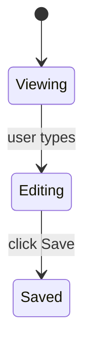

## What this skill does

Standalone entry point for the planning phase. The user invokes this when they want plan files written but are NOT yet ready to ship — they'll run `/dreamers-full` themselves later when ready.

This skill follows `~/.copilot/dreamers/refs/planning-procedure.md` end-to-end (Phase 1a → 1g) and exits cleanly at the approval gate. It does NOT invoke any other skill (no `Invoke /dreamers-full`, no chained-skill invocation). The user is in control of what runs next.

If the user wants planning + implementation + close-out in one go, they should run `/dreamers-full <task description>` instead — that skill follows the same planning procedure but continues into implementation automatically.

---

## Inlined ref content

Refs below are inlined from `.github/dreamers/refs/` by `scripts/sync-refs.ps1`. Do NOT edit between the XML tags — edit the source file and re-run sync.


Also load at runtime (not inlined — these are templates / project files):
- `~/.copilot/dreamers/templates/plan.md` — plan template
- `~/.copilot/dreamers/templates/manifest.md` — manifest template (when multi-plan with shared context)
- `.github/copilot-instructions.md` (root) — project conventions, tech stack, test commands, source roots.

<orchestration-flow>
<!-- GENERATED from .github/dreamers/refs/orchestration-flow.md -- do not edit between tags; edit the source file and re-run scripts/sync-refs.ps1 -->
# Orchestration flow — single-owner todo, continuation principle

Single source of truth for the orchestration principles that apply across all Dreamers skills.

---

## Single-owner todo rule (HARD RULE)

There is exactly ONE todo list per user-invoked skill run. The skill the user invoked at the top level (`/dreamers-full`, `/dreamers-plan`, `/dreamers-implement`, `/dreamers-fix`, `/dreamers-close-out`, etc.) owns the todo for the duration of its run. No other entity touches it.

### What the orchestrator does

At skill entry:
- Declare the todo via `manage_todo_list`. Each item corresponds to one major phase or step. Declare all items upfront; do not add items mid-run.

During the run:
- Mark the active item `in_progress` when starting.
- Mark it `completed` when done.
- Never batch completions at the end. The todo is a live progress indicator, not a retrospective log.
- Before every meaningful step, re-read the todo to confirm position — the todo is the authoritative "where am I" signal, not chat context.

At skill exit:
- All items should be `completed` (or explicitly noted as deferred/skipped, with reason).

### What subagents do NOT do

Subagents spawned by the orchestrator (Sentinel, Probe, Hone, Echo, Sage) do NOT touch the todo. Their prompts MUST include the line:

> "Do NOT call `manage_todo_list`. The orchestrator owns the todo."

A subagent that creates its own todo creates a parallel state that drifts from the orchestrator's. Don't do it.

### No composed-mode handoff

There is no "composed mode" for the todo. Skills do not invoke other skills as runtime sub-routines in this system. Each user-invoked skill runs end-to-end with its own todo. When a user wants the full pipeline, they run `/dreamers-full`; when they want only planning, they run `/dreamers-plan`; etc. Each run has one owner, one todo, one exit.

This rule replaces the previous "composed vs standalone — sub-skill updates parent's matching item" pattern, which created multi-owner todo state and was the root cause of mid-pipeline progress lapses.

### Granularity

One todo item per major phase or clearly distinct step. Not one per line of work. Not one per sub-step within a phase. Scannable overview, not micro-log.

---

## Continuation principle

### Definition

The orchestrator MUST NOT silently halt mid-feature. At every natural pause — where a phase ends and a meaningful choice about what to do next exists — the orchestrator calls `request_information` with a structured choice block. The user picks `Continue`, `Halt for now`, or `Other (freeform)`. No silent forward progress; no silent stops.

### Pause-point list

The following are the canonical natural pauses where a continuation prompt is required:

1. Between ATOMIC cycles in a multi-plan loop, after each plan's commit and drift check, before the next cycle starts — only when more plans remain.
2. Between LIGHT close-outs in INCREMENTAL multi-plan mode, after each per-plan PR opens, before the next cycle starts — only when more plans remain.

**Approval gates are NOT continuation prompts.** Phase 1c (proposal approval), Phase 1g (plan-file approval), and close-out Step 5 (push approval) each carry their own decision. They do not need a follow-up "do you want to continue?" prompt after they fire. Phase 1g's `Approved — start implementation` answer is itself the proceed signal — no second gate fires between Phase 1g and Phase 1.5 / Phase 2.

### Prompt template

Use this shape for every continuation prompt:

```
<status summary — one sentence stating what just completed>

<concrete next action — one sentence stating what will happen if the user says Continue>

Options:
- label: Continue — <specific yes-action label>
- label: Halt for now — No (halt; resume later)
- label: Other — freeform redirect
```

Call `request_information` with at minimum these three choices. The `Continue` label must name the concrete next action (e.g., "start next cycle for feature-auth/plan-02-logout.md").

### Halt behavior

On `Halt for now` at any continuation prompt: halt cleanly. Output one line stating the resume command:

```
Resume by re-invoking `/dreamers-full` with the remaining plan paths: <paths>
```

(Adapt the resume command to whichever skill the user was running.)

Do not leave partial state dangling. Stage nothing new. Do not proceed.

On `Other`: treat the freeform input as a redirect instruction. Acknowledge it, confirm the new direction, and proceed accordingly.

---

## Tool naming convention

Skills in this system reference two tools by pseudonym. Runtime resolves the pseudonym to whatever Copilot CLI surfaces as the actual tool name at the time of invocation.

| Pseudonym | Tool | What it does |
|-----------|------|--------------|
| `request_information` | Copilot CLI user-prompt tool | Pauses the orchestrator, presents a message and structured choices, waits for the user's response |
| `manage_todo_list` | Copilot CLI todo tool | Creates, updates, and marks items in a persistent todo list visible to the user |

When a skill says "call `request_information`" or "declare via `manage_todo_list`", it means: invoke the tool Copilot CLI has bound to that function at runtime. The pseudonym names are stable across skill files regardless of CLI version.

### Legacy convention note

The `.github/agents/nova.agent.md` file retains the older `ask_user` pseudonym (predates this ref). It is functionally equivalent to `request_information`. Out of scope for the current alignment pass; tracked as a follow-up to harmonize agent files with the skill convention.
</orchestration-flow>

<orchestrator-discipline>
<!-- GENERATED from .github/dreamers/refs/orchestrator-discipline.md -- do not edit between tags; edit the source file and re-run scripts/sync-refs.ps1 -->
# Orchestrator Discipline (mandatory)

When a Dreamers pipeline sub-skill is doing work the orchestrator handles inline — implementation, test writing, comment writing, logging, git operations — these rules apply.

Cited by `/dreamers-plan`, `/dreamers-implement`, `/dreamers-close-out`, `/dreamers-fix`, `/dreamers-pr-resolve`, `/dreamers-full`, and the three reviewer agents (Sentinel, Probe, Hone) for the structured findings format spec. This ref is inlined into every consumer by `scripts/sync-refs.ps1` and CI-verified — to change a rule, edit this file and re-run sync.

---

## Implementation discipline

- **NEVER spawn general-purpose or non-Dreamers subagents.** Implementation work (writing production code, writing tests, running tests, type-checking, running build/lint, git operations, file edits, doc updates beyond Echo-owned scope, PR creation) is done INLINE by the orchestrator using its own Edit / Write / Bash tools. The ONLY subagents Dreamers skills may spawn are: `sentinel` / `probe` / `hone` (read-only review) and `echo` (scoped doc writing) and `sage` (research). See `delegation.md` § "Subagent allowlist" for the full hard rule with the forbidden list. If you find yourself about to call `task` / Agent with `agent_type: "general-purpose"` (or any type outside the 5-item allowlist), STOP — the action belongs to the orchestrator inline or to one of the named Dreamers agents, never to a fallback.
- **Plan adherence:** only edit files in the plan's scope (or that the plan's scope clearly entails). No "while I'm here" cleanup, no unrelated refactors mixed with feature work. If a refactor is genuinely needed for the plan's work, do it as a separate inline step and note it in chat.
- **Incremental edits:** make changes in small, coherent steps. Stage with `git add` as work progresses.
- **No spec-arguing comments:** never add a code comment that argues the spec permits a pattern. If spec interpretation is non-obvious, document the reasoning in the PR description or commit message — never in code comments. When in doubt, implement the cleanest separation and let Sentinel judge.
- **All imports at the top of the file.** Every `import` statement before any declaration, function, or expression. Never insert imports mid-file or at the bottom.
- **Method signature changes:** when changing a signature (sync→async, parameter added/removed/renamed), grep the full codebase for every call site before staging. The plan's listed files are necessary but not sufficient.
- **Zustand creator objects:** never use ES getters (they're evaluated once at creation time and baked as static values, never reactive). Define computed values as exported selector functions outside the store.
- **Branch identity check:** before the first edit, run `git log --oneline -3` and confirm the branch and recent commits match the expected feature branch. If the working tree shows no feature commits for this milestone, stop and surface the discrepancy.
- **Data-model changes:** when a plan supersedes an earlier plan's data model, discard the old model completely. Cite the specific interface definitions from the plan's §Data Models (or equivalent) section before writing any new tables or classes.
- **No dependency installs without permission.** Do not add new packages, run `npm install <pkg>`, `pip install <pkg>`, or equivalent without explicit user approval. If a new dependency is needed for the plan, surface it in chat and ask before installing.
- **Type-check before declaring implementation done.** Run the project's type-check command (from project `.github/copilot-instructions.md`). Fix any errors before moving to the test-run step.

---

## Comment-writing discipline (mandatory — orchestrator is also the implementer)

Pulled from `comment-rules.md`. The orchestrator now writes comments inline, so these rules apply directly to every code edit:

- **No plan/ticket references in source.** Never mention plan files, milestone names (e.g. `D25`, `plan-3`), ticket numbers, or agent names in source code (production OR test).
- **No separator comments.** Never use `// ---`, `// ===`, `// ###`, blank-comment lines, or visual dividers.
- **No spec rationalization comments.** Implement cleanly; let review judge.
- **No redundant JSDoc/KDoc** that only repeats the function signature.
- **Style:** one line when possible; never exceed two lines for inline comments. Write *why*, never *what*. If a comment would need more than two lines to be useful, the code needs refactoring, not more words.
- **When to comment:** non-obvious logic (hidden constraints, gotchas, workarounds for specific bugs), public API documentation callers need, TODO/FIXME with specific actionable notes, license headers.

---

## Logging discipline (mandatory — orchestrator writes log calls inline)

Pulled from `logging-standards.md`. Key rules:

- **Log levels (use the right one):**
  - **ERROR** — unhandled or unexpected failures only. Always include the full error object and stack trace. Never swallow silently.
  - **WARN** — recoverable issues, unexpected-but-handled states, deprecations.
  - **INFO** — lifecycle and business signal. Use for startup config (non-secret), shutdown, incoming requests (method/path/status/duration), outbound HTTP (target/endpoint/status/duration), auth events, key business events.
  - **DEBUG** — high-traceability internal flow. Function entry/exit on non-trivial functions, every branch affecting business outcome, repository/data-layer calls (query + row count), cache hits/misses, retry attempts, state-machine transitions, middleware entries/exits.
- **Hard prohibitions — NEVER log:**
  - Passwords, API keys, tokens, secrets of any kind
  - PII: email addresses, phone numbers, names, addresses, payment data
  - Full request or response bodies (log status codes and durations instead)
- **High-frequency loop internals at DEBUG are allowed** if they add traceability value. Mark them with a `// high-freq` comment so Sentinel can assess noise risk.

---

## Test-writing discipline

- **Tests-first:** write failing tests against the plan's Acceptance Criteria (Given/When/Then with Layer annotations per `plan-content.md`) BEFORE implementing. There is no separate Test Cases section in the new plan format — the ACs are the test specification.
- **AC coverage matrix:** for every plan AC, identify the test(s) that cover it. If an AC has no covering test, write one. Do not declare the cycle done based on test count alone — verify by AC.
- **Layer audit (mandatory after implementation):** for the changed code, ask explicitly per layer:
  - *Unit:* Are there functions, branches, or error paths in the changed code with no unit test?
  - *Integration:* Are there layer boundaries (repo↔DB, service↔API, function↔trigger) exercised by this change without an integration test?
  - *UI / E2E:* Are there user-facing flows, screen states, or navigation paths introduced or changed without a UI / E2E test?
- **Navigation change rule:** when a plan changes how a nav element behaves (tab tap, modal open, screen transition), the work MUST include explicit E2E test cases — not just unit tests.
- **Negative + edge cases:** for non-trivial logic, write tests for invalid input, boundary values, empty/null/max, and error states.
- **No AC labels in test sources:** the AC coverage matrix lives in chat output / the retro. Never label tests with AC numbers, plan refs, or milestone names in source files (no `// AC-3`, no `describe('AC-7: ...')`).
- **No commented-out test bodies:** if a test must be disabled, use the runner's skip mechanism (`it.skip`, `xit`).
- **Test commands:** use ONLY the test commands defined in the project-level `.github/copilot-instructions.md`. Do not invent alternatives. Never run tests in parallel unless they are explicitly confirmed safe to run concurrently (separate runtimes, no shared daemon, no shared lock files, no shared output dirs). When in doubt, run sequentially.
- **Final missed-AC check (mandatory, last item of coverage sweep):** After the layer audit, re-read the plan's Acceptance Criteria one final time. Confirm every AC has a green test. If any AC has no covering test and no documented reason, write the test before signaling cycle complete. This is a hard gate.
- **Regression analysis (mandatory when the originating task is a user-reported bug fix):** when the work in this skill was triggered by a user-reported bug, the close-out retro must answer three questions explicitly:
  1. **Why wasn't this caught?** — which test layer failed (no test existed; test existed but didn't cover this path; test covered it but assertion was wrong; test was skipped/deferred)
  2. **What was added?** — specific test(s) now covering this case (names + file paths)
  3. **What else might be missing?** — adjacent cases the same gap might have left uncovered

---

## Closeout / retro discipline

- **Retro file:** `.dreamers/retros/retro-d<N>-<name>.md` per `close-out-procedure.md` Step 3. Orchestrator writes this inline (FULL close-out mode only).
- **Echo-owned section updates** to `.github/copilot-instructions.md` (Tech stack, Repo structure, Conventions, Key files, Test commands): delegated to the Echo subagent — see `close-out-procedure.md` Step 2 for the inline invocation contract.

---

## Git discipline

- Stage with `git add` as work progresses across all phases. Never commit mid-cycle.
- **One commit per cycle = one commit per plan.** Multi-plan milestones produce N commits on the branch (one per plan in the sequence).
- Commit message follows `.github/instructions/git.instructions.md` (if present) or the conventional-commits style used by recent commits on the default branch. Body MUST include `Plan: feature-<slug>/plan-NN-<name>` — the repo-relative plan path without the `.md` extension and without the `.dreamers/plans/` prefix. Example: `Plan: feature-plan-quality-scoring/plan-01-section-scorer`.
- **Push exactly once**, immediately before `gh pr create` at final close-out. Never push between cycles, never between plans.

---

## Review phase: parallel reviewers + orchestrator-as-fixer

The review phase in `/dreamers-implement` and `/dreamers-pr-resolve` spawns **three reviewers in parallel** via a single tool-call containing 3 Agent sub-tool-uses:

- **Sentinel** — correctness, security, maintainability lenses
- **Probe** — test coverage lens (AC matrix, layer audit, edge cases, gaps)
- **Hone** — simplicity / over-engineering / architectural quality lens

**All three are read-only / report-only.** They identify findings and return them in the structured format below. **None of them edits files** — the orchestrator (which already has the code in context from implementation) applies fixes from the combined findings.

### Structured findings format (mandatory — all three reviewers MUST use)

Each reviewer returns chat output containing:

**Status line** (one of):
- `Approved — no findings`
- `Findings reported — N items`
- `Blocked — <reason>`

**Findings** (if any) — one bullet per finding, exact format:
```
[severity] [lens-tag] file:line — what was wrong → suggested fix
```

Where:
- `severity` is one of: `critical`, `high`, `medium`, `low`
- `lens-tag` is one of: `correctness`, `security`, `maintainability` (Sentinel) / `test-coverage` (Probe) / `simplicity` (Hone)
- `file:line` is the absolute or repo-relative path + line number
- `what was wrong → suggested fix` is a one-line description + targeted fix the orchestrator can apply mechanically

**Observations** (optional, all reviewers) — out-of-scope notes that aren't findings. The orchestrator may or may not act on them.

**Open questions** (optional, all reviewers) — items needing orchestrator or user judgment. Use "none" if no questions.

### Orchestrator-as-fixer behavior

After all three reviewers return their chat output, the orchestrator:

1. **Concatenates the findings** into a single list, sorted by severity (critical → high → medium → low).
2. **Resolves conflicts.** If two findings touch the same `file:line` with contradicting fixes — e.g., Sentinel `[correctness] add defensive check` vs Hone `[simplicity] remove this as over-engineering` — apply the **conflict-resolution rule**:
   - **Correctness > simplicity always.** When in conflict, the correctness/security/maintainability finding wins.
   - **Genuine ambiguity surfaces to user.** If both arguments are equally strong (rare), present the conflict to the user before applying either.
3. **Evaluates each finding against the Major-refactor finding gate** (see sub-section below). For each finding, check the closed criteria checklist. If ANY criterion fires, route through the gate: call `request_information` with the 3-choice template; apply or defer per the user's answer. If no criterion fires, the finding is small — fall through to step 4 and apply inline. The orchestrator NEVER silently applies a finding that meets gate criteria, regardless of severity.
4. **Applies fixes inline** (only for findings that didn't trigger the gate, or that the user opted to apply via the gate). The orchestrator has Edit + Write tools; agents don't. Apply each finding's suggested fix as a targeted edit. Stage with `git add`.
5. **Re-runs type-check + tests after applying fixes** (to catch any regression introduced by fix application).
6. **Handles `Blocked` status from any reviewer** by halting the cycle and surfacing the block to the user. Resolve, then re-spawn the affected reviewer.
7. **Handles open questions** from any reviewer by presenting them to the user before declaring the review phase complete. Open questions still surface to the user; captured decisions still apply inline. The follow-up is re-run tests only — NOT a full re-spawn of Steps 3 + 4 + 5.

If the post-fix test run regresses (tests fail), the orchestrator diagnoses and re-fixes inline — up to 3 attempts, then surfaces to the user.

### Major-refactor finding gate

The orchestrator MUST NOT silently apply a finding that triggers any of the criteria below. The user decides whether to apply now in the current cycle, defer to a follow-up plan, or redirect. This is the mechanism that keeps performance and end-state code quality first-class — Hone (and any other reviewer) surfaces architectural issues without softening; the user disposes via this gate.

**The gate fires regardless of severity.** Critical / high severity findings still go through the gate when they meet the criteria — the user decides apply-now vs defer.

#### Closed criteria checklist (any ONE fires the gate)

A finding is "major-refactor scope" if its suggested fix meets ANY of:

1. **New module or top-level directory.** The fix adds a new module, package, or directory that doesn't exist in the plan's scope.
2. **Schema / data-model change.** The fix modifies a database schema, persisted shape, migration, or core data-model interface.
3. **Cross-cutting refactor.** The fix touches multiple unrelated subsystems (e.g., auth + cache + UI in one fix).
4. **New public exported symbols.** The fix introduces new exported functions, classes, types, or API endpoints not specified in the plan.
5. **Files outside the plan's scope.** The fix touches files not listed in the current plan's §Context or §Out of Scope. Bug-fix flows (`/dreamers-fix`) substitute "files outside the bug-fix surface" — same intent.
6. **Hone-recommended full refactor.** The suggested fix uses scope language like "tear out X across N files," "rewrite Y module," "remove Z abstraction and inline at N call sites" — indicating a refactor that goes beyond the immediate fix site.

The criteria are evaluated by reading the finding's suggested-fix text. If ambiguous, treat as major-refactor (fire the gate). The orchestrator does NOT invent new criteria at runtime; the checklist is closed.

#### Gate prompt template

For each finding (or batched group sharing the same refactor scope), call `request_information` with this block:

```
**Major-refactor finding surfaced.**

Reviewer: <sentinel | probe | hone>
Severity: <critical | high | medium | low>
Lens: <correctness | security | maintainability | test-coverage | simplicity>
Location: <file:line>

Finding:
<what was wrong>

Suggested fix:
<suggested fix verbatim>

Triggered criterion: <N — short label of which criterion fired>
Rationale: <one sentence explaining why criterion N fired for THIS specific finding — e.g., "This fix touches `src/auth/session.ts`, which is not listed in the current plan's scope" or "The suggested fix tears out the cache module across 12 files; meets criterion 6 (Hone-recommended full refactor)">
Breadth estimate: <files touched count, ~LOC, in-plan-scope: yes/no>

Options:
- label: Apply now — refactor in this cycle
- label: Defer — create follow-up plan
- label: Other
```

#### Routing per user's answer

- **`Apply now — refactor in this cycle`** → apply the fix inline at step 4 of orchestrator-as-fixer behavior; re-run tests at step 5; stage with `git add`. The current cycle continues — note this may expand cycle scope significantly; the user has accepted that.

- **`Defer — create follow-up plan`** → do NOT apply the fix. Create a stub plan file at `.dreamers/plans/feature-<deferred-slug>/plan-01-<short-slug>.md` using the canonical plan format from `plan-content.md`. The `<deferred-slug>` is derived from the finding's topic (kebab-case, ≤ 40 chars; e.g., "simplify-notification-factory"). The stub captures the finding verbatim but leaves real ACs / constraints / verification as TODO placeholders for the user to fill in via `/dreamers-plan` later. Stub format:

  ```
  # Plan-01: <short title derived from finding>

  **Date:** <today, YYYY-MM-DD>
  **Status:** Draft
  **Branch:** (TBD — fill in when starting work)
  **User-testing-required:** (TBD)

  ## Goal

  [Finding surfaced during review of <original-plan-path>. Captured for follow-up — fill in concrete done-state when ready to work on it.]

  ## Context

  - Surfaced by: <reviewer agent name>
  - During cycle of: <original-plan-path>
  - Finding verbatim:
    > [severity] [lens-tag] file:line — what was wrong → suggested fix
  - Triggered criterion: <criterion N>
  - Breadth estimate: <files / LOC / in-scope status>

  ## Acceptance Criteria

  <acceptance_criteria>
  1. (TBD — convert the finding's suggested fix into a verifiable AC.)
     *Layer: ___.*
  </acceptance_criteria>

  ## Out of Scope

  - (TBD)

  ## Constraints

  <constraints>
  - (TBD)
  </constraints>

  ## Verification

  - (TBD — fill in commands + files when planning this work)
  ```

  After writing the stub, surface the stub path to the user in chat and continue with the remaining findings. Do NOT mark the deferred finding as applied; do not edit the current cycle's code based on it.

- **`Other`** (freeform) → treat the response as a redirect. If the user clarifies "yes apply", route to Apply now. If they clarify "no defer", route to Defer. If they want something else (e.g., halt the cycle, revise the plan first), follow that direction. The orchestrator never silently applies or defers on `Other`.

#### Batching shared-scope findings

When multiple findings share the same refactor scope (e.g., 3 Hone findings all pointing at the same module), the orchestrator MAY combine them into a single gate call. The prompt lists all findings under one "Triggered criterion" block. The user's single answer applies to all batched findings.

Batching criteria: findings share scope when their suggested fixes touch the same module/directory AND would be implemented as a single refactor. When in doubt, do NOT batch — one gate call per finding is safe; over-batching loses granularity.

#### Severity does NOT bypass the gate

Critical and high severity findings still go through the gate when they meet the criteria. The user decides whether to apply now or defer, regardless of severity. The orchestrator surfaces; the user disposes. Use case: a critical security finding whose fix requires rewriting the entire auth module may be best deferred to a focused follow-up plan rather than mid-cycle, depending on the user's risk model. That's the user's call.

### Re-verification after fixes (mandatory)

**Snapshot first (required on both paths).** Before applying any review findings, snapshot the currently staged files via `git diff --cached --name-only` and `git diff --cached --stat`. This snapshot is the only accurate way to measure the fix-pass delta and is mandatory on the default path AND the second-pass path — without it, the significant-refactor criteria can't be evaluated at all.

After applying fixes from the first parallel review, the orchestrator re-runs the project's test command ONLY. No reviewer is re-spawned by default. A second 3-parallel pass occurs ONLY when the significant-refactor criteria fire AND the user explicitly opts in via `request_information`.

**Default path (no second pass):** snapshot → apply fixes → re-run tests → update `./test-benchmarks.md` → commit.

**Second-pass path (opt-in only):** snapshot → apply fixes → re-run tests → update `./test-benchmarks.md` → check significant-refactor criteria (see below) → if criteria fire, call `request_information` with (a) which criterion fired and the measured values, (b) one-sentence reasoning for why a second pass is recommended, (c) explicit choices `["Run second 3-parallel pass", "Skip — commit as-is", "Other"]`. On `Skip` = commit as-is. On `Other` = present the user's freeform response back to them as a redirect and halt — do not auto-commit and do not auto-spawn reviewers. On `Run second 3-parallel pass` = re-spawn Sentinel + Probe + Hone, re-apply findings, re-run tests, and update `./test-benchmarks.md` again with the second-pass run time before commit.

### Significant-refactor criteria

Diff the post-fix staged state against the snapshot captured in Re-verification (above) to measure the fix-pass delta. A second 3-parallel pass is eligible (not automatic — still requires user opt-in) when ANY ONE of the following fires:

1. More than 5 production files touched in the fix pass.
2. More than 150 LOC of production code changed in the fix pass.
3. A new file was added by the fix pass.
4. A new exported or public symbol was introduced by the fix pass.
5. Code was moved between modules in the fix pass.

**Test files are excluded from the LOC and file-count criteria** (criteria 1 and 2 only). Structural criteria (3–5) apply to all file types.

OR semantics: any single criterion firing is sufficient to make the second pass eligible.

### Parallel spawn — invocation pattern

In the skill body, the review phase is described as a single tool-call with 3 Agent sub-tool-uses (Claude Code idiom) or 3 parallel `task()` invocations (Copilot CLI idiom). Skills should specify intent ("spawn S + P + H in parallel; wait for all three to complete") and let the runtime execute per its primitives. If a runtime doesn't support parallel spawn, the skill still works — wall-clock cost increases but correctness is preserved.
</orchestrator-discipline>

<planning-procedure>
<!-- GENERATED from .github/dreamers/refs/planning-procedure.md -- do not edit between tags; edit the source file and re-run scripts/sync-refs.ps1 -->
# Planning Procedure (canonical)

This ref is the SOLE source of truth for the Dreamers planning phase. Both `/dreamers-plan` (standalone) and `/dreamers-full` (end-to-end pipeline) follow this procedure. There is no composed-mode branching — the procedure is the procedure.

---

## Inputs

The orchestrator running this procedure must have at minimum:

- A **task description** from the user (verbatim, as `$ARGUMENTS` passed to the invoking skill).
- Access to the project's `.github/copilot-instructions.md` (auto-loaded by Copilot CLI).
- Read access to `.dreamers/plans/` to detect existing feature directories (for the manifest backfill check).

## Outputs

- One or more plan files at `.dreamers/plans/feature-<slug>/plan-NN-<name>.md` per `plan-rules.md`.
- Optional `manifest.md` at `.dreamers/plans/feature-<slug>/manifest.md` for multi-plan work with shared context.
- Explicit user approval recorded at Phase 1g.

The orchestrator's todo (a single list owned by the top-level skill) records phase completion.

---

## Phase 1a — Hash it out

1. Write a one-paragraph **understanding summary** of the goal.
2. Identify all ambiguities, gaps, open decisions.
3. Ask every clarifying question in ONE round via `request_information`. Do not trickle questions across multiple message turns.

If the task is fully unambiguous, skip to Phase 1b with a brief "I understand the goal as: …" confirmation.

After clarifications are received, proceed to Phase 1b.

## Phase 1b — User Input Audit (gate)

Before presenting the proposal, review the full conversation. Verify every suggestion, correction, preference, and constraint the user expressed is explicitly addressed. If anything is missing, incorporate it.

## Phase 1c — Approval gate

Present this proposal block in chat:

```
**Goal:** [one sentence]
**Scope:** [what is in]
**Non-goals:** [only if scope is genuinely ambiguous]
**Acceptance criteria:**
1. [AC 1]
2. [AC 2]
…
```

Call `request_information` with choice `["Approved"]` and allow inline freeform corrections in the same interaction. Treat any non-approval freeform response as corrections; revise and re-present until explicit approval.

## Phase 1d — Decide plan count

Default to ONE plan inside a feature directory. If the work's scope is too large to land cleanly in a single cycle, produce MULTIPLE independent plans inside the same feature directory per `feature-decomposition.md`.

"Too large" thresholds:
- More than ~300 lines of new/changed code across the touched files.
- More than one data-layer change PLUS more than one UI surface in the same cycle.
- Crosses natural seams (model → repository → viewmodel → screen → cloud function) such that one cycle's review would be unwieldy.

When splitting, each plan MUST be:
- **Independently shippable** — can merge to main alone; no dependency on a later plan.
- **Testable in isolation** — at least one machine-verifiable assertion per plan.
- **Coherent scope** — touches at most one data-layer change + one UI surface.
- **At a natural seam** — model/repo/viewmodel/screen/function boundary.

State your decision in chat: "Producing ONE plan: …" or "Producing N plans: …" with a one-sentence rationale.

### Phase 1d.1 — Decide whether to produce a manifest (multi-plan only)

If producing multiple plans, decide whether they warrant a `manifest.md` at `.dreamers/plans/feature-<slug>/manifest.md`. **Produce a manifest if ANY of these hold:**

- At least 2 shared constraints apply across all plans (e.g., "all plans must preserve API X's backward compat until plan-03 ships")
- Shared design decisions span plans (e.g., "all auth flows use the same state-machine abstraction")
- Shared data models referenced by multiple plans (interface / type contracts)
- End-to-end Acceptance Criteria exist (only verifiable after ALL plans ship)
- Cross-plan rollback rules (ordering dependencies, coordinated revert)

**Skip the manifest if:** the multiple plans are essentially unrelated. No shared context → manifest would be decorative.

State your manifest decision: "Manifest: yes (because …)" or "Manifest: no (plans are independent)."

### Phase 1d.2 — Manifest backfill detection (mandatory)

Before writing plans in Phase 1e, check: does a feature directory already exist for this work at `.dreamers/plans/feature-<slug>/`?

- **If NO:** new feature dir — proceed normally (will be created in Phase 1e).
- **If YES, and the existing dir contains `plan-01-*.md` but NO `manifest.md`:** this is the backfill scenario. The current work is producing what will become `plan-02-*.md` (or later) for the SAME feature. A manifest MUST be created in Phase 1e — even if Phase 1d.1's normal heuristics said "skip the manifest." The backfill rule overrides: when a feature has multiple plans, it has a manifest, period.
  - Use plan-01's content as seed context for the manifest's Shared constraints / Shared design decisions / Shared data models sections.
  - Surface this to the user in chat: "Feature dir already exists with plan-01; creating manifest as part of plan-02 (backfill rule)."
- **If YES, and `manifest.md` already exists:** normal multi-plan continuation. Read the existing manifest. The new plan goes in the same dir with the next `plan-NN-*.md` number.

## Phase 1e — Write plan file(s)

Plan paths follow the per-feature directory convention from `plan-rules.md`:

- **Plan file:** `.dreamers/plans/feature-<slug>/plan-NN-<name>.md` where NN is zero-padded order within the feature dir (`01`, `02`, ..., `99`).
- **Manifest (optional, multi-plan only):** `.dreamers/plans/feature-<slug>/manifest.md`.

Create the feature directory if it does not exist: `mkdir -p .dreamers/plans/feature-<slug>/`. If the directory already exists with prior plans, see Phase 1d.2 for the manifest backfill rule.

Use the templates as starting structure:
- `~/.copilot/dreamers/templates/plan.md` — every plan.
- `~/.copilot/dreamers/templates/manifest.md` — feature manifest.

**Each plan must include (per `plan-content.md`):**
- Metadata block: Date, Status (Draft/Active/Completed/Superseded), Branch, User-testing-required (yes/no). No Owner, no Scope, no Links — those belong in the PR description.
- Sections in order: Goal, Context (≤200 words), Acceptance Criteria (XML-wrapped, numbered G/W/T with Layer annotations), Out of Scope, Constraints (XML-wrapped), Design Decisions (optional), UI (optional, 3-layer), Verification (last, commands only).

**Acceptance Criteria — XML wrapping + Layer annotation (mandatory):**

```
<acceptance_criteria>
1. Given <state>, when <trigger>, then <observable outcome>.
   *Layer: unit.*
2. ...
</acceptance_criteria>
```

Layer label set (closed): `unit` / `integration` / `E2E` / `perf`. Compound labels allowed.

**Constraints — XML wrapping (mandatory):**

```
<constraints>
- **Technical:** ...
- **Process:** ...
- **Hard rules:** ...
</constraints>
```

**XML escaping:** if literal `</acceptance_criteria>` or `</constraints>` text needs to appear inside a wrapped block, use HTML entity escapes: `&lt;` / `&gt;` / `&amp;`. Phase 1f's parser is entity-aware.

**User-testing required:** `yes` if a human must manually verify before the cycle completes (UI flows, push notifications, payments, camera, permissions). `no` for backend, data-layer, non-visible. Default to `yes` when in doubt.

**Plans MUST NOT include code snippets.** One exception: interface/type contracts where the signature itself is the design decision.

**Plans MUST NOT contain an "Open Questions" section.** All open questions are resolved in Phase 1a (Hash it out) BEFORE plan generation. If you discover a new question during Phase 1e, halt, surface it to the user via `request_information`, get the answer, then resume.

**Plan length:** target 200–400 lines. Hard cap 600.

### Phase 1e.1 — Component usage check

When a plan modifies a shared component, search for all references to it across the project's source root (from `.github/copilot-instructions.md`) before finalizing the scope file list — include all callers.

### Phase 1e.2 — Citation accuracy

Before citing the behavior, structure, content, or API of any existing artifact in the plan — test file, test method, repository method, ViewModel property, Maestro YAML, UI assertion pattern, or any other code artifact — read and verify the source during this planning session. Claiming "method X does Y" or "test Z asserts W" without reading the file is a planning error.

- **If the artifact cannot be read** (belongs to a later plan in the same sequence and doesn't exist yet): state explicitly in the plan that the citation is an assumption pending verification.
- **UI assertion-string collision check** (when applicable): verify no other persistent UI element shares the asserted text. If a collision exists, specify a more-specific assertion that matches only the intended element.

## Phase 1f — Plan quality self-check (mandatory)

Before exiting Phase 1, verify each plan against:

**Structural checks:**
- [ ] File path matches `.dreamers/plans/feature-<slug>/plan-NN-<name>.md`
- [ ] Metadata block present with Date / Status / Branch / User-testing-required
- [ ] All mandatory sections present in order: Goal, Context, Acceptance Criteria, Out of Scope, Constraints, Verification
- [ ] Verification section is at the bottom (Anthropic recency-bias rule)
- [ ] No "Open Questions" section exists
- [ ] No "Risks / Mitigations" section exists (real risks folded into Constraints)
- [ ] No standalone "Test Cases" section exists (test layer captured via `*Layer: ...*` annotation on each AC)

**Content checks:**
- [ ] Goal is one paragraph stating the done-state
- [ ] Context is ≤ 200 words, bullet links only (no motivation prose)
- [ ] At least 2 Acceptance Criteria (soft warning if fewer — overridable with user confirmation)
- [ ] Every AC has a Layer annotation
- [ ] ACs are XML-wrapped in `<acceptance_criteria>...</acceptance_criteria>`
- [ ] Constraints are XML-wrapped in `<constraints>...</constraints>`
- [ ] XML is structurally valid (parser is entity-aware)
- [ ] Out of Scope has explicit "Will NOT" bullets
- [ ] Verification is 5–8 lines: test command + type-check command + files to inspect + smoke check
- [ ] References only files/paths that exist
- [ ] No code snippets (exception: interface/type contracts only)
- [ ] Plan length ≤ 600 lines

**UI section checks (only when UI section exists):**
- [ ] Layer 1 ASCII layout in code-fenced block
- [ ] Layer 2 component spec (table OR per-component subsections)
- [ ] Layer 3 Mermaid (optional)

**Multi-plan checks (when multiple plans are produced):**
- [ ] Each plan is independently shippable
- [ ] Each plan has at least one machine-verifiable AC testable in isolation
- [ ] Splits fall at natural seams
- [ ] All plans share the same `feature-<slug>/` directory

**Manifest checks (when a manifest is produced):**
- [ ] `feature-<slug>/manifest.md` exists at the feature directory root
- [ ] Manifest has a Plan sequence table listing all plans in the intended run order
- [ ] At least one of: shared constraints, shared design decisions, shared data models, or end-to-end ACs is populated
- [ ] Manifest does NOT have separate "Risks / Mitigations (cross-plan)" or "Rollback strategy (cross-plan)" sections

Any failure → halt and prompt the user with the specific item(s) that failed. Soft-warning items (fewer than 2 ACs) may be overridden with explicit user confirmation; all other items are hard fails.

## Phase 1g — Implementation start approval gate (mandatory)

Phase 1c approved the high-level goal. Phase 1g approves the actual plan files.

Present this block:

```
**Plans written and ready for review:**

- `.dreamers/plans/feature-<slug>/plan-01-<name>.md` — [one-line summary from plan Goal]
- `.dreamers/plans/feature-<slug>/plan-02-<name>.md` — [one-line summary]  (if multiple plans were produced)
- ...

Manifest (if produced): `.dreamers/plans/feature-<slug>/manifest.md`

Please read the plan file(s) above. Choose how to proceed.
```

Call `request_information` with choices `["Approved — start implementation", "Halt — planning only", "Other"]`.

### What happens after Phase 1g approval

This procedure ends at Phase 1g. What happens next depends on the consuming skill:

- **`/dreamers-full`** (end-to-end pipeline): on `Approved`, proceed directly to the implementation phase (read `implementation-procedure.md` if not already loaded, then start Phase 2 per cycle). Do NOT issue a second continuation prompt — Phase 1g approval is the signal to continue. On `Halt`, exit with the saved plan path(s) surfaced; on `Other` (corrections), revise inline, re-run Phase 1f, re-present this gate.
- **`/dreamers-plan` standalone**: on `Approved — start implementation`, the user has indicated they want implementation. The skill exits with success and surfaces the next-step command (`/dreamers-full <plan-paths>` for a full pipeline) to the user. The standalone skill does NOT itself invoke `/dreamers-full` — that would create a chained-skill invocation (see `orchestration-flow.md` § "Single-owner todo"). The user runs `/dreamers-full` themselves. On `Halt`, exit cleanly with the saved plan path(s). On `Other`, revise + re-present.

This split keeps both consumers compliant with the single-owner todo rule: each skill owns its own todo for the duration of its own run; control returns to the user between skills.
</planning-procedure>

<plan-content>
<!-- GENERATED from .github/dreamers/refs/plan-content.md -- do not edit between tags; edit the source file and re-run scripts/sync-refs.ps1 -->
# Plan Content Rules

Every plan uses `~/.copilot/dreamers/templates/plan.md` as the starting structure. Copy it, fill in the sections, remove any that don't apply.

## Required metadata block

Top of file, just under the H1 title:

- `# Plan-NN: {short-title}` — filename matches `plan-NN-{slug}.md` (NN is the zero-padded order within the feature dir)
- `**Date:**` YYYY-MM-DD
- `**Status:**` Draft / Active / Completed / Superseded
- `**Branch:**` feat/{slug} (or fix/{slug} for bug-fix plans)
- `**User-testing-required:**` yes / no

No `Owner`, no `Scope`, no `Links` metadata fields. They belong in the PR description.

## Required sections

In this order — Verification ALWAYS LAST (Anthropic recency-bias rule):

1. **Goal** (mandatory) — one paragraph. What is true when this plan is done that wasn't true before.
2. **Context** (mandatory) — ≤ 200 words. Bullet links to relevant files / prior plans / PRs. NO motivation prose ("this is important because..."); that belongs in Goal or the PR description.
3. **Acceptance Criteria** (mandatory) — XML-wrapped, numbered G/W/T with Layer annotations. See "Acceptance Criteria format" below.
4. **Out of Scope** (mandatory) — explicit bullets. "Will NOT touch X." "Will NOT change Y."
5. **Constraints** (mandatory) — XML-wrapped. Technical / process / hard rules. See "Constraints format" below.
6. **Design Decisions** (optional but recommended) — only when there are non-obvious choices. See "Design Decisions format" below.
7. **UI** (optional) — only when the plan has a user-visible surface. See "UI section" below.
8. **Verification** (mandatory, bottom of file) — commands to run + files to inspect + smoke check. 5–8 lines max.

## Acceptance Criteria format

XML-wrapped, numbered, each item in Given/When/Then form with a layer annotation:

```
<acceptance_criteria>
1. Given <state>, when <trigger>, then <observable outcome>.
   *Layer: unit.*
2. Given ..., when ..., then ...
   *Layer: integration.*
</acceptance_criteria>
```

**Layer label set (closed):** `unit` / `integration` / `E2E` / `perf`. Compound labels allowed when one test serves two purposes (e.g., `*Layer: integration / perf.*`).

**Why the layer annotation:** `/dreamers-implement` Step 1 writes failing tests from each AC; the layer label tells the implementer which test layer to write in. Probe's coverage sweep in Step 4 reads these labels to verify coverage at every layer.

**Number of ACs:** soft minimum 2. A plan with only one AC produces a Phase 1f soft warning (overridable with user confirmation if the work is genuinely single-AC).

**"And" continuation** is allowed for compound outcomes:

```
1. Given a feature with 3 plans, when ship-strategy is "atomic", then no PR opens until all 3 plans complete; and on any plan failure, the entire feature reverts.
   *Layer: integration.*
```

## Constraints format

XML-wrapped, organized into 3 sub-categories:

```
<constraints>
- **Technical:** stack / perf / libs.
- **Process:** gates / review / tests.
- **Hard rules:** "never do Z" — the rationale-bearing constraints that prevent the agent from relaxing the rule.
</constraints>
```

## Design Decisions format

Optional section. Include ONLY when the plan has non-obvious choices the implementer needs the rationale for (so the agent doesn't relax a constraint it shouldn't, and doesn't re-ask a question the planning conversation already answered).

One entry per significant choice:

- **Decision:** what was chosen
- **Rationale:** why — one sentence
- **Rejected:** alternatives considered — one line each

Skip the section entirely on trivial plans where no decision is non-obvious.

## UI section (3-layer convention)

Include this section ONLY when the plan has a user-visible surface (UI screen, CLI output, chat block, IDE pane, etc.).

**Layer 1 — ASCII layout (MANDATORY when UI section exists):**

Box-drawing characters in a code-fenced block. Shows spatial arrangement.

```
┌─ Header: title ───────────────────────────┐
│  Body content                              │
│    Nested element                          │
│  [Action button]   [Cancel]                │
└────────────────────────────────────────────┘
```

**Layer 2 — Component spec (MANDATORY when UI section exists):**

Two acceptable formats — writer's choice based on row count and cell length:

Table form (good for ≤ 5 components, short cells):

| Component | Type | Behavior | Source data |
|---|---|---|---|
| ... | ... | ... | ... |

OR per-component subsections (good when behavior descriptions are long):

```
### ComponentName
- **Type:** <UI primitive>
- **Behavior:** <what it does, when it's disabled, etc.>
- **Source data:** <where the data comes from>
```

**Layer 3 — Mermaid state/flow (OPTIONAL):**

Use only when the UI has interactive state transitions or branching flows that prose would describe verbosely.



Layer 4 (pseudo-JSX) is NOT used. Sage's research flagged it as risky — agents treat it as ground truth and over-fit.

## Verification format

Plain markdown (NOT XML-wrapped). 5–8 lines max. Commands and files, not narrative.

- **Test command:** the command from `.github/copilot-instructions.md`
- **Type-check command:** the command from `.github/copilot-instructions.md`
- **Files to inspect after implementation:** absolute or repo-relative paths
- **Smoke check:** one or two specific commands or manual steps not covered by automated tests

NO retelling of ACs. ACs are already specified above; Verification is the closing checklist of commands to run.

## XML escaping rule

Inside `<acceptance_criteria>` and `<constraints>` blocks, if you need to write literal angle brackets in content (e.g., a constraint that describes another plan's XML structure), use HTML entity escapes:

- `&lt;` for `<`
- `&gt;` for `>`
- `&amp;` for `&`

Renderers (GitHub, VS Code preview) decode these to literal characters in the display. The parser used by `/dreamers-plan` Phase 1f is entity-aware — it sees `&lt;/acceptance_criteria&gt;` as text content, not a closing tag.

Phase 1f only flags genuinely-malformed structural XML (e.g., missing closing tag at the right nesting depth), not literal text content that happens to contain `<` or `>`.

## Code in plans (mandatory rule)

Plans must NOT include code snippets. Implementation is the orchestrator's domain.

**One exception:** interface and type contracts where the signature itself IS the design decision (e.g., a new public API shape). In this case:
- Include the interface/type signature only — no implementation bodies.
- State the file path and package where it will live.
- Keep it minimal: the contract, not the code.

## Plan length

- **Target:** 200–400 lines.
- **Hard cap:** 600 lines. If a plan exceeds 600 lines, split it into two plans within the feature directory.

Research evidence ([Sage report §verbosity U-curve](.dreamers/sage/plan-format-research/report.md)) shows execution accuracy degrades past 600 lines for LLM consumers; technical-writing literature shows human readers disengage past ~400.

## Sections NOT to include in a plan

The following are explicitly out — do not add them to plans even if you think they'd help. Each item lists where the equivalent information goes instead.

- **Summary** — write a **Goal** paragraph instead.
- **Scope / Non-goals** — split across **Context** (bullet links to relevant code) and **Out of Scope** (explicit "will NOT" bullets).
- **Test Cases** as a standalone section — embed in **Acceptance Criteria** as `*Layer: ...*` annotations on each AC.
- **Rollback Boundary** — write in PR description / commit body. Not a plan section.
- **Risks / Mitigations** — write real risks as hard rules inside **Constraints** ("never do Z"). Decorative risk enumeration adds no execution value.
- **Post-merge gates** — write in PR description.
- **Deferred Items** — write in PR description.
- **Owner / Stakeholders / Links** metadata — write in PR description.
- **Open Questions** — banned. All open questions must be resolved in the planning conversation BEFORE plan generation. A plan with open questions is not ready to ship.
- **Race conditions sub-table** — write into Constraints when relevant.

## Multi-plan work

When the scope of work is too large for one plan, planning produces **multiple plans inside a feature directory**: `.dreamers/plans/feature-<slug>/plan-01-<name>.md`, `plan-02-<name>.md`, etc.

For multi-plan features with shared cross-plan context, an OPTIONAL **manifest** lives at `.dreamers/plans/feature-<slug>/manifest.md`. See `feature-decomposition.md` § "Manifest pattern" for when to use one.

Single-plan features still get a feature directory: `.dreamers/plans/feature-<slug>/plan-01-<name>.md` — no manifest needed.
</plan-content>

<plan-rules>
<!-- GENERATED from .github/dreamers/refs/plan-rules.md -- do not edit between tags; edit the source file and re-run scripts/sync-refs.ps1 -->
# Plan Naming + Location Rules

## Directory layout (mandatory)

All plans live under `.dreamers/plans/feature-<slug>/`. Flat layouts directly under `.dreamers/plans/` are not used.

```
.dreamers/plans/
├── feature-<slug>/
│   ├── manifest.md              (optional — only when multi-plan with shared context)
│   ├── plan-01-<name>.md
│   ├── plan-02-<name>.md
│   └── plan-NN-<name>.md
├── feature-<other>/
│   └── plan-01-<name>.md        (single-plan feature: no manifest needed)
└── archive/
    └── feature-<old>/           (archived features: whole dir moves at milestone-final PR merge)
```

## Feature directory naming

- Directory name: `feature-<slug>`
- Slug rules (same as before):
  - lowercase
  - replace non-alphanumerics with single hyphen
  - trim leading/trailing hyphens
  - collapse repeated hyphens
  - if empty, use `misc`

Examples:
- `feature-auth` (authentication overhaul)
- `feature-plan-format-overhaul` (the work currently in flight)
- `feature-checkout-flow` (e-commerce checkout)

## Plan filename naming

- Filename: `plan-NN-<name>.md`
  - `NN` is zero-padded two-digit order within the feature directory: `01`, `02`, ..., `99`.
  - `<name>` is a slug describing the plan's specific scope (NOT the whole feature).
- Numbered ordering reasons:
  - Survives insertion (`plan-01.5-foo` is uglier than splitting into a new feature, but at least parseable).
  - Lexically sortable when zero-padded.
  - BMad-precedented; no 26-letter cap like `-a` / `-b` / `-c`.

Examples:
- `feature-auth/plan-01-login-flow.md`
- `feature-auth/plan-02-logout.md`
- `feature-auth/plan-03-password-reset.md`
- `feature-plan-format-overhaul/plan-01-refs-and-templates.md`

Do not use lettered conventions (`plan-a-...`, `plan-b-...`) — numbered ordering is the only naming pattern.

## Manifest naming

- Path: `feature-<slug>/manifest.md`
- The manifest is OPTIONAL. Produce one only when multiple plans in the feature share cross-plan context (constraints, design decisions, data models, end-to-end ACs). See `feature-decomposition.md` for the trigger rules.

Manifests live inside the feature directory (`feature-<slug>/manifest.md`), not at the plans/ root.

## Manifest backfill (mandatory rule)

A feature directory starts with a single plan and no manifest. When a SECOND plan is added to the same feature (because the work grew beyond one plan's scope), the manifest is created at that moment.

- **Trigger:** `/dreamers-plan` Phase 1d.1 detects the feature dir already exists with `plan-01-*.md` and no `manifest.md`, AND the current planning conversation is producing what will become `plan-02-*.md` for the same feature.
- **Responsibility:** `/dreamers-plan` creates `manifest.md` during the same planning conversation that produces plan-02. Uses the existing plan-01 as the seed context.
- **Timing:** before any implementation of plan-02 starts.

## Archive rules

When a feature's plans are all shipped (single-plan: that plan; multi-plan: all plans merged), the WHOLE feature directory moves to `.dreamers/plans/archive/`:

```
.dreamers/plans/feature-auth/  →  .dreamers/plans/archive/feature-auth/
```

Never file-by-file mid-feature. Mid-feature archive would leave partially-emptied directories.

Trigger: `/dreamers-close-out` Step 7 archives the feature directory at the milestone-final PR merge — i.e., the last plan in the feature has merged to main.

## Backward compatibility

None. The new format applies to all plans written from the moment this convention ships. Existing flat plans in `.dreamers/plans/` (e.g., `plan-tdd-rewrite-a.md`) remain where they are; they are not auto-migrated. If you need to edit one, you may either rewrite it into the new format manually or leave it as legacy.
</plan-rules>

<feature-decomposition>
<!-- GENERATED from .github/dreamers/refs/feature-decomposition.md -- do not edit between tags; edit the source file and re-run scripts/sync-refs.ps1 -->
# When to write multiple plans (mandatory)

Default to one plan inside a feature directory. Split into multiple plans only when one plan's scope is genuinely too large to land cleanly in a single cycle.

## What counts as "too large"

- More than ~300 lines of new/changed code across all touched files.
- Touches more than one data-layer change PLUS more than one UI surface in the same cycle.
- Crosses natural seams (model → repository → viewmodel → screen → cloud function) in ways that make one cycle's review hard to scope.

## Splitting rules

When you do split into multiple plans, each plan MUST satisfy:

- **Independently shippable.** Each plan can be merged to main on its own. No plan depends on a later plan to land.
- **Testability in isolation.** Each plan has at least one machine-verifiable assertion the orchestrator can declare pass/fail before the next plan starts.
- **Coherent scope.** Each plan touches at most one data-layer change + one UI surface (loose guideline, not absolute).
- **Natural seam.** Split boundaries fall at model → repository → viewmodel → screen → cloud function joints, not arbitrary line-count cuts.

## Sequencing

Multiple plans within a feature directory run sequentially via:

```
/dreamers-full feature-<slug>/plan-01-<name>.md feature-<slug>/plan-02-<name>.md feature-<slug>/plan-03-<name>.md
```

OR, when a manifest exists:

```
/dreamers-full feature-<slug>/manifest.md
```

The orchestrator runs cycle-A → inline drift check → cycle-B → inline drift check → cycle-C → close-out + single PR (or per-plan PRs in INCREMENTAL ship strategy).

If plan-02 references state that plan-01 modified (paths, signatures, data shapes), the inline drift check between cycles surfaces any mismatch before cycle-02 starts.

## When NOT to split

Truly atomic changes (a single model field, a single bug fix, a single screen tweak) stay as one plan inside a single-plan feature directory. Splitting an atomic change adds ceremony without benefit.

## Manifest pattern (optional, for multi-plan with shared context)

When multiple plans share genuine cross-plan context — constraints, design decisions, data models, or end-to-end ACs that span all plans — produce a **manifest** at the feature directory's root: `feature-<slug>/manifest.md`.

**Why:** research on AI coding agents shows hierarchical task decomposition is significantly more effective than flat plan lists (58% faster on complex tasks; ~2× success rate on long-horizon work in published benchmarks). The manifest carries the cross-plan context into each cycle's reviewer prompts so the AI reasons with full-feature awareness, not just the single plan in isolation.

**Produce a manifest if ANY hold:**
- ≥ 2 shared constraints apply across all plans.
- Shared design decisions span plans (e.g., a common abstraction every plan uses).
- Shared data models / interface contracts referenced by multiple plans.
- End-to-end ACs only verifiable after ALL plans ship.
- Cross-plan rollback rules — captured as hard rules inside Shared constraints, not in a separate rollback section.

**Skip the manifest if:** the multiple plans are independent (e.g., 3 unrelated changes shipped together). A manifest with all sections empty is decorative — either populate it or skip it.

**Path:** `feature-<slug>/manifest.md` (lives inside the feature directory, not at the plans/ root).

**Template:** `~/.copilot/dreamers/templates/manifest.md`.

**Invocation:**
- Variadic plans (no manifest): `/dreamers-full feature-<slug>/plan-01-<name>.md feature-<slug>/plan-02-<name>.md ...` — plans run in argument order; no shared context.
- Manifest mode: `/dreamers-full feature-<slug>/manifest.md` — orchestrator reads the manifest, extracts the plan sequence, threads shared context into reviewer prompts at each cycle.

## Manifest backfill (mandatory)

A feature directory may start with a single plan and no manifest. When a SECOND plan is added to the same feature directory (because work grew beyond one plan's scope), the manifest is created during the planning conversation that produces plan-02:

- **Trigger:** `/dreamers-plan` Phase 1d.1 detects: feature dir already exists, contains `plan-01-*.md`, no `manifest.md` present, and the current conversation is producing what will become `plan-02-*.md` for the same feature.
- **Responsibility:** `/dreamers-plan` creates `manifest.md` in that same Phase 1d.1 step. Uses the existing plan-01 as seed context for the manifest's shared sections.
- **Timing:** before plan-02 implementation starts.

This avoids the edge case where a feature has multiple plans but no manifest, and reviewer agents can't see the cross-plan shared context.

## Ship strategy (multi-plan invocations)

When `/dreamers-full` runs ≥ 2 plans, it presents a **Phase 1.5 ship-strategy gate** asking how to ship:

- **INCREMENTAL** — each plan's cycle ends with its own push + PR; main advances incrementally; the final plan's close-out runs the milestone retro + improvements + plan-archive (whole feature dir moves to archive at that point).
- **ATOMIC** — plans land as commits on one branch; ONE close-out + ONE PR at the end covering all plans; whole feature dir moves to archive after the single PR merges.

The orchestrator RECOMMENDS a strategy based on heuristics; the user picks at the gate. Single-plan invocations skip this gate.

### Recommendation heuristics

The orchestrator reads the manifest (if any) and plan files; the strongest signal cited as the reasoning.

**Recommend INCREMENTAL when ANY hold:**
- ≥ 4 plans in the sequence (review burden of one big PR is high).
- Plans touch significantly different file subsystems (low overlap in plan Context file lists).
- Manifest's shared constraints do NOT mention "ordering dependency," "breaking change," or "coordinated revert."
- Plans are substantial (≥ 5 ACs each, or test cases spanning multiple layers).
- Plan A's value is observable to users without plans B+ (incremental value delivery).

**Recommend ATOMIC when ANY hold:**
- 2–3 plans only (small feature).
- Plans touch overlapping files (same files edited by multiple plans).
- Manifest's shared constraints mention "ordering dependency," "breaking change requiring shim," or "coordinated revert."
- DB migrations or schema changes gated on prior plans.
- End-to-end ACs require ALL plans to verify (no piecewise testability).
- Feature-flag protected work where partial deployment leaves the system in a half-state.

If signals conflict, default to ATOMIC (safer) and cite the conflicting signals.

### Strategy is a runtime decision, not a manifest field

The manifest itself does NOT declare a strategy. The decision happens at invocation time, at the Phase 1.5 gate, where the user can weigh current capacity, review bandwidth, and post-incident risk against the recommendation. Same manifest may ship atomically one cycle and incrementally the next.
</feature-decomposition>

<citation-accuracy>
<!-- GENERATED from .github/dreamers/refs/citation-accuracy.md -- do not edit between tags; edit the source file and re-run scripts/sync-refs.ps1 -->
# Citation Accuracy (mandatory)

Before citing the behavior, structure, content, or API of any existing artifact in a plan — test file, test class, test method, Maestro YAML, assertion pattern, flow behavior, repository method, ViewModel property, or any other code artifact — **read and verify the source**.

Claiming "flow 11 uses X" or "TestClass asserts Y" without reading the file is a planning error. The plan becomes a liability when the orchestrator implements against a wrong assumption.

**Rule:** Every cited artifact must be verified by reading its source during the session in which the citation is written. If the artifact cannot be read (e.g. it does not yet exist because it belongs to a later plan in the same sequence), state explicitly that the citation is an assumption pending verification — do not present it as confirmed fact.

## Maestro assertNotVisible collision check (mandatory)

When specifying `assertNotVisible` (or `assertVisible`) text in a plan's Maestro flow requirements, **read the target screen's Compose code** and verify that no OTHER persistent UI element (filter tabs, headers, navigation labels, bottom bar items) shares the assertion text. If a collision exists, the plan must specify a more-specific assertion string that matches only the intended element.

Example: asserting `"Overdue"` is not visible will false-match if the screen has a permanent "Overdue" filter tab. The card indicator format is `"Overdue by Xh Ym"`, so the correct assertion is `assertNotVisible: "Overdue by"`.
</citation-accuracy>

<testing-mandate>
<!-- GENERATED from .github/dreamers/refs/testing-mandate.md -- do not edit between tags; edit the source file and re-run scripts/sync-refs.ps1 -->
# Testing Coverage Mandate (MANDATORY)

Every plan must express its test coverage intent through the Acceptance Criteria's Layer annotations. The planner specifies *what observable outcome* the AC requires and *which test layer* covers it. The implementer (orchestrator at `/dreamers-implement` Step 1) writes the actual tests from each AC's Given/When/Then.

## How test coverage is expressed in plans (new format)

Plan ACs are numbered Given/When/Then statements with a Layer annotation per AC. See `plan-content.md` § "Acceptance Criteria format" for the canonical spec.

```
<acceptance_criteria>
1. Given <state>, when <trigger>, then <observable outcome>.
   *Layer: unit.*
2. Given <state>, when <trigger>, then <observable outcome>.
   *Layer: integration.*
3. Given <state>, when <trigger>, then <observable outcome>.
   *Layer: E2E.*
</acceptance_criteria>
```

Layer label set (closed): `unit` / `integration` / `E2E` / `perf`. Compound labels allowed when one assertion serves two purposes (e.g., `*Layer: integration / perf.*`).

**Test coverage intent is expressed via the `*Layer: ...*` annotation on each Acceptance Criterion — not via a standalone Test Cases section.** Do not write a separate Test Cases section in a plan; embed the test layer directly in the AC. This keeps ACs and test specification in one place so they never drift.

## Coverage requirement (every plan)

Across all of a plan's ACs, the layer mix must cover the following whenever applicable to the work — think through each layer explicitly:

**Unit layer**
- Each significant function, method, or class in isolation.
- All branches: happy path, edge cases (boundary values, empty/null/max), negative cases (invalid input, error states).
- Any pure logic that does not require a real device, network, or database.

**Integration layer**
- Interactions between layers: repository ↔ data source, ViewModel ↔ repository, service ↔ external API.
- Database reads/writes (real or in-memory, not mocked).
- Auth flows end-to-end within the backend.
- Cloud function triggers and side-effects.

**UI / E2E layer**
- Full user journeys through the UI: screen load → interaction → outcome visible on screen.
- Navigation flows between screens.
- Error and empty states rendered correctly in the UI.
- Any flow that requires a real device or emulator.
- **Navigation change rule (mandatory):** When a plan changes how a nav element behaves (tab tap, modal open, screen transition), the plan must include at least one AC with `*Layer: E2E.*` — not just unit/integration. Probe enforces this in the layer audit and blocks if missing.

**Regression risks**
- Anything touching existing behavior that could break — call out the specific existing test or flow at risk in the plan's Context section.

If a layer cannot be covered automatically (e.g., camera permission flows), flag it explicitly as a manual-verification requirement in the plan's Verification section with a reason.

## Probe's layer audit (consumes the new format)

In `/dreamers-implement` Step 4 (coverage sweep) and Step 5 (parallel review with Probe), the layer audit reads each AC's `*Layer: ...*` annotation to verify coverage at each layer was implemented. Probe blocks the cycle if any AC's annotated layer lacks a corresponding green test.

## Test benchmarks

Each project that uses `/dreamers-implement` maintains a `./test-benchmarks.md` file at the project root. The file records measured run times per test command so the orchestrator can set realistic timeouts.

- **File path:** `./test-benchmarks.md` at the project root (committed to version control).
- **Recommended-timeout formula:** `max(last_run_time × 2, 30s)` — the 2× multiplier accounts for machine variance; 30s is a non-negotiable floor.
- **Orchestrator updates** the row for each test command after every successful test run. **Humans may edit** the `Notes` column to capture CI environment factors or known flakiness.
- Template: `.github/dreamers/templates/test-benchmarks.md` (catalog-relative; resolves to `~/.copilot/dreamers/templates/test-benchmarks.md` at install).

## Why this matters

Layer-annotated ACs prevent Probe from guessing intent. The Given/When/Then format forces specificity about preconditions and expected outcomes; the Layer annotation forces specificity about which test layer covers each AC. Together they reduce ambiguity at the planning → implementation handoff without duplicating content across multiple plan sections.
</testing-mandate>

$ARGUMENTS

---

## Todo list (single owner: this skill)

At skill entry, declare via `manage_todo_list`:

- [ ] Read planning-procedure.md
- [ ] Phase 1a — hash it out
- [ ] Phase 1b — user input audit
- [ ] Phase 1c — approval gate
- [ ] Phase 1d — decide plan count (and manifest backfill check)
- [ ] Phase 1e — write plan file(s)
- [ ] Phase 1f — plan quality self-check
- [ ] Phase 1g — implementation-start approval gate

Mark each item `in_progress` when starting, `completed` when done. Never batch completions at the end.

This skill is the sole owner of the todo. No subagents are spawned in this skill, so no subagent prompts need the "do NOT touch todo" reminder. But the rule still applies if any subagent IS spawned in the future.

---

## Procedure

Follow `~/.copilot/dreamers/refs/planning-procedure.md` Phase 1a through Phase 1g, exactly as written. The procedure handles its own approval gates (Phase 1c, Phase 1g) and quality self-check (Phase 1f). Update this skill's todo as each phase is completed.

At Phase 1g, the user picks one of three options. Handle each per the planning-procedure.md "What happens after Phase 1g approval" section:

- **`Approved — start implementation`** — exit this skill with success. Surface the saved plan path(s) to the user and the next-step command:
  - Single plan: `Plans saved. To begin implementation, run: /dreamers-full .dreamers/plans/feature-<slug>/plan-01-<name>.md`
  - Multiple plans, no manifest: `Plans saved. To begin implementation, run: /dreamers-full .dreamers/plans/feature-<slug>/plan-01-<name>.md .dreamers/plans/feature-<slug>/plan-02-<name>.md ...`
  - Multiple plans with manifest: `Plans saved. To begin implementation, run: /dreamers-full .dreamers/plans/feature-<slug>/manifest.md`

  This skill does NOT itself invoke `/dreamers-full`. Skill-calls-skill chaining is forbidden under the new architecture (see `orchestration-flow.md` § "Single-owner todo rule"). The user invokes the next skill themselves.

- **`Halt — planning only`** — exit cleanly. Output: `Planning complete. Plan file(s) saved at <paths>. To begin implementation later, run /dreamers-full with the plan paths.` Stop. Do not invoke any further skill.

- **`Other` / corrections** — apply inline per the planning-procedure.md guidance. Revise plan files, re-run Phase 1f, re-present the Phase 1g gate. Loop until the user picks Approved or Halt.

---

## Exit behavior

On Phase 1g approval (any approval choice or Halt): exit with success. Tell the user:
- The approved plan file path(s).
- If a manifest was produced: the manifest path.
- Next step: run `/dreamers-full <plan-paths>` (or `/dreamers-full <manifest-path>` for manifest mode) when ready to begin implementation.

---

## What this skill does NOT do

- Does NOT proceed to implementation. That's `/dreamers-full`'s job.
- Does NOT auto-invoke `/dreamers-full` or any other skill. The user invokes the next step themselves.
- Does NOT spawn any subagent. Planning is entirely inline by the orchestrator (this skill, running in your context).
- Does NOT write code or test files. Plan files only.

## HARD STOP after Phase 1g

When plan files are written and the approval gate clears, the skill exits. No edits beyond plan files. No invocations of other skills. The user is in control of what happens next.

If the user asks "now start implementing" in the same session: surface the `/dreamers-full <plan-paths>` command to them and stop. They run it.
