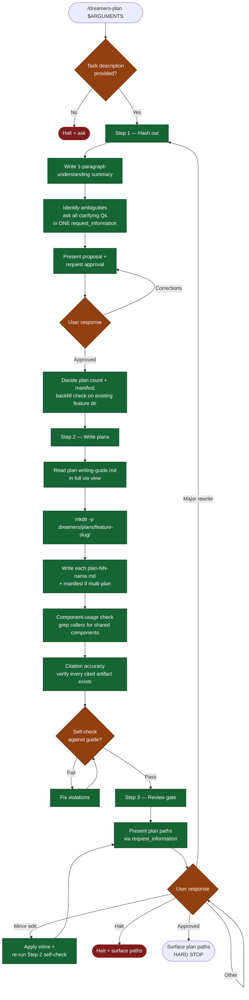

# /dreamers-plan — flow

Visual map of the 3-phase planning conversation. Source of truth is `SKILL.md`.

## Key invariants

- **Hard stop at Step 3.** The skill never invokes implementation — surfaces plan paths and exits.
- **One round of clarifying questions** in Step 1. No trickling questions across turns.
- **Manifest backfill check** in Step 1 — existing `feature-<slug>/` + `plan-01-*.md` + no `manifest.md` → manifest MUST be produced in Step 2.
- **Major rewrite loops back to Step 1**, not Step 2 — the proposal/scope needs to be re-agreed first.
