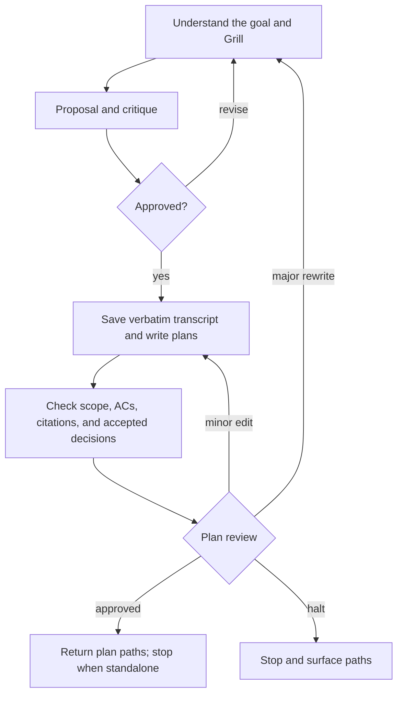

# /dreamers-plan — flow

Planning only. Source of truth is `SKILL.md`.

Every plan uses **Goal**, **Scope and context**, and **Acceptance Criteria**. Keep relevant decisions, constraints, contracts, UI details, and risks within scope; attach validation details to ACs when needed. There are no separate Approach or Verification sections.

- `Plan-type` still labels lite / standard / complex for reviewer selection; it does not select a document format.
- Grill one unresolved decision at a time. Save questions and responses verbatim and link the transcript from each plan when present.
- Proposal critique and plan approval remain mandatory. Written plans must preserve all accepted requirements and user decisions.
- Use a manifest for shared multi-plan context; backfill one when adding a second plan. Individual plans must remain usable alone.
- Planning rules and templates are embedded through XML sync; no Dreamers rule-file reads are required.
- The caller owns its todo. This skill never invokes implementation.
