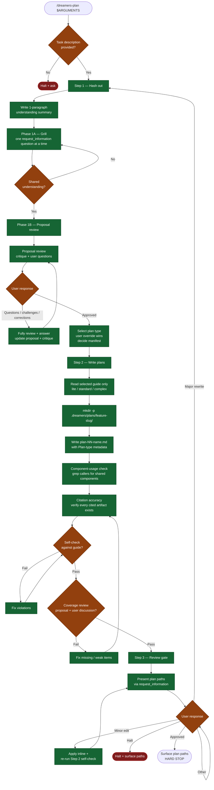

# /dreamers-plan — flow

Visual map of the 3-phase planning conversation. Source of truth is `SKILL.md`.

## Key invariants

- **Phase boundary at Step 3.** The skill never invokes implementation. Standalone use stops after surfacing plan paths; invoked use returns them to the caller.
- **Phase 1A — Grill is mandatory.** The Grill text is the planning phase, not a checklist item, and must be followed before proposal approval. Ask one blocking question at a time through `request_information`; option 1 is the recommendation, option 2 is the strongest alternate, and option 3 is `Other`.
- **Proposal review is mandatory and interactive.** Approval is valid only after the proposal is stress-tested for pitfalls, weak spots, tradeoffs, hidden assumptions, likely failure modes, scope risks, and simpler counter-proposals. User questions, challenges, and partial answers are handled inside the same loop with substantive reasoning, implications, and a recommended next move.
- **Plan type is selected before writing.** User override wins; otherwise use the smallest guide that preserves quality: lite / standard / complex.
- **Plans are right-sized specs.** Each plan follows only its selected guide and includes enough detail that implementation does not infer missing design.
- **Plan coverage review is mandatory after writing.** Before Step 3, compare the written plan(s) against the approved proposal, proposal critique, and all user-discussed questions, corrections, decisions, and constraints. Fix any missing, ambiguous, contradicted, or weakened item before presenting paths.
- **Manifest backfill check** in Step 1 — existing `feature-<slug>/` + `plan-01-*.md` + no `manifest.md` → manifest MUST be produced in Step 2.
- **Major rewrite loops back to Step 1**, not Step 2 — the proposal/scope needs to be re-agreed first.
