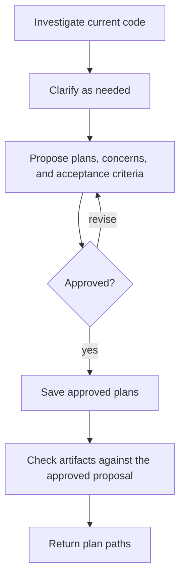

# /dreamers-plan — flow

Planning only. Source of truth is `SKILL.md`.

```mermaid
flowchart TD
    I[Investigate current code] --> Q[Clarify as needed]
    Q --> P[Propose plans, concerns, and acceptance criteria]
    P --> A{Approved?}
    A -->|revise| P
    A -->|yes| W[Save approved plans]
    W --> C[Check artifacts against the approved proposal]
    C --> E[Return plan paths]
```

Every plan uses **Goal** and **Acceptance criteria**, matching GitHub issue proposals. Each plan retains its title and `User-testing-required` flag.

- Investigate code before proposing; report concerns with suggested acceptance criteria.
- Ask questions when needed.
- Obtain proposal approval before writing; revisions require approval of the revised proposal.
- Split work only into independently shippable plans; use a manifest for their order and shared context.
- The shared proposal ref and manifest format are embedded through XML sync; no Dreamers rule-file reads are required.
- This skill returns paths to its caller or stops when standalone. It never implements or changes project files or git state.
