# /dreamers-pr-resolve — flow

Visual map of the PR-feedback resolution skill. Source of truth is `SKILL.md`.

```mermaid
flowchart TD
    Start(["/dreamers-pr-resolve $ARGUMENTS"]) --> S1

    S1["Step 1 — Discover open PRs"] --> PRCheck{"PR target?"}
    PRCheck -->|$ARGUMENTS specified| UseSpecified["Use specified PR"]
    PRCheck -->|"Multiple open<br/>none specified"| PickPR["request_information<br/>list open PRs + Other"]
    PRCheck -->|Exactly one open| UseOne["Use it without prompting"]
    PickPR --> UseSpecified
    UseSpecified --> S2
    UseOne --> S2

    S2["Step 2 — Pull unresolved threads<br/>via GraphQL only"] --> Query["gh api graphql<br/>filter isResolved: false"]
    Query --> HasThreads{"Unresolved<br/>threads?"}
    HasThreads -->|None| EarlyExit(["Report + stop"])
    HasThreads -->|Yes| S3

    S3["Step 3 — Decide accept / reject per thread"] --> PerThread["For each thread:<br/>judge accept or reject<br/>record decision + rationale"]
    PerThread --> AcceptedAny{"Any threads<br/>accepted?"}
    AcceptedAny -->|No| S7Skip["Skip to Step 7"]
    AcceptedAny -->|Yes| ApplyFixes["Apply accepted fixes<br/>inline + git add"]
    ApplyFixes --> S4

    S4["Step 4 — Type-check + run tests"] --> TestResult{"Tests pass<br/>within 3 attempts?"}
    TestResult -->|No| HaltA(["Halt + surface"])
    TestResult -->|Yes| S5

    S5["Step 5 — Review accepted changes"] --> SpawnLane["Spawn selected lane<br/>default Sentinel<br/>scope = files touched by accepts"]
    SpawnLane --> ReviewResult{"Reviewer<br/>statuses?"}
    ReviewResult -->|Blocked| HaltB(["Halt + surface;<br/>resolve + re-spawn"])
    ReviewResult -->|Findings| ApplyReviewer["Apply findings inline<br/>major-refactor gate per dreamers-review<br/>re-run tests"]
    ReviewResult -->|Approved no findings| S6
    ApplyReviewer --> S6

    S6["Step 6 — Commit accepted fixes"] --> CommitFixes["git commit -m fix: address PR feedback"]
    CommitFixes --> PushGate{"Push gate"}
    PushGate -->|Hold| HaltC(["Hold; commit stays on branch"])
    PushGate -->|Push to PR| Push["git push"]
    PushGate -->|Other| PushGate
    Push --> S7

    S7Skip --> S7
    S7["Step 7 — Resolve accepted threads"] --> ResolveGQL["gh api graphql<br/>resolveReviewThread per accepted"]
    ResolveGQL --> S8

    S8["Step 8 — Report"] --> End(["N accepted + rationale<br/>M rejected + rationale<br/>commit hash + push status<br/>reviewer results"])

    classDef gate fill:#92400e,stroke:#78350f,stroke-width:2px,color:#fff
    classDef halt fill:#7f1d1d,stroke:#991b1b,stroke-width:2px,color:#fff
    classDef phase fill:#166534,stroke:#14532d,stroke-width:2px,color:#fff
    classDef agent fill:#7c3aed,stroke:#6d28d9,stroke-width:2px,color:#fff

    class PRCheck,HasThreads,AcceptedAny,TestResult,ReviewResult,PushGate gate
    class HaltA,HaltB,HaltC halt
    class SpawnLane agent
    class S1,S2,S3,S4,S5,S6,S7,S8,UseSpecified,PickPR,UseOne,Query,PerThread,ApplyFixes,ApplyReviewer,CommitFixes,Push,ResolveGQL,S7Skip phase
```

## Key invariants

- **GraphQL only** for unresolved-thread discovery. The REST API's `resolved` field is unreliable.
- **Reject is OK.** Don't feel obligated to accept every comment. If a suggestion conflicts with the plan, architecture, or is simply wrong, reject with rationale.
- **Rejected threads stay open** — they represent active disagreements the reviewer should see.
- **Review lane is narrow by default.** Sentinel reviews accepted fixes; add Probe for coverage/regression-sensitive changes and Hone for architecture/refactor changes.
- **Push requires explicit approval.** Post-PR changes never auto-push.
- **Hold is a valid exit** — the commit stays on the branch for the user to push manually later.
