# /dreamers-research — flow

Visual map of the 4-phase deep-research skill. Source of truth is `SKILL.md`.

```mermaid
flowchart TD
    Start(["/dreamers-research $ARGUMENTS"]) --> P1

    P1["Phase 1 — Preliminary scoping"] --> ScopeSage["Spawn Sage<br/>mode: preliminary<br/>3-5 broad searches<br/>identify 5-10 sub-topics"]
    ScopeSage --> WriteScope["Write .dreamers/sage/scope.md<br/>title + desc + depth per sub-topic"]
    WriteScope --> P15

    P15["Phase 1.5 — User selection gate"] --> AskUser["request_information<br/>multi-select sub-topics<br/>+ Cancel research<br/>+ Other"]
    AskUser --> SelGate{"User choice"}
    SelGate -->|Cancel research| HaltClean(["Halt cleanly<br/>Phase 1 complete<br/>no deep research"])
    SelGate -->|Other| AskUser
    SelGate -->|Selected sub-topics| P2

    P2["Phase 2 — Deep research loop<br/>parallel across selected sub-topics"] --> ParallelSpawn["For each selected sub-topic:<br/>spawn Sage research → review<br/>up to 6 concurrent"]
    ParallelSpawn --> ResearchSage["Sage mode: deep<br/>5-phase pipeline:<br/>scope → discover → gather →<br/>verify → synthesize"]
    ResearchSage --> ReviewSage["Sage mode: review<br/>citations + gaps + bias<br/>+ confidence ratings"]
    ReviewSage --> ReviewResult{"Review<br/>findings?"}
    ReviewResult -->|Critical issues| FlagIssues["Flag sub-topic<br/>optional re-run"]
    ReviewResult -->|Verified| AllDone{"All sub-topics<br/>complete?"}
    FlagIssues --> AllDone
    AllDone -->|No| ParallelSpawn
    AllDone -->|Yes| P3

    P3["Phase 3 — Synthesis"] --> SynthSage["Spawn Sage one final time<br/>mode: synthesis<br/>read all report.md + review.md<br/>unified outline + exec summary"]
    SynthSage --> WriteFinal["Write .dreamers/sage/final-report.md<br/>with full source list"]
    WriteFinal --> P4

    P4["Phase 4 — Delivery"] --> Present["Present exec summary in chat<br/>+ file paths to full + sub-topic reports"]
    Present --> NextStep["Offer: expand sub-topic<br/>research more<br/>export format"]
    NextStep --> End(["Exit"])

    classDef gate fill:#92400e,stroke:#78350f,stroke-width:2px,color:#fff
    classDef halt fill:#7f1d1d,stroke:#991b1b,stroke-width:2px,color:#fff
    classDef phase fill:#166534,stroke:#14532d,stroke-width:2px,color:#fff
    classDef agent fill:#7c3aed,stroke:#6d28d9,stroke-width:2px,color:#fff

    class SelGate,ReviewResult,AllDone gate
    class HaltClean halt
    class ScopeSage,ResearchSage,ReviewSage,SynthSage,ParallelSpawn agent
    class P1,P15,P2,P3,P4,WriteScope,AskUser,FlagIssues,WriteFinal,Present,NextStep phase
```

## Key invariants

- **Phase 1.5 gate is hard.** Never proceed to deep research without explicit sub-topic selection. `Cancel research` halts cleanly.
- **Parallel where possible.** Phase 2 spawns up to 6 concurrent research/review pairs in batched `task()` calls.
- **Review is paired with research** — every sub-topic gets its own Sage review pass before synthesis runs.
- **Failures don't halt the batch.** A failed sub-topic is logged in `errors.md` and reported at delivery; other sub-topics continue.
- **Sage is the only agent** invoked by this skill, used in 4 different modes (`preliminary`, `deep`, `review`, `synthesis`).
