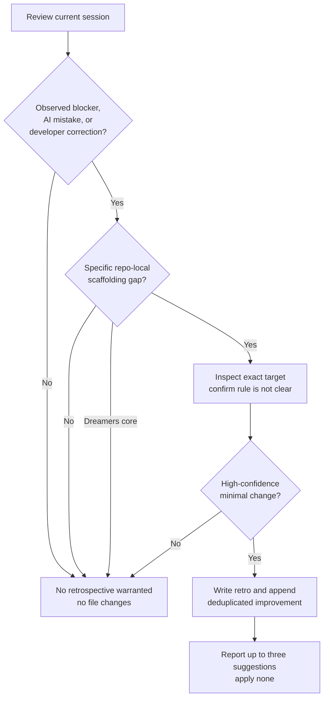

# /dreamers-retro — flow

Source of truth is `SKILL.md`.

## Invariants

- `/dreamers` and `/dreamers-lite` invoke this skill exactly once before a terminal response.
- Evidence comes from the current session; no speculative repository audit.
- Suggestions target current-repo AI scaffolding only.
- Dreamers core is never a target.
- No evidence means no retro file and no improvement entry.
- Scaffolding changes are never applied by this skill.
