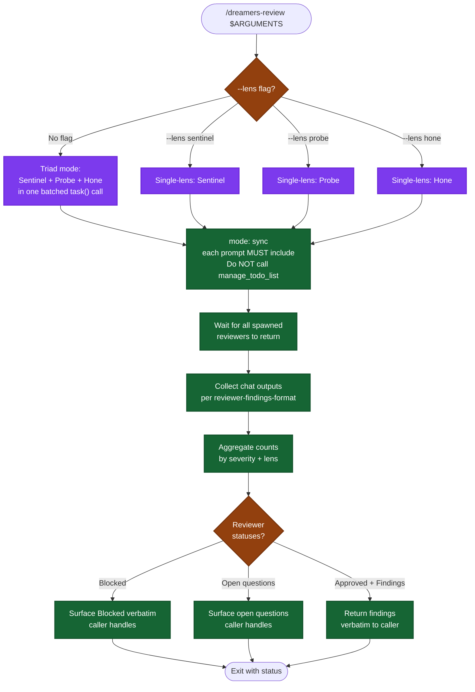

# /dreamers-review — flow

Visual map of the parallel-triad review skill. Source of truth is `SKILL.md`. **Read-only** — does NOT apply fixes; the caller does.

## Lens scope (read-only)

| Lens | Reviewer | Returns |
|---|---|---|
| Correctness / security / maintainability | Sentinel | Findings + plan-alignment summary |
| Test coverage (AC matrix, layer audit, gaps) | Probe | Findings + AC coverage table |
| Simplicity / over-engineering / architecture | Hone | Findings (incl. full-refactor recommendations) |

## Key invariants

- **Read-only.** This skill does NOT apply fixes. The caller (`/dreamers-full` Step 5, or whoever invoked it) decides what to do with the findings.
- **No major-refactor gate here.** That logic lives in the caller. This skill just reports.
- **All reviewer prompts MUST include** `Do NOT call manage_todo_list.`
- **`--no-apply` doesn't exist anymore** — this skill is always read-only by design.
