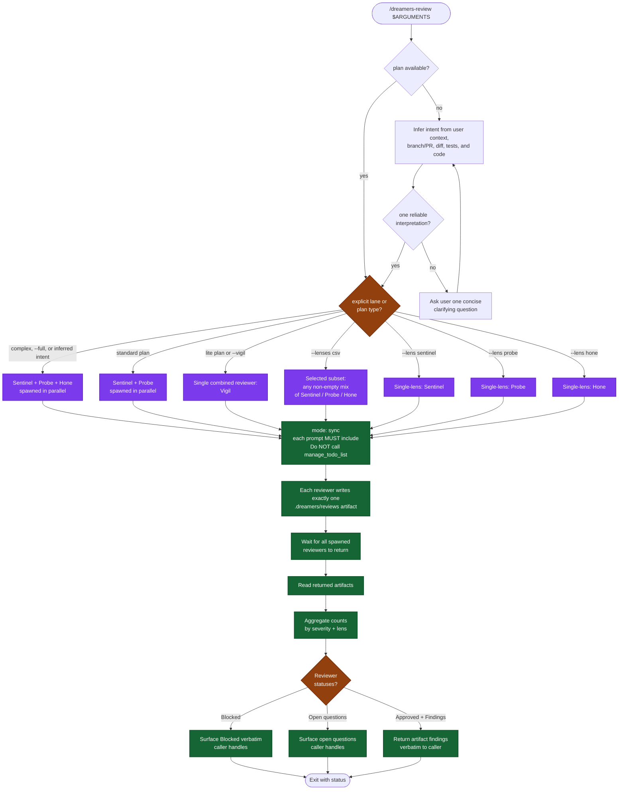

# /dreamers-review — flow

Visual map of the selected-lane review skill. Source of truth is `SKILL.md`. **Read-only** — does NOT apply fixes; the caller does.

## Lens scope (read-only)

| Lens | Reviewer | Returns |
|---|---|---|
| Combined correctness, security, maintainability, coverage, and simplicity | Vigil | One artifact with findings, intent alignment, requirement coverage, and architecture audit |
| Correctness / security / maintainability | Sentinel | Artifact with findings + intent-alignment summary |
| Test coverage (requirement matrix, layer audit, gaps) | Probe | Artifact with findings + requirement coverage table |
| Simplicity / over-engineering / architecture | Hone | Artifact with findings incl. full-refactor recommendations |

## Lane policy

| Lane | Reviewers | Normal use |
|---|---|---|
| vigil | Vigil | Lite plan or explicit request. |
| sentinel | Sentinel | Focused correctness, security, or maintainability audit. |
| probe | Probe | Focused test coverage or regression-risk audit. |
| hone | Hone | Focused architecture or simplicity audit. |
| standard | Sentinel + Probe | Standard plan or explicit combined correctness and coverage audit. |
| full | Sentinel + Probe + Hone | Complex plan, explicit full review, or standalone default. |

Selection precedence is explicit user direction or lane flag, then an explicit reviewer requirement in the plan, then `Plan-type`: lite → Vigil; standard → Sentinel + Probe; complex → Sentinel + Probe + Hone. Without a plan, it infers the intended behavior from user context, branch/PR metadata, the selected diff, tests, changed code, and nearby conventions; an ambiguous basis gets one user question before review. Inferred-intent reviews use the full triad unless the user chose a lane. This skill owns selection and execution, then reports artifact-backed results.

## Key invariants

- **Read-only.** This skill does NOT apply fixes. The caller (`/dreamers` Step 5, or whoever invoked it) decides what to do with the findings. Reviewers may write only their required `.dreamers/reviews/` artifacts.
- **`/dreamers` reruns.** Routine follow-up review reruns use `/dreamers-review --vigil`. A full or selected-lane rerun runs only when the major-change rerun gate asks the user and the user selects it.
- **No major-refactor gate here.** That logic lives in the caller. This skill just reports.
- **Artifacts are the handoff.** Each selected reviewer writes one `.dreamers/reviews/<reviewer>-*.md` artifact; this skill reads those files before reporting.
- **All reviewer prompts MUST include** `Do NOT call manage_todo_list.`
- **`--no-apply` doesn't exist** — this skill is always read-only by design.
- **Todo ownership is contextual.** Standalone review owns its two-step todo; when invoked by /dreamers, it completes the phase under the outer todo.
