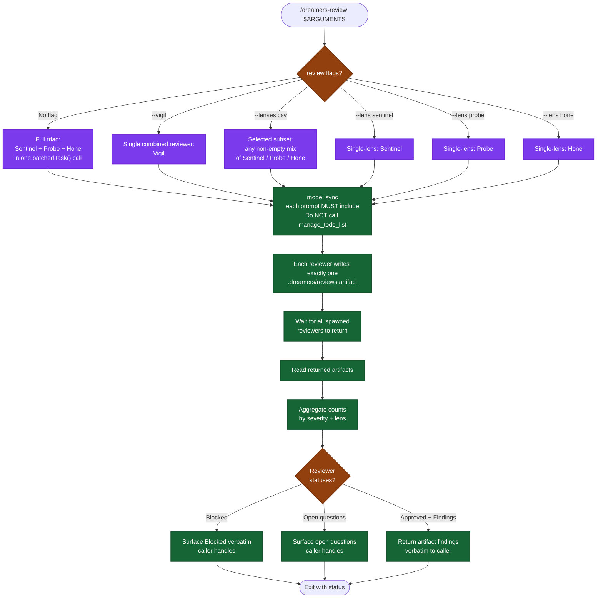

# /dreamers-review — flow

Visual map of the selected-lane review skill. Source of truth is `SKILL.md`. **Read-only** — does NOT apply fixes; the caller does.

## Lens scope (read-only)

| Lens | Reviewer | Returns |
|---|---|---|
| Combined correctness, security, maintainability, coverage, and simplicity | Vigil | One artifact with findings, plan alignment, AC coverage, and architecture audit |
| Correctness / security / maintainability | Sentinel | Artifact with findings + plan-alignment summary |
| Test coverage (AC matrix, layer audit, gaps) | Probe | Artifact with findings + AC coverage table |
| Simplicity / over-engineering / architecture | Hone | Artifact with findings incl. full-refactor recommendations |

## Lane policy

| Lane | Reviewers | Normal use |
|---|---|---|
| vigil | Vigil | Combined proportional review selected by a delivery caller or explicit user request. |
| sentinel | Sentinel | Focused correctness, security, or maintainability audit. |
| probe | Probe | Focused test coverage or regression-risk audit. |
| hone | Hone | Focused architecture or simplicity audit. |
| standard | Sentinel + Probe | Explicit combined correctness and coverage audit. |
| full | Sentinel + Probe + Hone | Adaptive triad selection or explicit full review. |

The adaptive /dreamers caller owns lane selection and invokes this skill for every lane, including Vigil for low-risk lite and standard plans. This skill only executes the requested lane and reports artifact-backed results; explicit user overrides remain authoritative.

## Key invariants

- **Project-file read-only.** This skill and every reviewer leave project code, tests, docs, config, dependencies, and git state unchanged. Each reviewer may write exactly one .dreamers/reviews artifact.
- **Caller applies findings.** This skill does not apply fixes; the caller decides what to apply or defer.
- **No major-scope gate here.** That logic remains in the caller.
- **Reviewer artifacts are the subagent handoff.** This skill reads every selected reviewer's artifact before reporting.
- **Every reviewer prompt includes the parent-todo prohibition.**
- **Todo ownership is contextual.** Standalone review owns its two-step todo; when invoked by /dreamers, it completes the phase under the outer todo.
