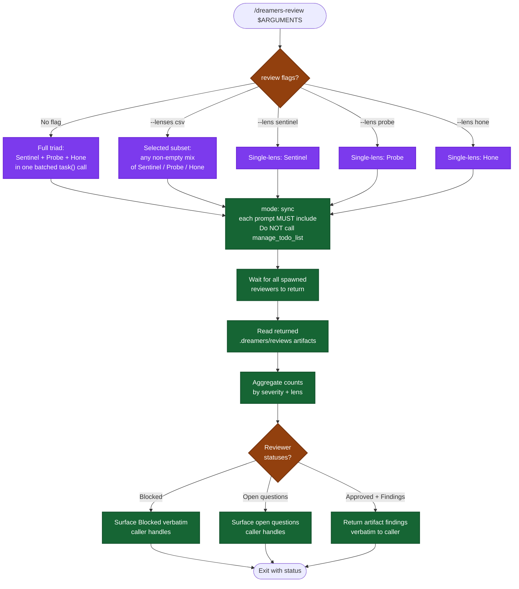

# /dreamers-review — flow

Visual map of the selected-lane review skill. Source of truth is `SKILL.md`. **Read-only** — does NOT apply fixes; the caller does.

## Lens scope (read-only)

| Lens | Reviewer | Returns |
|---|---|---|
| Correctness / security / maintainability | Sentinel | Artifact with findings + plan-alignment summary |
| Test coverage (AC matrix, layer audit, gaps) | Probe | Artifact with findings + AC coverage table |
| Simplicity / over-engineering / architecture | Hone | Artifact with findings incl. full-refactor recommendations |

## Lane policy

| Lane | Reviewers | Normal use |
|---|---|---|
| sentinel | Sentinel | Focused correctness, security, or maintainability audit. |
| probe | Probe | Focused test coverage or regression-risk audit. |
| hone | Hone | Focused architecture or simplicity audit. |
| standard | Sentinel + Probe | Explicit combined correctness and coverage audit. |
| full | Sentinel + Probe + Hone | Adaptive triad selection or explicit full review. |

The adaptive /dreamers caller chooses Vigil directly for low-risk lite and standard plans and invokes this skill for complex or high-risk triad work. It surfaces the selected lane and rationale without a routine confirmation gate; explicit user overrides win.

## Key invariants

- **Read-only.** This skill does not apply fixes; the caller decides what to apply or defer.
- **No major-scope gate here.** That logic remains in the caller.
- **Artifacts are the handoff.** Each selected reviewer writes one .dreamers/reviews artifact, and this skill reads it before reporting.
- **Every reviewer prompt includes the parent-todo prohibition.**
- **Vigil is external to this skill.** Adaptive callers spawn Vigil directly.
